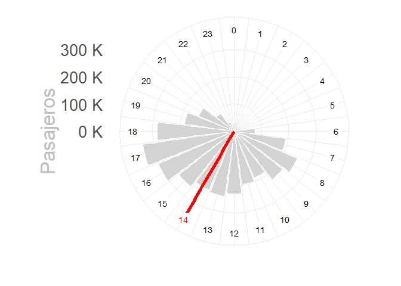
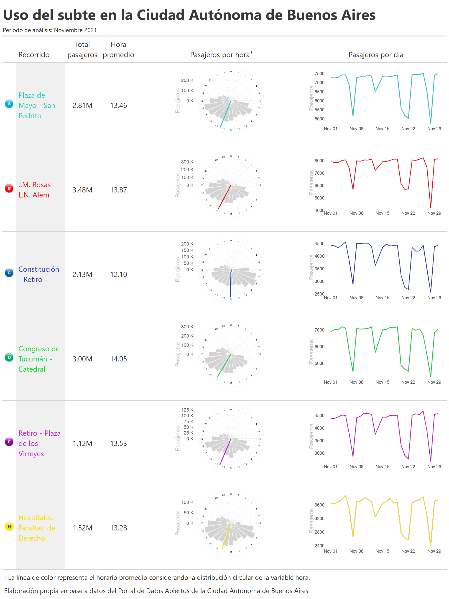
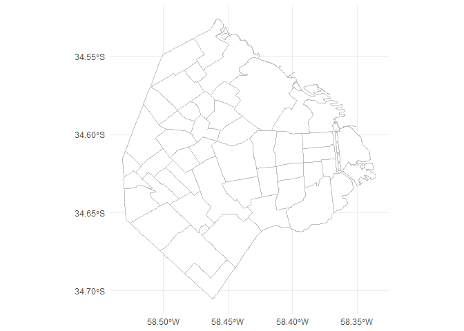
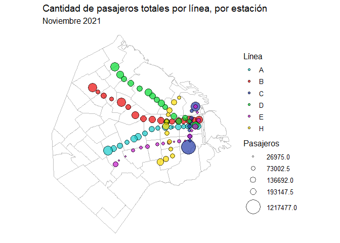
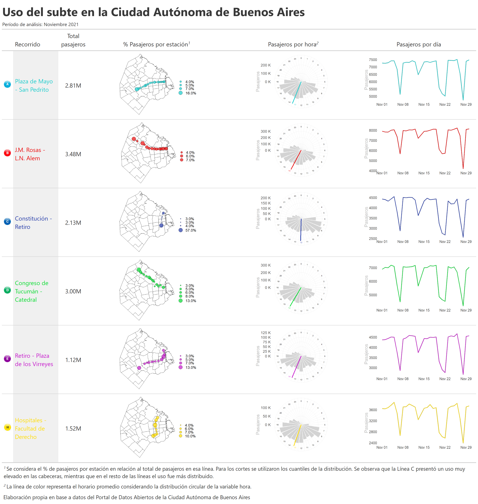

Viajes en subte
================

# Librerías

Se cargan las librerías a utilizar

``` r
library(tidyverse) # Manipulación de datos
library(lubridate)  # Manipulación de fechas
library(circular) # Datos periódicos
library(gt) # Tablas
library(reshape) # Untable
conflicted::conflict_prefer("filter", "dplyr")
conflicted::conflict_prefer("select", "dplyr")

options(scipen=999)
```

# Datos

Se importan los datos de viajes en subte de la Ciudad Autónoma de Buenos
Aires, en 2020.

``` r
df <-
  read_delim(
    'https://cdn.buenosaires.gob.ar/datosabiertos/datasets/sbase/subte-viajes-molinetes/molinetes_112021.csv',
    delim = ';',
    col_types = cols(FECHA = col_date("%d/%m/%Y"))
  ) %>%
  janitor::clean_names() %>%
  filter(!is.na(fecha)) %>%
  mutate(hora = hour(desde))
```

# Generación de datos para la tabla

Función para obtener la hora promedio o mediana:

``` r
get_hour <- function(.linea, .df, .mean = TRUE) {
  temp <- .df %>%
    filter(linea == .linea) %>%
    select(hora, pax_total)
  
  if (.mean == TRUE) {
    hora <- untable(temp, num = temp$pax_total) %>%
      select(-pax_total) %>%
      mutate(hora_circular = circular(hora, template = "clock24", units = "hours")) %>%
      summarise(hora = mean(hora_circular)) %>%
      pull(hora)
  } else {
    hora <- untable(temp, num = temp$pax_total) %>%
      select(-pax_total) %>%
      mutate(hora_circular = circular(hora, template = "clock24", units = "hours")) %>%
      summarise(hora = median(hora_circular)) %>%
      pull(hora)
  }
  
  as.numeric(hora) %% 24
}
```

Función para generar un gráfico circular de la cantidad de pasajeros por
hora por línea de subte:

``` r
.color = 'red'
.linea = 'LineaB'
.df = df
.hora_promedio = 14

temp <- data.frame(hora=seq(0,23)) %>% 
  left_join(.df %>%
  filter(linea == .linea) %>%
  group_by(hora) %>%
  summarise(pax_total = sum(pax_total)) %>%
  ungroup()) %>% 
  mutate(color_hora = ifelse(hora==round(.hora_promedio),TRUE,FALSE)) %>% 
  mutate(pax_total = ifelse(is.na(pax_total),0,pax_total))

temp %>% 
  ggplot(aes(x = hora, y = pax_total)) +
  geom_col(color = 'white', fill = 'lightgrey') +
  coord_polar(start = 0) +
    geom_vline(xintercept = .hora_promedio,
             color = .color,
             size = 2) +
  geom_label(aes(x = hora, y = max(pax_total)+quantile(pax_total,0.3), 
                color = color_hora,
                label = hora),
            size = 10*5/14, label.size = NA, 
            show.legend=FALSE) +
  scale_color_manual(values=c('black',.color))+
  scale_x_continuous(
    "",
    limits = c(0, 24),
    breaks = seq(0, 24),
    labels = seq(0, 24)
  ) +
  scale_y_continuous(labels = scales::unit_format(unit = "K", scale = 1e-3))+
  labs(y = 'Pasajeros') +
  theme_minimal() +
  theme(text = element_text(size = 25, color='grey'), 
        axis.text.x = element_blank())
```

<!-- -->

``` r
plot_clock <- function(.linea, .df, .color = 'black', .hora_promedio) {
  temp <- data.frame(hora = seq(0, 23)) %>%
    left_join(
      .df %>%
        filter(linea == .linea) %>%
        group_by(hora) %>%
        summarise(pax_total = sum(pax_total)) %>%
        ungroup()
    ) %>%
    mutate(color_hora = ifelse(hora == round(.hora_promedio), TRUE, FALSE)) %>%
    mutate(pax_total = ifelse(is.na(pax_total), 0, pax_total))
  
  temp %>%
    ggplot(aes(x = hora, y = pax_total)) +
    geom_col(color = 'white', fill = 'lightgrey') +
    coord_polar(start = 0) +
    geom_vline(xintercept = .hora_promedio,
               color = .color,
               size = 2) +
    geom_label(
      aes(
        x = hora,
        y = max(pax_total) + quantile(pax_total, 0.3),
        color = color_hora,
        label = hora
      ),
      size = 10 * 5 / 14,
      label.size = NA,
      show.legend = FALSE
    ) +
    scale_color_manual(values = c('black', .color)) +
    scale_x_continuous(
      "",
      limits = c(0, 24),
      breaks = seq(0, 24),
      labels = seq(0, 24)
    ) +
    scale_y_continuous(labels = scales::unit_format(unit = "K", scale = 1e-3)) +
    labs(y = 'Pasajeros') +
    theme_minimal() +
    theme(text = element_text(size = 25, color = 'grey'),
          axis.text.x = element_blank())
}
```

Se genera el tibble que contiene los datos para luego generar la tabla:

``` r
datos_tabla <- tibble(linea = sort(unique(df$linea))) %>% 
  
  # Colores
  mutate(recorrido = case_when(linea == 'LineaA'~'Plaza de Mayo - San Pedrito',
                           linea == 'LineaB'~'J.M. Rosas - L.N. Alem',
                           linea == 'LineaC'~'Constitución - Retiro',
                           linea == 'LineaD' ~'Congreso de Tucumán - Catedral',
                           linea == 'LineaE' ~'Retiro - Plaza de los Virreyes',
                           linea == 'LineaH' ~ 'Hospitales - Facultad de Derecho',
                           TRUE ~ 'black')) %>%
  
  
  # Colores
  mutate(color = case_when(linea == 'LineaA'~'#18cccc',
                           linea == 'LineaB'~'#eb0909',
                           linea == 'LineaC'~'#233aa8',
                           linea == 'LineaD' ~'#02db2e',
                           linea == 'LineaE' ~'#c618cc',
                           linea == 'LineaH' ~ '#ffdd00',
                           TRUE ~ 'black')) %>%
  
  # Cantidad de viajes realizados en cada línea
  left_join(df %>% 
    group_by(linea) %>% 
    summarise(pax_total = sum(pax_total))) %>%
  
  # Hora promedio por línea
  mutate(hora_promedio = map(linea, ~get_hour(.linea=.x, .df=df))) %>% 

  mutate(hora_promedio = unlist(hora_promedio)) %>% 
  
  
  # Gráfico de cantidad de pasajeros por hora por línea
  mutate(reloj_plot = pmap(
    list(linea, color, hora_promedio),
    ~ plot_clock(
      .linea = ..1,
      .df = df,
      .color = ..2,
      .hora_promedio = ..3
    )
  )) %>%
  
  # Gráfico de la evolución de cantidad de pasajeros por línea
  mutate(
    evolucion_plot = map2(linea, color,
      ~ df %>% filter(linea == .x) %>%
          group_by(fecha) %>%
          summarise(n = n()) %>%
          ggplot(aes(x = fecha, y = n)) +
          geom_line(color='grey', size=2.5)+
          geom_line(color=.y, size=1.5)+
          theme_minimal()+
          labs(x='',y='Pasajeros')+
          theme(text=element_text(size=30),
                axis.title.y=element_text(color='grey'),
                 panel.grid = element_blank())
    )
  ) %>% 
  mutate(linea_imagen = here::here('',paste0('gcba_subte/lineas/',
                                             tolower(linea), 
                                             '.jpg')))
```

# Generación de la tabla

Se utiliza el paquete {gt} para generar la tabla que contiene plots de
{ggplot2}

``` r
tabla<-datos_tabla %>% 
  ungroup() %>% 
  select(linea, linea_imagen, recorrido, pax_total, 
         hora_promedio, reloj_plot, evolucion_plot) %>% 
  
  # Se genera la tabla
  gt() %>% 
  
  
  # Colores de los textos
  tab_style(
    style = cell_text(color = "#18cccc"),
    locations = cells_body(columns = c(recorrido),
                           rows = linea == "LineaA")
  ) %>%
  tab_style(
    style = cell_text(color = "#eb0909"),
    locations = cells_body(columns = c(recorrido),
                           rows = linea == "LineaB")
  ) %>%
  tab_style(
    style = cell_text(color = "#233aa8"),
    locations = cells_body(columns = c(recorrido),
                           rows = linea == "LineaC")
  ) %>%
  tab_style(
    style = cell_text(color = "#02db2e"),
    locations = cells_body(columns = c(recorrido),
                           rows = linea == "LineaD")
  ) %>%
  tab_style(
    style = cell_text(color = "#c618cc"),
    locations = cells_body(columns = c(recorrido),
                           rows = linea == "LineaE")
  ) %>%
  tab_style(
    style = cell_text(color = "#ffdd00"),
    locations = cells_body(columns = c(recorrido),
                           rows = linea == "LineaH")
  ) %>% 
  
  cols_hide(linea) %>% 


  
  text_transform(
    locations = cells_body(columns = c(linea_imagen)),
    fn = function(linea_imagen) {
      lapply(linea_imagen, local_image, height=20)
    }
  ) %>% 
  cols_label(linea_imagen = '') %>% 
  
  # Ggplots en formato gráfico (sino aparecen como texto)
  text_transform(
    locations = cells_body(columns=reloj_plot),
    fn = function(x){
      map(datos_tabla$reloj_plot, gt::ggplot_image, 
          height=px(180), aspect_ratio=2)
    }
  ) %>% 
  
  text_transform(
    locations = cells_body(columns=evolucion_plot),
    fn = function(x){
      map(datos_tabla$evolucion_plot, gt::ggplot_image, 
          height=px(150), aspect_ratio=2)
    }
  ) %>% 
  
  fmt_number(hora_promedio) %>% 
  
  fmt_number(pax_total, suffixing = TRUE) %>% 
  
  cols_label(
    recorrido = md('Recorrido'),
    hora_promedio = md("Hora promedio"),
    reloj_plot = md('Pasajeros por hora'),
    # reloj_plot = gt::html(
    #   "<span style='color:#grey'>Pasajeros por hora</span>"),
    pax_total = md('Total pasajeros'),
    evolucion_plot = 'Pasajeros por día'
  )%>%
  
  # Fondo gris en el recorrido
  tab_style(
    style = list(cell_fill(color = "#f0f0f0")),
    locations = cells_body(columns = c('recorrido'))
  )%>%
  
  
  # Opciones de la tabla
  tab_options(
    data_row.padding = px(0),
    table.border.top.style = "hidden",
    table.border.bottom.style = "hidden",
    table_body.border.top.style = "solid",
    column_labels.border.bottom.style = "solid"
  ) %>% 
  
  tab_header(title=md('**Uso del subte en la Ciudad Autónoma de Buenos Aires**'), 
             subtitle='Período de análisis: Noviembre 2021') %>% 
  
  opt_align_table_header('left') %>% 
  
  tab_footnote(cells_column_labels(columns = reloj_plot), footnote = 'La línea de color representa el horario promedio considerando la distribución circular de la variable hora.') %>% 
  
  tab_source_note('Elaboración propia en base a datos del Portal de Datos Abiertos de la Ciudad Autónoma de Buenos Aires') %>% 
  
  # Título
  tab_style(
    locations = cells_title(groups = 'title'),
    style = list(
      cell_text(
        font=google_font(name = 'Raleway'), 
        size='xx-large',weight='bold',align='left',
        color='#383838'
  )))%>%
  
  # Subtítulo
  tab_style(
    locations = cells_title(groups = 'subtitle'),
    style = list(
      cell_text(
        font=google_font(name = 'Raleway'), 
        size='small',align='left'
  ))) %>% 
  
  # Alineación 
  cols_align('center',  columns = c('pax_total', 'hora_promedio', 
                                    'reloj_plot', 'evolucion_plot')) 
```

# Guardar la tabla

Se guarda la tabla:

``` r
gt::gtsave(tabla, 'tabla_subtes.png')
```

<!-- -->

# Upgrade

``` r
library(sf)


# Mapa barrios CABA
caba <- st_read('http://cdn.buenosaires.gob.ar/datosabiertos/datasets/barrios/barrios.geojson') %>% 
  mutate(barrio=str_to_title(BARRIO))
```

    ## Reading layer `barrios_badata_wgs84' from data source 
    ##   `http://cdn.buenosaires.gob.ar/datosabiertos/datasets/barrios/barrios.geojson' 
    ##   using driver `GeoJSON'
    ## Simple feature collection with 48 features and 6 fields
    ## Geometry type: MULTIPOLYGON
    ## Dimension:     XY
    ## Bounding box:  xmin: -58.53152 ymin: -34.70529 xmax: -58.33515 ymax: -34.52649
    ## Geodetic CRS:  WGS 84

``` r
mapa <- ggplot()+
  geom_sf(data = caba, 
          color = "grey", 
          fill = 'white',
          size = 0.1, 
          show.legend = FALSE)+
  theme_minimal()
mapa
```

<!-- -->

``` r
estaciones_simple <- readr::read_csv('https://cdn.buenosaires.gob.ar/datosabiertos/datasets/sbase/subte-estaciones/estaciones-de-subte.csv') %>% 
  mutate(estacion = str_to_title(estacion)) %>% 
  mutate(estacion = iconv(estacion, from="UTF-8",to="ASCII//TRANSLIT")) %>% 
  select(linea, estacion, lat, long)


estaciones_accesibles <- readr::read_csv('https://cdn.buenosaires.gob.ar/datosabiertos/datasets/sbase/subte-estaciones/estaciones-accesibles.csv') %>% 
  mutate(estacion = str_to_title(estacion)) %>% 
  mutate(estacion = iconv(estacion, from="UTF-8",to="ASCII//TRANSLIT")) %>% 
  select(linea, estacion, lat, long)

estaciones <- estaciones_accesibles %>% 
  bind_rows(estaciones_simple) %>% 
  mutate(estacion = case_when(estacion=='Saenz Pena'~'Saenz Peña',
                              estacion=='Humberto 1?'~'Humberto I',
                              estacion=='R.scalabrini Ortiz'~'Scalabrini Ortiz',
                              estacion=='Plaza De Los Virreyes - Eva Peron'~'Pza. De Los Virreyes',
                              estacion=='Aguero'~'Agüero',
                              estacion=='San Martin'~'General San Martin',
                              str_detect(estacion,'Carranza')~'Ministro Carranza',
                              TRUE ~ estacion))


estaciones <- estaciones[!duplicated(estaciones[,1:2]),]
```

``` r
df_pasajeros_estaciones <- df %>% 
  group_by(linea, estacion) %>% 
  summarise(pax_total = sum(pax_total)) %>% 
  mutate(estacion = str_trim(str_to_title(estacion)), 
         linea = str_replace(linea, 'Linea','')) %>% 
    mutate(estacion = case_when(estacion=='Flores'~'San Jose De Flores',
                                estacion=='Saenz Peña '~'Saenz Peña',
                                estacion=='Callao.b'~'Callao',
                                estacion=='Retiro E'~'Retiro',
                                estacion=='Independencia.h'~'Independencia',
                                estacion=='Pueyrredon.d'~'Pueyrredon',
                                estacion=='General Belgrano'~'Belgrano',
                                estacion=='Rosas'~'Juan Manuel De Rosas',
                                estacion=='Patricios'~'Parque Patricios',
                                estacion=='Mariano Moreno'~'Moreno',
                              TRUE ~ estacion)) %>% 
  left_join(estaciones, by = c("linea" = "linea", "estacion" = "estacion")) %>% 
  mutate(color = case_when(linea == 'A'~'#18cccc',
                           linea == 'B'~'#eb0909',
                           linea == 'C'~'#233aa8',
                           linea == 'D' ~'#02db2e',
                           linea == 'E' ~'#c618cc',
                           linea == 'H' ~ '#ffdd00',
                           TRUE ~ 'black'))
```

Mapa de todas las estaciones juntas:

``` r
ggplot() +
  geom_sf(data = caba, 
          color = "grey", 
          fill = 'white',
          size = 0.1, 
          show.legend = FALSE)+
  geom_point(data = df_pasajeros_estaciones,
             aes(x = long, y = lat, color=linea, size=pax_total))+
  scale_color_manual(values=unique(df_pasajeros_estaciones$color))+
  theme_minimal()
```

<!-- -->

Estaciones individuales para la tabla:

``` r
plot_mapa <- function(.df, .linea){
   temp <- .df %>% 
    mutate(linea = paste0('Linea',linea)) %>% 
    filter(linea==.linea) %>% 
    mutate(pax_percent = pax_total / sum(pax_total))
   
  lbreaks <- round(quantile(temp$pax_percent, c(0,0.25,0.5,0.75,1)),2) %>%
    as.numeric()
  
  ggplot() +
    geom_sf(data = caba, 
            color = "black", 
            fill = 'white',
            size = 0.1, 
            show.legend = FALSE)+
    geom_point(data = temp,
               aes(x = long, y = lat, size=pax_percent), alpha=0.7,
               fill = temp$color %>% unique(), color='black', shape=21)+
    scale_size_continuous(breaks = lbreaks, range=c(1,10),
                          limits=c(min(temp$pax_percent),max(temp$pax_percent)),
                          labels = scales::percent(lbreaks, accuracy=0.1))+
    theme_void()+
    theme(text = element_text(size = 25), 
          legend.position = 'right', 
          axis.text = element_blank(), 
          plot.margin = unit(c(0, 0, 0, 0), "null"))+
    labs(x='',y='',size='')
}
```

Se añade el nuevo gráfico a la tabla:

``` r
datos_tabla <- datos_tabla %>% 
  mutate(mapa = map(linea, ~ plot_mapa(.df=df_pasajeros_estaciones, .linea=.x)))

datos_tabla$mapa[[5]]
```

<!-- -->

``` r
tabla<-datos_tabla %>% 
  
  ungroup() %>% 
  
  select(linea, linea_imagen, recorrido,pax_total, mapa, 
         reloj_plot, evolucion_plot) %>% 
  
  # Se genera la tabla
  gt() %>% 
  
  
  # Colores de los textos
  tab_style(
    style = cell_text(color = "#18cccc"),
    locations = cells_body(columns = c(recorrido),
                           rows = linea == "LineaA")
  ) %>%
  tab_style(
    style = cell_text(color = "#eb0909"),
    locations = cells_body(columns = c(recorrido),
                           rows = linea == "LineaB")
  ) %>%
  tab_style(
    style = cell_text(color = "#233aa8"),
    locations = cells_body(columns = c(recorrido),
                           rows = linea == "LineaC")
  ) %>%
  tab_style(
    style = cell_text(color = "#02db2e"),
    locations = cells_body(columns = c(recorrido),
                           rows = linea == "LineaD")
  ) %>%
  tab_style(
    style = cell_text(color = "#c618cc"),
    locations = cells_body(columns = c(recorrido),
                           rows = linea == "LineaE")
  ) %>%
  tab_style(
    style = cell_text(color = "#ffdd00"),
    locations = cells_body(columns = c(recorrido),
                           rows = linea == "LineaH")
  ) %>% 
  
  # La línea oculta, con la imagen alcanza
  cols_hide(linea) %>% 


  # Iconos de cada línea
  text_transform(
    locations = cells_body(columns = c(linea_imagen)),
    fn = function(linea_imagen) {
      lapply(linea_imagen, local_image, height=20)
    }
  ) %>% 
  cols_label(linea_imagen = '') %>% 
  
  # Ggplots en formato gráfico (sino aparecen como texto)
  text_transform(
    locations = cells_body(columns=reloj_plot),
    fn = function(x){
      map(datos_tabla$reloj_plot, gt::ggplot_image, 
          height=px(180), aspect_ratio=2)
    }
  ) %>% 
  
  text_transform(
    locations = cells_body(columns=evolucion_plot),
    fn = function(x){
      map(datos_tabla$evolucion_plot, gt::ggplot_image, 
          height=px(150), aspect_ratio=2)
    }
  ) %>% 
  
  text_transform(
    locations = cells_body(columns=mapa),
    fn = function(x){
      map(datos_tabla$mapa, gt::ggplot_image, 
          height=px(180), aspect_ratio=2)
    }
  ) %>% 
  
  
  # Formato numérico
  # fmt_number(hora_promedio) %>% 
  fmt_number(pax_total, suffixing = TRUE) %>% 
  
  # Renombrar variables
  cols_label(
    recorrido = md('Recorrido'),
    # hora_promedio = md("Hora promedio"),
    mapa = md('% Pasajeros por estación'),
    reloj_plot = md('Pasajeros por hora'),
    # reloj_plot = gt::html(
    #   "<span style='color:#grey'>Pasajeros por hora</span>"),
    pax_total = md('Total pasajeros'),
    evolucion_plot = 'Pasajeros por día'
  )%>%
  
  # Fondo gris en el recorrido
  tab_style(
    style = list(cell_fill(color = "#f0f0f0")),
    locations = cells_body(columns = c('recorrido'))
  )%>%
  
  
  # Opciones de la tabla
  tab_options(
    data_row.padding = px(0),
    table.border.top.style = "hidden",
    table.border.bottom.style = "hidden",
    table_body.border.top.style = "solid",
    column_labels.border.bottom.style = "solid"
  ) %>% 
  
  # Título y anotaciones
  tab_header(title=md('**Uso del subte en la Ciudad Autónoma de Buenos Aires**'), 
             subtitle='Período de análisis: Noviembre 2021') %>% 
  
  opt_align_table_header('left') %>% 
  
  tab_footnote(cells_column_labels(columns = reloj_plot), footnote = 'La línea de color representa el horario promedio considerando la distribución circular de la variable hora.') %>% 
  
    tab_footnote(cells_column_labels(columns = mapa), footnote = 'Se considera el % de pasajeros por estación en relación al total de pasajeros en esa línea. Para los cortes se utilizaron los cuantiles de la distribución. Se observa que la Línea C presentó un uso muy elevado en las cabeceras, mientras que en el resto de las líneas el uso fue más distribuido.') %>% 
  
  
  tab_source_note('Elaboración propia en base a datos del Portal de Datos Abiertos de la Ciudad Autónoma de Buenos Aires') %>% 
  
  # Título
  tab_style(
    locations = cells_title(groups = 'title'),
    style = list(
      cell_text(
        font=google_font(name = 'Raleway'), 
        size='xx-large',weight='bold',align='left',
        color='#383838'
  )))%>%
  
  # Subtítulo
  tab_style(
    locations = cells_title(groups = 'subtitle'),
    style = list(
      cell_text(
        font=google_font(name = 'Raleway'), 
        size='small',align='left'
  ))) %>% 
  
  # Alineación 
  cols_align('center',  columns = c('pax_total', 
                                    'reloj_plot', 'evolucion_plot')) 
```

# Guardar la tabla nueva

Se guarda la tabla:

``` r
gt::gtsave(tabla, 'tabla_subtes_upgrade.png', 
           vwidth = 1300, vheight = 2500)
```

<!-- -->

# Datos adicionales

``` r
estacion_mas_usada <- df %>% 
  group_by(linea, estacion_mas_usada = estacion) %>% 
  summarise(pax_total = sum(pax_total)) %>% 
  group_by(linea) %>% 
  slice(which.max(pax_total)) 
```

``` r
datos_tabla <- datos_tabla %>% 
  left_join(estacion_mas_usada %>% select(-pax_total))
```

``` r
tabla<-datos_tabla %>% 
  
  ungroup() %>% 
  
  select(linea, linea_imagen, recorrido,mapa, pax_total, estacion_mas_usada, 
         reloj_plot, evolucion_plot) %>% 
  
  # Se genera la tabla
  gt() %>% 
  
  
  # Colores de los textos
  tab_style(
    style = cell_text(color = "#18cccc"),
    locations = cells_body(columns = c(recorrido),
                           rows = linea == "LineaA")
  ) %>%
  tab_style(
    style = cell_text(color = "#eb0909"),
    locations = cells_body(columns = c(recorrido),
                           rows = linea == "LineaB")
  ) %>%
  tab_style(
    style = cell_text(color = "#233aa8"),
    locations = cells_body(columns = c(recorrido),
                           rows = linea == "LineaC")
  ) %>%
  tab_style(
    style = cell_text(color = "#02db2e"),
    locations = cells_body(columns = c(recorrido),
                           rows = linea == "LineaD")
  ) %>%
  tab_style(
    style = cell_text(color = "#c618cc"),
    locations = cells_body(columns = c(recorrido),
                           rows = linea == "LineaE")
  ) %>%
  tab_style(
    style = cell_text(color = "#ffdd00"),
    locations = cells_body(columns = c(recorrido),
                           rows = linea == "LineaH")
  ) %>% 
  
  # La línea oculta, con la imagen alcanza
  cols_hide(linea) %>% 


  # Iconos de cada línea
  text_transform(
    locations = cells_body(columns = c(linea_imagen)),
    fn = function(linea_imagen) {
      lapply(linea_imagen, local_image, height=20)
    }
  ) %>% 
  cols_label(linea_imagen = '') %>% 
  
  # Ggplots en formato gráfico (sino aparecen como texto)
  text_transform(
    locations = cells_body(columns=reloj_plot),
    fn = function(x){
      map(datos_tabla$reloj_plot, gt::ggplot_image, 
          height=px(180), aspect_ratio=2)
    }
  ) %>% 
  
  text_transform(
    locations = cells_body(columns=evolucion_plot),
    fn = function(x){
      map(datos_tabla$evolucion_plot, gt::ggplot_image, 
          height=px(120), aspect_ratio=2)
    }
  ) %>% 
  
  text_transform(
    locations = cells_body(columns=mapa),
    fn = function(x){
      map(datos_tabla$mapa, gt::ggplot_image, 
          height=px(180), aspect_ratio=2)
    }
  ) %>% 
  
  
  # Formato numérico
  # fmt_number(hora_promedio) %>% 
  fmt_number(pax_total, suffixing = TRUE) %>% 
  
  # Renombrar variables
  cols_label(
    recorrido = md('Recorrido'),
    # hora_promedio = md("Hora promedio"),
    mapa = md('% Pasajeros por estación'),
    reloj_plot = md('Pasajeros por hora'),
    # reloj_plot = gt::html(
    #   "<span style='color:#grey'>Pasajeros por hora</span>"),
    pax_total = md('Total pasajeros'),
    evolucion_plot = 'Pasajeros por día', 
    estacion_mas_usada = 'Estacion más usada'
  )%>%
  
  # Fondo gris en el recorrido
  tab_style(
    style = list(cell_fill(color = "#f0f0f0")),
    locations = cells_body(columns = c('recorrido'))
  )%>%
  
  # Opciones de la tabla
  tab_options(
    data_row.padding = px(0),
    table.border.top.style = "hidden",
    table.border.bottom.style = "hidden",
    table_body.border.top.style = "solid",
    column_labels.border.bottom.style = "solid"
  ) %>%

  # Título y anotaciones
  tab_header(title=md('**Uso del subte en la Ciudad Autónoma de Buenos Aires**'), 
             subtitle='Período de análisis: Noviembre 2021') %>% 
  
  opt_align_table_header('left') %>% 
  
  tab_footnote(cells_column_labels(columns = reloj_plot), footnote = 'La línea de color representa el horario promedio considerando la distribución circular de la variable hora.') %>% 
  
    tab_footnote(cells_column_labels(columns = mapa), footnote = 'Se considera el % de pasajeros por estación en relación al total de pasajeros en esa línea. Para los cortes se utilizaron los cuantiles de la distribución. Se observa que la Línea C presentó un uso muy elevado en las cabeceras, mientras que en el resto de las líneas el uso fue más distribuido.') %>% 
  
  
  tab_source_note('Elaboración propia en base a datos del Portal de Datos Abiertos de la Ciudad Autónoma de Buenos Aires') %>% 
  
  # Título
  tab_style(
    locations = cells_title(groups = 'title'),
    style = list(
      cell_text(
        font=google_font(name = 'Raleway'), 
        size='xx-large',weight='bold',align='left',
        color='#515459'
  )))%>%
  
  # Subtítulo
  tab_style(
    locations = cells_title(groups = 'subtitle'),
    style = list(
      cell_text(
        font=google_font(name = 'Raleway'), 
        size='small',align='left'
  ))) %>% 
  
  # Alineación 
  cols_align('center',  columns = c('pax_total', 'estacion_mas_usada',
                                    'reloj_plot', 'evolucion_plot')) %>%
  
  cols_width(
    recorrido~px(100),
    estacion_mas_usada~px(80),
    reloj_plot ~px(20),
    pax_total ~ px(80)
  )
```

``` r
datos_tabla %>% 
  select(recorrido, linea, pax_total, estacion_mas_usada) %>% 
  gt() %>% 
    cols_width(
      estacion_mas_usada~px(200),
      recorrido ~px(20)
  ) %>% 
    # Renombrar variables
  cols_label(
    pax_total = 'Pasajeros',
    linea = 'Línea',
    recorrido = md('Recorrido'),
    estacion_mas_usada = 'Estacion más usada'
  )
```

<div id="snmntacrvz" style="overflow-x:auto;overflow-y:auto;width:auto;height:auto;">
<style>html {
  font-family: -apple-system, BlinkMacSystemFont, 'Segoe UI', Roboto, Oxygen, Ubuntu, Cantarell, 'Helvetica Neue', 'Fira Sans', 'Droid Sans', Arial, sans-serif;
}

#snmntacrvz .gt_table {
  display: table;
  border-collapse: collapse;
  margin-left: auto;
  margin-right: auto;
  color: #333333;
  font-size: 16px;
  font-weight: normal;
  font-style: normal;
  background-color: #FFFFFF;
  width: auto;
  border-top-style: solid;
  border-top-width: 2px;
  border-top-color: #A8A8A8;
  border-right-style: none;
  border-right-width: 2px;
  border-right-color: #D3D3D3;
  border-bottom-style: solid;
  border-bottom-width: 2px;
  border-bottom-color: #A8A8A8;
  border-left-style: none;
  border-left-width: 2px;
  border-left-color: #D3D3D3;
}

#snmntacrvz .gt_heading {
  background-color: #FFFFFF;
  text-align: center;
  border-bottom-color: #FFFFFF;
  border-left-style: none;
  border-left-width: 1px;
  border-left-color: #D3D3D3;
  border-right-style: none;
  border-right-width: 1px;
  border-right-color: #D3D3D3;
}

#snmntacrvz .gt_title {
  color: #333333;
  font-size: 125%;
  font-weight: initial;
  padding-top: 4px;
  padding-bottom: 4px;
  border-bottom-color: #FFFFFF;
  border-bottom-width: 0;
}

#snmntacrvz .gt_subtitle {
  color: #333333;
  font-size: 85%;
  font-weight: initial;
  padding-top: 0;
  padding-bottom: 4px;
  border-top-color: #FFFFFF;
  border-top-width: 0;
}

#snmntacrvz .gt_bottom_border {
  border-bottom-style: solid;
  border-bottom-width: 2px;
  border-bottom-color: #D3D3D3;
}

#snmntacrvz .gt_col_headings {
  border-top-style: solid;
  border-top-width: 2px;
  border-top-color: #D3D3D3;
  border-bottom-style: solid;
  border-bottom-width: 2px;
  border-bottom-color: #D3D3D3;
  border-left-style: none;
  border-left-width: 1px;
  border-left-color: #D3D3D3;
  border-right-style: none;
  border-right-width: 1px;
  border-right-color: #D3D3D3;
}

#snmntacrvz .gt_col_heading {
  color: #333333;
  background-color: #FFFFFF;
  font-size: 100%;
  font-weight: normal;
  text-transform: inherit;
  border-left-style: none;
  border-left-width: 1px;
  border-left-color: #D3D3D3;
  border-right-style: none;
  border-right-width: 1px;
  border-right-color: #D3D3D3;
  vertical-align: bottom;
  padding-top: 5px;
  padding-bottom: 6px;
  padding-left: 5px;
  padding-right: 5px;
  overflow-x: hidden;
}

#snmntacrvz .gt_column_spanner_outer {
  color: #333333;
  background-color: #FFFFFF;
  font-size: 100%;
  font-weight: normal;
  text-transform: inherit;
  padding-top: 0;
  padding-bottom: 0;
  padding-left: 4px;
  padding-right: 4px;
}

#snmntacrvz .gt_column_spanner_outer:first-child {
  padding-left: 0;
}

#snmntacrvz .gt_column_spanner_outer:last-child {
  padding-right: 0;
}

#snmntacrvz .gt_column_spanner {
  border-bottom-style: solid;
  border-bottom-width: 2px;
  border-bottom-color: #D3D3D3;
  vertical-align: bottom;
  padding-top: 5px;
  padding-bottom: 6px;
  overflow-x: hidden;
  display: inline-block;
  width: 100%;
}

#snmntacrvz .gt_group_heading {
  padding: 8px;
  color: #333333;
  background-color: #FFFFFF;
  font-size: 100%;
  font-weight: initial;
  text-transform: inherit;
  border-top-style: solid;
  border-top-width: 2px;
  border-top-color: #D3D3D3;
  border-bottom-style: solid;
  border-bottom-width: 2px;
  border-bottom-color: #D3D3D3;
  border-left-style: none;
  border-left-width: 1px;
  border-left-color: #D3D3D3;
  border-right-style: none;
  border-right-width: 1px;
  border-right-color: #D3D3D3;
  vertical-align: middle;
}

#snmntacrvz .gt_empty_group_heading {
  padding: 0.5px;
  color: #333333;
  background-color: #FFFFFF;
  font-size: 100%;
  font-weight: initial;
  border-top-style: solid;
  border-top-width: 2px;
  border-top-color: #D3D3D3;
  border-bottom-style: solid;
  border-bottom-width: 2px;
  border-bottom-color: #D3D3D3;
  vertical-align: middle;
}

#snmntacrvz .gt_from_md > :first-child {
  margin-top: 0;
}

#snmntacrvz .gt_from_md > :last-child {
  margin-bottom: 0;
}

#snmntacrvz .gt_row {
  padding-top: 8px;
  padding-bottom: 8px;
  padding-left: 5px;
  padding-right: 5px;
  margin: 10px;
  border-top-style: solid;
  border-top-width: 1px;
  border-top-color: #D3D3D3;
  border-left-style: none;
  border-left-width: 1px;
  border-left-color: #D3D3D3;
  border-right-style: none;
  border-right-width: 1px;
  border-right-color: #D3D3D3;
  vertical-align: middle;
  overflow-x: hidden;
}

#snmntacrvz .gt_stub {
  color: #333333;
  background-color: #FFFFFF;
  font-size: 100%;
  font-weight: initial;
  text-transform: inherit;
  border-right-style: solid;
  border-right-width: 2px;
  border-right-color: #D3D3D3;
  padding-left: 12px;
}

#snmntacrvz .gt_summary_row {
  color: #333333;
  background-color: #FFFFFF;
  text-transform: inherit;
  padding-top: 8px;
  padding-bottom: 8px;
  padding-left: 5px;
  padding-right: 5px;
}

#snmntacrvz .gt_first_summary_row {
  padding-top: 8px;
  padding-bottom: 8px;
  padding-left: 5px;
  padding-right: 5px;
  border-top-style: solid;
  border-top-width: 2px;
  border-top-color: #D3D3D3;
}

#snmntacrvz .gt_grand_summary_row {
  color: #333333;
  background-color: #FFFFFF;
  text-transform: inherit;
  padding-top: 8px;
  padding-bottom: 8px;
  padding-left: 5px;
  padding-right: 5px;
}

#snmntacrvz .gt_first_grand_summary_row {
  padding-top: 8px;
  padding-bottom: 8px;
  padding-left: 5px;
  padding-right: 5px;
  border-top-style: double;
  border-top-width: 6px;
  border-top-color: #D3D3D3;
}

#snmntacrvz .gt_striped {
  background-color: rgba(128, 128, 128, 0.05);
}

#snmntacrvz .gt_table_body {
  border-top-style: solid;
  border-top-width: 2px;
  border-top-color: #D3D3D3;
  border-bottom-style: solid;
  border-bottom-width: 2px;
  border-bottom-color: #D3D3D3;
}

#snmntacrvz .gt_footnotes {
  color: #333333;
  background-color: #FFFFFF;
  border-bottom-style: none;
  border-bottom-width: 2px;
  border-bottom-color: #D3D3D3;
  border-left-style: none;
  border-left-width: 2px;
  border-left-color: #D3D3D3;
  border-right-style: none;
  border-right-width: 2px;
  border-right-color: #D3D3D3;
}

#snmntacrvz .gt_footnote {
  margin: 0px;
  font-size: 90%;
  padding: 4px;
}

#snmntacrvz .gt_sourcenotes {
  color: #333333;
  background-color: #FFFFFF;
  border-bottom-style: none;
  border-bottom-width: 2px;
  border-bottom-color: #D3D3D3;
  border-left-style: none;
  border-left-width: 2px;
  border-left-color: #D3D3D3;
  border-right-style: none;
  border-right-width: 2px;
  border-right-color: #D3D3D3;
}

#snmntacrvz .gt_sourcenote {
  font-size: 90%;
  padding: 4px;
}

#snmntacrvz .gt_left {
  text-align: left;
}

#snmntacrvz .gt_center {
  text-align: center;
}

#snmntacrvz .gt_right {
  text-align: right;
  font-variant-numeric: tabular-nums;
}

#snmntacrvz .gt_font_normal {
  font-weight: normal;
}

#snmntacrvz .gt_font_bold {
  font-weight: bold;
}

#snmntacrvz .gt_font_italic {
  font-style: italic;
}

#snmntacrvz .gt_super {
  font-size: 65%;
}

#snmntacrvz .gt_footnote_marks {
  font-style: italic;
  font-weight: normal;
  font-size: 65%;
}
</style>
<table class="gt_table" style="table-layout: fixed;">
  <colgroup>
    <col style="width:20px;"/>
    <col/>
    <col/>
    <col style="width:200px;"/>
  </colgroup>
  
  <thead class="gt_col_headings">
    <tr>
      <th class="gt_col_heading gt_columns_bottom_border gt_left" rowspan="1" colspan="1">Recorrido</th>
      <th class="gt_col_heading gt_columns_bottom_border gt_left" rowspan="1" colspan="1">Línea</th>
      <th class="gt_col_heading gt_columns_bottom_border gt_right" rowspan="1" colspan="1">Pasajeros</th>
      <th class="gt_col_heading gt_columns_bottom_border gt_left" rowspan="1" colspan="1">Estacion más usada</th>
    </tr>
  </thead>
  <tbody class="gt_table_body">
    <tr><td class="gt_row gt_left">Plaza de Mayo - San Pedrito</td>
<td class="gt_row gt_left">LineaA</td>
<td class="gt_row gt_right">2812536</td>
<td class="gt_row gt_left">San Pedrito</td></tr>
    <tr><td class="gt_row gt_left">J.M. Rosas - L.N. Alem</td>
<td class="gt_row gt_left">LineaB</td>
<td class="gt_row gt_right">3476972</td>
<td class="gt_row gt_left">Federico Lacroze</td></tr>
    <tr><td class="gt_row gt_left">Constitución - Retiro</td>
<td class="gt_row gt_left">LineaC</td>
<td class="gt_row gt_right">2129704</td>
<td class="gt_row gt_left">Constitucion</td></tr>
    <tr><td class="gt_row gt_left">Congreso de Tucumán - Catedral</td>
<td class="gt_row gt_left">LineaD</td>
<td class="gt_row gt_right">2995373</td>
<td class="gt_row gt_left">Congreso de Tucuman</td></tr>
    <tr><td class="gt_row gt_left">Retiro - Plaza de los Virreyes</td>
<td class="gt_row gt_left">LineaE</td>
<td class="gt_row gt_right">1120315</td>
<td class="gt_row gt_left">Bolivar</td></tr>
    <tr><td class="gt_row gt_left">Hospitales - Facultad de Derecho</td>
<td class="gt_row gt_left">LineaH</td>
<td class="gt_row gt_right">1515556</td>
<td class="gt_row gt_left">Once</td></tr>
  </tbody>
  
  
</table>
</div>

# Guardar la tabla nueva

Se guarda la tabla:

``` r
gt::gtsave(tabla, 'tabla_subtes_upgrade.png', 
           vwidth = 1500, vheight = 2500)
```

<!-- -->
