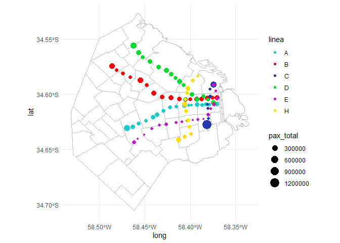
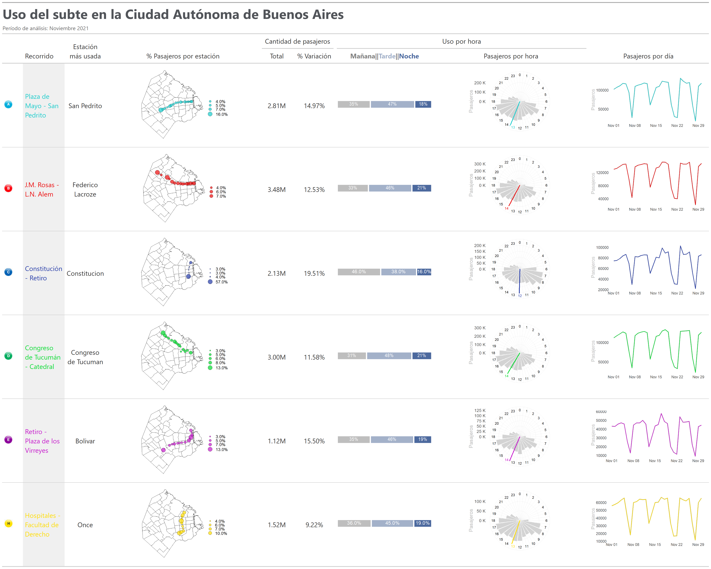
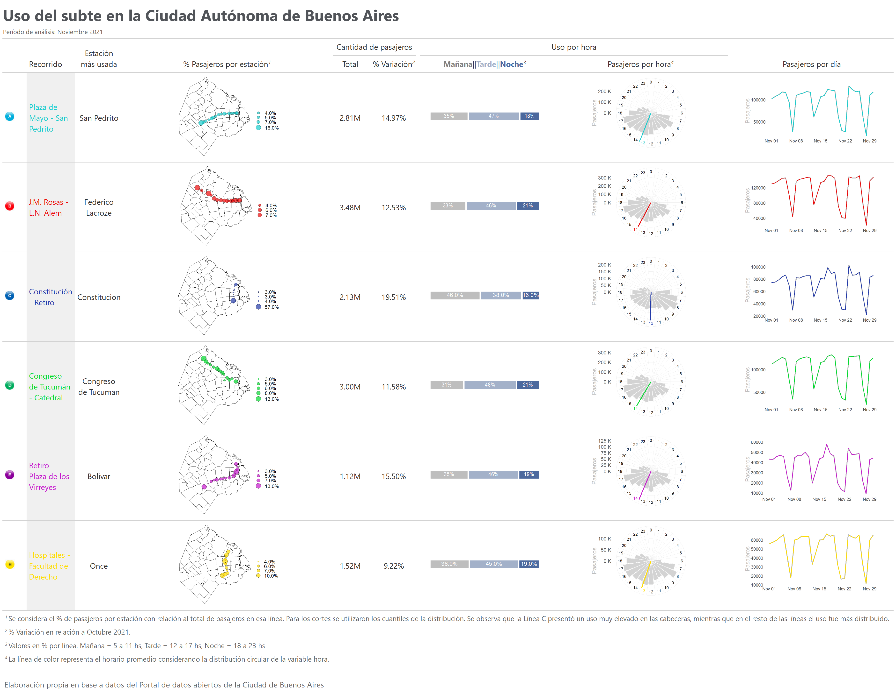

Uso del subte en la Ciudad Autónoma de Buenos Aires
================
true
2022-01-15

# Introducción

El paquete **{ggplot2}** 📦[1] es uno de los paquetes más utilizados para
la visualización de datos en R. Está basado en **the Grammar of
Graphics**, Wilkinson (2012), y permite generar gráficos mediante capas.
Por otro lado, **the Grammar of Tables {gt}** 📦[2] se utiliza para
generar tablas con una estructura similar a la de {ggplot2}, utilizando
capas. Ambos enfoques pueden combinarse generando tablas que incluyen
gráficos. En este caso, armé un ejemplo con datos provistos por el
portal de datos abiertos de la Ciudad Autónoma de Buenos Aires. La idea
de este post surgió de una [publicación de Benjamin Nowak en
Twitter](https://twitter.com/BjnNowak/status/1472562727684124688).

The grammar of tables se basa en la siguiente estructura:

``` r
knitr::include_graphics(here::here('gcba_subte/images/gt_workflow_diagram.svg'))
```


En donde las tablas tienen un formato específico, generado mediante
capas:

``` r
knitr::include_graphics(here::here('gcba_subte/images/gt_parts_of_a_table.svg'))
```


# 1️⃣ Librerías

Se cargan las librerías a utilizar. Principalmente se utilizarán
**{ggplot2}**, incluida en el ecosistema **Tidyverse**[3], y **{gt}**.

``` r
library(tidyverse) # Manipulación de datos
library(lubridate)  # Manipulación de fechas
library(circular) # Datos periódicos
library(gt) # Tablas
library(gtExtras) # Extras de tablas gt
library(gtsummary) # Tablas resúmen
library(reshape) # Untable
library(sf) # Trabajar con mapas
conflicted::conflict_prefer("filter", "dplyr")
conflicted::conflict_prefer("select", "dplyr")

options(scipen=999)
```

# 2️⃣ Datos

Se importan los datos de [viajes en subte de la Ciudad Autónoma de
Buenos
Aires](https://data.buenosaires.gob.ar/dataset/subte-viajes-molinetes),
en Noviembre 2021.

``` r
base_url = 'https://cdn.buenosaires.gob.ar/datosabiertos/datasets/sbase/subte-viajes-molinetes/'
mes_url  = 'molinetes_112021.csv'


df <- read_delim(
    paste0(base_url, mes_url),
    delim = ';',
    col_types = cols(FECHA = col_date("%d/%m/%Y"))
  ) %>%
  
  # Limpieza de los nombres de las columnas
  janitor::clean_names() %>%
  
  # Existen algunos datos sin fecha
  filter(!is.na(fecha)) %>%
  
  # Hora en formato correcto
  mutate(hora = hour(desde)) %>% 
  
  # Se asigna el color correspondiente a cada línea
  mutate(
    linea=str_replace(linea, 'Linea',''),
    color = case_when(
      linea == 'A' ~ '#18cccc',
      linea == 'B' ~ '#eb0909',
      linea == 'C' ~ '#233aa8',
      linea == 'D' ~ '#02db2e',
      linea == 'E' ~ '#c618cc',
      linea == 'H' ~ '#ffdd00',
      TRUE ~ 'black'
    )
  ) %>% 
  
  # Selección de variables relevantes
  select(linea, color, fecha, desde, hasta, hora, linea, molinete, estacion, 
         pax_pagos, pax_pases_pagos, pax_franq, pax_total)
```

Se obtienen los datos del mes anterior para generar comparaciones:

``` r
mes_url = 'molinetes_102021.csv'

df_oct <- read_delim(
    paste0(base_url, mes_url),
    delim = ';',
    col_types = cols(FECHA = col_date("%d/%m/%Y"))
  ) %>% 
  # Limpieza de los nombres de las columnas
  janitor::clean_names() %>%
  
  # Existen algunos datos sin fecha
  filter(!is.na(fecha)) %>%
  
  # Hora en formato correcto
  mutate(hora = hour(desde)) %>% 
  
  # Se asigna el color correspondiente a cada línea
  mutate(linea=str_replace(linea, 'Linea',''))
```

# 3️⃣ Análisis exploratorio de los datos

``` r
df %>% select(-color) %>% 
  head(5) %>% 
  gt() %>% 
  tab_header(title=md('**Formato de los datos (primeras 5 filas)**'),
             subtitle='Cantidad de pasajeros por molinete 
             y por estación de todas las estaciones de la 
             red de subte, Noviembre 2021') %>% 
  opt_align_table_header('left') %>% 
  tab_footnote(locations=cells_column_labels(columns=molinete),
               'Se ignorará el molinete específico y se considerarán 
               los datos agregados a nivel estación')
```

<div id="oyobyuvaaq" style="overflow-x:auto;overflow-y:auto;width:auto;height:auto;">
<style>html {
  font-family: -apple-system, BlinkMacSystemFont, 'Segoe UI', Roboto, Oxygen, Ubuntu, Cantarell, 'Helvetica Neue', 'Fira Sans', 'Droid Sans', Arial, sans-serif;
}

#oyobyuvaaq .gt_table {
  display: table;
  border-collapse: collapse;
  margin-left: auto;
  margin-right: auto;
  color: #333333;
  font-size: 16px;
  font-weight: normal;
  font-style: normal;
  background-color: #FFFFFF;
  width: auto;
  border-top-style: solid;
  border-top-width: 2px;
  border-top-color: #A8A8A8;
  border-right-style: none;
  border-right-width: 2px;
  border-right-color: #D3D3D3;
  border-bottom-style: solid;
  border-bottom-width: 2px;
  border-bottom-color: #A8A8A8;
  border-left-style: none;
  border-left-width: 2px;
  border-left-color: #D3D3D3;
}

#oyobyuvaaq .gt_heading {
  background-color: #FFFFFF;
  text-align: left;
  border-bottom-color: #FFFFFF;
  border-left-style: none;
  border-left-width: 1px;
  border-left-color: #D3D3D3;
  border-right-style: none;
  border-right-width: 1px;
  border-right-color: #D3D3D3;
}

#oyobyuvaaq .gt_title {
  color: #333333;
  font-size: 125%;
  font-weight: initial;
  padding-top: 4px;
  padding-bottom: 4px;
  border-bottom-color: #FFFFFF;
  border-bottom-width: 0;
}

#oyobyuvaaq .gt_subtitle {
  color: #333333;
  font-size: 85%;
  font-weight: initial;
  padding-top: 0;
  padding-bottom: 4px;
  border-top-color: #FFFFFF;
  border-top-width: 0;
}

#oyobyuvaaq .gt_bottom_border {
  border-bottom-style: solid;
  border-bottom-width: 2px;
  border-bottom-color: #D3D3D3;
}

#oyobyuvaaq .gt_col_headings {
  border-top-style: solid;
  border-top-width: 2px;
  border-top-color: #D3D3D3;
  border-bottom-style: solid;
  border-bottom-width: 2px;
  border-bottom-color: #D3D3D3;
  border-left-style: none;
  border-left-width: 1px;
  border-left-color: #D3D3D3;
  border-right-style: none;
  border-right-width: 1px;
  border-right-color: #D3D3D3;
}

#oyobyuvaaq .gt_col_heading {
  color: #333333;
  background-color: #FFFFFF;
  font-size: 100%;
  font-weight: normal;
  text-transform: inherit;
  border-left-style: none;
  border-left-width: 1px;
  border-left-color: #D3D3D3;
  border-right-style: none;
  border-right-width: 1px;
  border-right-color: #D3D3D3;
  vertical-align: bottom;
  padding-top: 5px;
  padding-bottom: 6px;
  padding-left: 5px;
  padding-right: 5px;
  overflow-x: hidden;
}

#oyobyuvaaq .gt_column_spanner_outer {
  color: #333333;
  background-color: #FFFFFF;
  font-size: 100%;
  font-weight: normal;
  text-transform: inherit;
  padding-top: 0;
  padding-bottom: 0;
  padding-left: 4px;
  padding-right: 4px;
}

#oyobyuvaaq .gt_column_spanner_outer:first-child {
  padding-left: 0;
}

#oyobyuvaaq .gt_column_spanner_outer:last-child {
  padding-right: 0;
}

#oyobyuvaaq .gt_column_spanner {
  border-bottom-style: solid;
  border-bottom-width: 2px;
  border-bottom-color: #D3D3D3;
  vertical-align: bottom;
  padding-top: 5px;
  padding-bottom: 6px;
  overflow-x: hidden;
  display: inline-block;
  width: 100%;
}

#oyobyuvaaq .gt_group_heading {
  padding: 8px;
  color: #333333;
  background-color: #FFFFFF;
  font-size: 100%;
  font-weight: initial;
  text-transform: inherit;
  border-top-style: solid;
  border-top-width: 2px;
  border-top-color: #D3D3D3;
  border-bottom-style: solid;
  border-bottom-width: 2px;
  border-bottom-color: #D3D3D3;
  border-left-style: none;
  border-left-width: 1px;
  border-left-color: #D3D3D3;
  border-right-style: none;
  border-right-width: 1px;
  border-right-color: #D3D3D3;
  vertical-align: middle;
}

#oyobyuvaaq .gt_empty_group_heading {
  padding: 0.5px;
  color: #333333;
  background-color: #FFFFFF;
  font-size: 100%;
  font-weight: initial;
  border-top-style: solid;
  border-top-width: 2px;
  border-top-color: #D3D3D3;
  border-bottom-style: solid;
  border-bottom-width: 2px;
  border-bottom-color: #D3D3D3;
  vertical-align: middle;
}

#oyobyuvaaq .gt_from_md > :first-child {
  margin-top: 0;
}

#oyobyuvaaq .gt_from_md > :last-child {
  margin-bottom: 0;
}

#oyobyuvaaq .gt_row {
  padding-top: 8px;
  padding-bottom: 8px;
  padding-left: 5px;
  padding-right: 5px;
  margin: 10px;
  border-top-style: solid;
  border-top-width: 1px;
  border-top-color: #D3D3D3;
  border-left-style: none;
  border-left-width: 1px;
  border-left-color: #D3D3D3;
  border-right-style: none;
  border-right-width: 1px;
  border-right-color: #D3D3D3;
  vertical-align: middle;
  overflow-x: hidden;
}

#oyobyuvaaq .gt_stub {
  color: #333333;
  background-color: #FFFFFF;
  font-size: 100%;
  font-weight: initial;
  text-transform: inherit;
  border-right-style: solid;
  border-right-width: 2px;
  border-right-color: #D3D3D3;
  padding-left: 12px;
}

#oyobyuvaaq .gt_summary_row {
  color: #333333;
  background-color: #FFFFFF;
  text-transform: inherit;
  padding-top: 8px;
  padding-bottom: 8px;
  padding-left: 5px;
  padding-right: 5px;
}

#oyobyuvaaq .gt_first_summary_row {
  padding-top: 8px;
  padding-bottom: 8px;
  padding-left: 5px;
  padding-right: 5px;
  border-top-style: solid;
  border-top-width: 2px;
  border-top-color: #D3D3D3;
}

#oyobyuvaaq .gt_grand_summary_row {
  color: #333333;
  background-color: #FFFFFF;
  text-transform: inherit;
  padding-top: 8px;
  padding-bottom: 8px;
  padding-left: 5px;
  padding-right: 5px;
}

#oyobyuvaaq .gt_first_grand_summary_row {
  padding-top: 8px;
  padding-bottom: 8px;
  padding-left: 5px;
  padding-right: 5px;
  border-top-style: double;
  border-top-width: 6px;
  border-top-color: #D3D3D3;
}

#oyobyuvaaq .gt_striped {
  background-color: rgba(128, 128, 128, 0.05);
}

#oyobyuvaaq .gt_table_body {
  border-top-style: solid;
  border-top-width: 2px;
  border-top-color: #D3D3D3;
  border-bottom-style: solid;
  border-bottom-width: 2px;
  border-bottom-color: #D3D3D3;
}

#oyobyuvaaq .gt_footnotes {
  color: #333333;
  background-color: #FFFFFF;
  border-bottom-style: none;
  border-bottom-width: 2px;
  border-bottom-color: #D3D3D3;
  border-left-style: none;
  border-left-width: 2px;
  border-left-color: #D3D3D3;
  border-right-style: none;
  border-right-width: 2px;
  border-right-color: #D3D3D3;
}

#oyobyuvaaq .gt_footnote {
  margin: 0px;
  font-size: 90%;
  padding: 4px;
}

#oyobyuvaaq .gt_sourcenotes {
  color: #333333;
  background-color: #FFFFFF;
  border-bottom-style: none;
  border-bottom-width: 2px;
  border-bottom-color: #D3D3D3;
  border-left-style: none;
  border-left-width: 2px;
  border-left-color: #D3D3D3;
  border-right-style: none;
  border-right-width: 2px;
  border-right-color: #D3D3D3;
}

#oyobyuvaaq .gt_sourcenote {
  font-size: 90%;
  padding: 4px;
}

#oyobyuvaaq .gt_left {
  text-align: left;
}

#oyobyuvaaq .gt_center {
  text-align: center;
}

#oyobyuvaaq .gt_right {
  text-align: right;
  font-variant-numeric: tabular-nums;
}

#oyobyuvaaq .gt_font_normal {
  font-weight: normal;
}

#oyobyuvaaq .gt_font_bold {
  font-weight: bold;
}

#oyobyuvaaq .gt_font_italic {
  font-style: italic;
}

#oyobyuvaaq .gt_super {
  font-size: 65%;
}

#oyobyuvaaq .gt_footnote_marks {
  font-style: italic;
  font-weight: normal;
  font-size: 65%;
}
</style>
<table class="gt_table">
  <thead class="gt_header">
    <tr>
      <th colspan="11" class="gt_heading gt_title gt_font_normal" style><strong>Formato de los datos (primeras 5 filas)</strong></th>
    </tr>
    <tr>
      <th colspan="11" class="gt_heading gt_subtitle gt_font_normal gt_bottom_border" style>Cantidad de pasajeros por molinete 
             y por estación de todas las estaciones de la 
             red de subte, Noviembre 2021</th>
    </tr>
  </thead>
  <thead class="gt_col_headings">
    <tr>
      <th class="gt_col_heading gt_columns_bottom_border gt_left" rowspan="1" colspan="1">linea</th>
      <th class="gt_col_heading gt_columns_bottom_border gt_left" rowspan="1" colspan="1">fecha</th>
      <th class="gt_col_heading gt_columns_bottom_border gt_center" rowspan="1" colspan="1">desde</th>
      <th class="gt_col_heading gt_columns_bottom_border gt_center" rowspan="1" colspan="1">hasta</th>
      <th class="gt_col_heading gt_columns_bottom_border gt_right" rowspan="1" colspan="1">hora</th>
      <th class="gt_col_heading gt_columns_bottom_border gt_left" rowspan="1" colspan="1">molinete<sup class="gt_footnote_marks">1</sup></th>
      <th class="gt_col_heading gt_columns_bottom_border gt_left" rowspan="1" colspan="1">estacion</th>
      <th class="gt_col_heading gt_columns_bottom_border gt_right" rowspan="1" colspan="1">pax_pagos</th>
      <th class="gt_col_heading gt_columns_bottom_border gt_right" rowspan="1" colspan="1">pax_pases_pagos</th>
      <th class="gt_col_heading gt_columns_bottom_border gt_right" rowspan="1" colspan="1">pax_franq</th>
      <th class="gt_col_heading gt_columns_bottom_border gt_right" rowspan="1" colspan="1">pax_total</th>
    </tr>
  </thead>
  <tbody class="gt_table_body">
    <tr><td class="gt_row gt_left">C</td>
<td class="gt_row gt_left">2021-11-01</td>
<td class="gt_row gt_center">05:30:00</td>
<td class="gt_row gt_center">05:45:00</td>
<td class="gt_row gt_right">5</td>
<td class="gt_row gt_left">LineaC_Indepen_Turn03</td>
<td class="gt_row gt_left">Independencia</td>
<td class="gt_row gt_right">0</td>
<td class="gt_row gt_right">0</td>
<td class="gt_row gt_right">2</td>
<td class="gt_row gt_right">2</td></tr>
    <tr><td class="gt_row gt_left">A</td>
<td class="gt_row gt_left">2021-11-01</td>
<td class="gt_row gt_center">05:30:00</td>
<td class="gt_row gt_center">05:45:00</td>
<td class="gt_row gt_right">5</td>
<td class="gt_row gt_left">LineaA_Pasco_Turn03</td>
<td class="gt_row gt_left">Pasco</td>
<td class="gt_row gt_right">1</td>
<td class="gt_row gt_right">0</td>
<td class="gt_row gt_right">0</td>
<td class="gt_row gt_right">1</td></tr>
    <tr><td class="gt_row gt_left">B</td>
<td class="gt_row gt_left">2021-11-01</td>
<td class="gt_row gt_center">05:30:00</td>
<td class="gt_row gt_center">05:45:00</td>
<td class="gt_row gt_right">5</td>
<td class="gt_row gt_left">LineaB_Malabia_N_Turn05</td>
<td class="gt_row gt_left">Malabia</td>
<td class="gt_row gt_right">0</td>
<td class="gt_row gt_right">0</td>
<td class="gt_row gt_right">1</td>
<td class="gt_row gt_right">1</td></tr>
    <tr><td class="gt_row gt_left">B</td>
<td class="gt_row gt_left">2021-11-01</td>
<td class="gt_row gt_center">05:30:00</td>
<td class="gt_row gt_center">05:45:00</td>
<td class="gt_row gt_right">5</td>
<td class="gt_row gt_left">LineaB_Gallardo_S_Turn02</td>
<td class="gt_row gt_left">Angel Gallardo</td>
<td class="gt_row gt_right">1</td>
<td class="gt_row gt_right">0</td>
<td class="gt_row gt_right">0</td>
<td class="gt_row gt_right">1</td></tr>
    <tr><td class="gt_row gt_left">A</td>
<td class="gt_row gt_left">2021-11-01</td>
<td class="gt_row gt_center">05:30:00</td>
<td class="gt_row gt_center">05:45:00</td>
<td class="gt_row gt_right">5</td>
<td class="gt_row gt_left">LineaA_Congreso_S_Turn03</td>
<td class="gt_row gt_left">Congreso</td>
<td class="gt_row gt_right">0</td>
<td class="gt_row gt_right">0</td>
<td class="gt_row gt_right">1</td>
<td class="gt_row gt_right">1</td></tr>
  </tbody>
  
  <tfoot>
    <tr class="gt_footnotes">
      <td colspan="11">
        <p class="gt_footnote">
          <sup class="gt_footnote_marks">
            <em>1</em>
          </sup>
           
          Se ignorará el molinete específico y se considerarán 
               los datos agregados a nivel estación
          <br />
        </p>
      </td>
    </tr>
  </tfoot>
</table>
</div>

Se observa la distribución de pasajeros por hora. La cantidad total de
pasajeros difiere entre líneas.

``` r
df %>%
  group_by(linea, color, hora) %>%
  summarise(pax_total=sum(pax_total)) %>%
  ungroup() %>%
  ggplot(aes(x=hora, y=pax_total, fill=color))+
  geom_col(color='white')+
  scale_fill_identity()+
  facet_wrap(~linea)+
  scale_y_continuous(labels = scales::label_number(suffix = "k", 
                                           scale = 1e-3, 
                                           big.mark = ","))+
  theme_bw()+
  labs(x='Hora', y='Pasajeros totales', 
       title='Cantidad de pasarjeros por hora por línea',
       subtitle='Noviembre 2021',
       caption='Fuente: Elaboración propia en base a datos del portal de datos abiertos de la Ciudad de Buenos Aires')
```

<!-- -->

# 4️⃣ Transformaciones y gráficos

Se realizan algunas transformaciones y se generan las funciones que
luego se utilizarán para generar gráficos a incorporar a una tabla.

## 4.1 Hora de uso de cada línea de subte

Función para obtener la hora promedio:

``` r
get_hour <- function(.linea, .df) {
  temp <- .df %>%
    filter(linea == .linea) %>%
    select(hora, pax_total)
  
    hora <- untable(temp, num = temp$pax_total) %>%
      select(-pax_total) %>%
      mutate(hora_circular = circular(hora, 
                                      template = "clock24", 
                                      units = "hours")) %>%
      summarise(hora = mean(hora_circular)) %>%
      pull(hora)
  
  as.numeric(hora) %% 24
}
```

Función para generar un gráfico circular de la cantidad de pasajeros por
hora por línea de subte:

``` r
plot_clock <- function(.linea, .df, .color = 'black', .hora_promedio) {
  temp <- data.frame(hora = seq(0, 23)) %>%
    left_join(
      .df %>%
        filter(linea == .linea) %>%
        group_by(hora) %>%
        summarise(pax_total = sum(pax_total)) %>%
        ungroup()
    ) %>%
    mutate(color_hora = ifelse(hora == round(.hora_promedio), TRUE, FALSE)) %>%
    mutate(pax_total = ifelse(is.na(pax_total), 0, pax_total))
  
  temp %>%
    ggplot(aes(x = hora, y = pax_total)) +
    geom_col(color = 'white', fill = 'lightgrey') +
    coord_polar(start = 0) +
    geom_vline(xintercept = .hora_promedio,
               color = .color,
               size = 2) +
    geom_label(
      aes(
        x = hora,
        y = max(pax_total) + quantile(pax_total, 0.3),
        color = color_hora,
        label = hora
      ),
      size = 6,
      label.size = NA,
      show.legend = FALSE
    ) +
    scale_color_manual(values = c('black', .color)) +
    scale_x_continuous(
      "",
      limits = c(0, 24),
      breaks = seq(0, 24),
      labels = seq(0, 24)
    ) +
    scale_y_continuous(labels = scales::unit_format(unit = "K", scale = 1e-3)) +
    labs(y = 'Pasajeros') +
    theme_minimal() +
    theme(text = element_text(size = 25, color = 'grey'),
          axis.text.x = element_blank())
}
```

Test de la función

``` r
plot_clock(.df=df, .linea='B', .color='red',
           .hora_promedio=get_hour(.linea='B',.df=df))
```

<!-- -->

## 4.2 Estación más utilizada por línea

``` r
estacion_mas_usada <- df %>% 
  group_by(linea, estacion_mas_usada = estacion) %>% 
  summarise(pax_total = sum(pax_total)) %>% 
  group_by(linea) %>% 
  slice(which.max(pax_total)) 
```

## 4.3 Mapa de de estaciones y uso

Se cargan los datos del geojson de barrios de la Ciudad Autónoma de
Buenos Aires:

``` r
# Mapa barrios CABA
caba <- st_read('http://cdn.buenosaires.gob.ar/datosabiertos/datasets/barrios/barrios.geojson', quiet = TRUE) %>% 
  mutate(barrio=str_to_title(BARRIO))

mapa <- ggplot()+
  geom_sf(data = caba, 
          color = "grey", 
          fill = 'white',
          size = 0.1, 
          show.legend = FALSE)+
  theme_minimal()

mapa
```

<!-- -->

Se incluyen los datos de latitud y longitud de cada estación:

``` r
estaciones_simple <- readr::read_csv('https://cdn.buenosaires.gob.ar/datosabiertos/datasets/sbase/subte-estaciones/estaciones-de-subte.csv') %>% 
  mutate(estacion = str_to_title(estacion)) %>% 
  mutate(estacion = iconv(estacion, from="UTF-8",to="ASCII//TRANSLIT")) %>% 
  select(linea, estacion, lat, long)


estaciones_accesibles <- readr::read_csv('https://cdn.buenosaires.gob.ar/datosabiertos/datasets/sbase/subte-estaciones/estaciones-accesibles.csv') %>% 
  mutate(estacion = str_to_title(estacion)) %>% 
  mutate(estacion = iconv(estacion, from="UTF-8",to="ASCII//TRANSLIT")) %>% 
  select(linea, estacion, lat, long)

estaciones <- estaciones_accesibles %>% 
  bind_rows(estaciones_simple) %>% 
  mutate(
    estacion = case_when(
      estacion == 'Saenz Pena' ~ 'Saenz Peña',
      estacion == 'Humberto 1?' ~ 'Humberto I',
      estacion == 'R.scalabrini Ortiz' ~ 'Scalabrini Ortiz',
      estacion == 'Plaza De Los Virreyes - Eva Peron' ~ 'Pza. De Los Virreyes',
      estacion == 'Aguero' ~ 'Agüero',
      estacion == 'San Martin' ~ 'General San Martin',
      str_detect(estacion, 'Carranza') ~ 'Ministro Carranza',
      TRUE ~ estacion
    )
  )


estaciones <- estaciones[!duplicated(estaciones[, 1:2]), ]

df_pasajeros_estaciones <- df %>%
  group_by(linea, color, estacion) %>%
  summarise(pax_total = sum(pax_total)) %>%
  mutate(estacion = str_trim(str_to_title(estacion))) %>%
  mutate(
    estacion = case_when(
      estacion == 'Flores' ~ 'San Jose De Flores',
      estacion == 'Saenz Peña ' ~ 'Saenz Peña',
      estacion == 'Callao.b' ~ 'Callao',
      estacion == 'Retiro E' ~ 'Retiro',
      estacion == 'Independencia.h' ~ 'Independencia',
      estacion == 'Pueyrredon.d' ~ 'Pueyrredon',
      estacion == 'General Belgrano' ~ 'Belgrano',
      estacion == 'Rosas' ~ 'Juan Manuel De Rosas',
      estacion == 'Patricios' ~ 'Parque Patricios',
      estacion == 'Mariano Moreno' ~ 'Moreno',
      TRUE ~ estacion
    )
  ) %>%
  left_join(estaciones, by = c("linea" = "linea", "estacion" = "estacion"))
```

Mapa de todas las estaciones juntas:

``` r
lbreaks <- round(quantile(df_pasajeros_estaciones$pax_total, 
                          c(0,0.25,0.5,0.75,1)),2) %>%
    as.numeric()

ggplot() +
  geom_sf(data = caba, 
          color = "grey", 
          fill = 'white',
          size = 0.1, 
          show.legend = FALSE)+
    geom_point(data = df_pasajeros_estaciones,
               aes(x = long, y = lat, size=pax_total, fill=linea), 
               alpha=0.7, color='black', shape=21)+
    scale_size_continuous(breaks = lbreaks, range=c(1,10),
                          limits=c(min(df_pasajeros_estaciones$pax_total),
                                   max(df_pasajeros_estaciones$pax_total)))+
    scale_fill_manual(values=unique(df_pasajeros_estaciones$color %>% unique()))+
    theme_void()+
    theme(text = element_text(size = 12), 
          legend.position = 'right', 
          axis.text = element_blank(), 
          plot.margin = unit(c(0, 0, 0, 0), "null"))+
    labs(x='',y='',size='Pasajeros', fill='Línea', 
         title='Cantidad de pasajeros totales por línea, por estación',
         subtitle='Noviembre 2021')
```

<!-- -->

Estaciones individuales para la tabla:

``` r
plot_mapa <- function(.df, .linea){
   temp <- .df %>% 
    filter(linea==.linea) %>% 
    mutate(pax_percent = pax_total / sum(pax_total))
   
  lbreaks <- round(quantile(temp$pax_percent, c(0,0.25,0.5,0.75,1)),2) %>%
    as.numeric()
  
  ggplot() +
    geom_sf(data = caba, 
            color = "black", 
            fill = 'white',
            size = 0.1, 
            show.legend = FALSE)+
    geom_point(data = temp,
               aes(x = long, y = lat, size=pax_percent), alpha=0.7,
               fill = temp$color %>% unique(), color='black', shape=21)+
    scale_size_continuous(breaks = lbreaks, range=c(1,10),
                          limits=c(min(temp$pax_percent),max(temp$pax_percent)),
                          labels = scales::percent(lbreaks, accuracy=0.1))+
    theme_void()+
    theme(text = element_text(size = 25), 
          legend.position = 'right', 
          axis.text = element_blank(), 
          plot.margin = unit(c(0, 0, 0, 0), "null"))+
    labs(x='',y='',size='')
}
```

# 5️⃣ Datos para la tabla

Cantidad de pasajeros por estación en Octubre 2021:

``` r
df_pasajeros_mesprevio <- df_oct %>%
  group_by(linea) %>%
  summarise(pax_total_oct = sum(pax_total)) 
```

Se genera el tibble que contiene los datos para luego generar la tabla:

``` r
datos_tabla <- tibble(linea = sort(unique(df$linea))) %>%
  
  # Recorridos
  mutate(
    recorrido = case_when(
      linea == 'A' ~ 'Plaza de Mayo - San Pedrito',
      linea == 'B' ~ 'J.M. Rosas - L.N. Alem',
      linea == 'C' ~ 'Constitución - Retiro',
      linea == 'D' ~ 'Congreso de Tucumán - Catedral',
      linea == 'E' ~ 'Retiro - Plaza de los Virreyes',
      linea == 'H' ~ 'Hospitales - Facultad de Derecho',
      TRUE ~ 'black'
    )
  ) %>%
  
  
  # Colores
  mutate(
    color = case_when(
      linea == 'A' ~ '#18cccc',
      linea == 'B' ~ '#eb0909',
      linea == 'C' ~ '#233aa8',
      linea == 'D' ~ '#02db2e',
      linea == 'E' ~ '#c618cc',
      linea == 'H' ~ '#ffdd00',
      TRUE ~ 'black'
    )
  ) %>% 
  
  # Cantidad de viajes realizados en cada línea
  left_join(df %>%
              mutate(hora_grupo = cut(
                hora,
                breaks = 3,
                labels = c('Mañana', 'Tarde', 'Noche')
              )) %>%
              group_by(linea, hora_grupo) %>%
              summarise(pax_total = sum(pax_total)) %>%
              group_by(linea) %>%
              mutate(pax_percent = round(pax_total / sum(pax_total)*100)) %>%
              group_by(linea) %>%
              summarise(pasajeros_tipo = list(pax_percent))) %>% 
  
  left_join(df %>% 
    group_by(linea) %>% 
    summarise(pax_total = sum(pax_total))) %>%
  
  left_join(df_pasajeros_mesprevio) %>% 
  
  mutate(variacion=(pax_total/pax_total_oct-1)) %>% 
  
  # Hora promedio por línea
  mutate(hora_promedio = map(linea, ~get_hour(.linea=.x, .df=df))) %>% 

  mutate(hora_promedio = unlist(hora_promedio)) %>% 
  
  
  # Gráfico de cantidad de pasajeros por hora por línea
  mutate(reloj_plot = pmap(
    list(linea, color, hora_promedio),
    ~ plot_clock(
      .linea = ..1,
      .df = df,
      .color = ..2,
      .hora_promedio = ..3
    )
  )) %>%
  
  # Gráfico de la evolución de cantidad de pasajeros por línea
  mutate(
    evolucion_plot = map2(
      linea,
      color,
      ~ df %>% filter(linea == .x) %>%
        group_by(fecha) %>%
        summarise(n = sum(pax_total)) %>%
        ggplot(aes(x = fecha, y = n)) +
        geom_line(color = 'grey', size = 2.5) +
        geom_line(color = .y, size = 1.5) +
        # scale_y_continuous(labels = scales::unit_format(unit = "K", scale = 1e-3)) +
        theme_minimal() +
        labs(x = '', y = 'Pasajeros') +
        theme(
          text = element_text(size = 30),
          axis.title.y = element_text(color = 'grey'),
          panel.grid = element_blank()
        )
    )
  ) %>%
  mutate(linea_imagen = here::here('', paste0(
    'gcba_subte/lineas/', tolower(linea), '.jpg'
  ))) %>%
  
  # Mapa por línea:
  mutate(mapa = map(linea, ~ plot_mapa(.df = df_pasajeros_estaciones,
                                       .linea = .x))) %>%

  # Estación más utilizada por línea
  left_join(estacion_mas_usada %>% select(-pax_total))
```

# 6️⃣ Generación de la tabla

Se utiliza el paquete {gt} para generar la tabla que contiene plots de
{ggplot2}

``` r
tabla <- datos_tabla %>%
  
  # Selección de variables relevantes y orden:
  select(
    linea,
    linea_imagen,
    recorrido,
    estacion_mas_usada,
    mapa,
    pax_total,
    variacion,
    pasajeros_tipo,
    reloj_plot,
    evolucion_plot
  ) %>%
  
  # Se genera la tabla
  gt() 
```

De momento se centrará el análisis en las columnas con datos simples,
sin considerar las que incluyen gráficos.

``` r
tabla %>%  
  cols_hide(columns = c(pasajeros_tipo, linea_imagen, mapa, reloj_plot, evolucion_plot)) 
```

<div id="gqmhyxpscp" style="overflow-x:auto;overflow-y:auto;width:auto;height:auto;">
<style>html {
  font-family: -apple-system, BlinkMacSystemFont, 'Segoe UI', Roboto, Oxygen, Ubuntu, Cantarell, 'Helvetica Neue', 'Fira Sans', 'Droid Sans', Arial, sans-serif;
}

#gqmhyxpscp .gt_table {
  display: table;
  border-collapse: collapse;
  margin-left: auto;
  margin-right: auto;
  color: #333333;
  font-size: 16px;
  font-weight: normal;
  font-style: normal;
  background-color: #FFFFFF;
  width: auto;
  border-top-style: solid;
  border-top-width: 2px;
  border-top-color: #A8A8A8;
  border-right-style: none;
  border-right-width: 2px;
  border-right-color: #D3D3D3;
  border-bottom-style: solid;
  border-bottom-width: 2px;
  border-bottom-color: #A8A8A8;
  border-left-style: none;
  border-left-width: 2px;
  border-left-color: #D3D3D3;
}

#gqmhyxpscp .gt_heading {
  background-color: #FFFFFF;
  text-align: center;
  border-bottom-color: #FFFFFF;
  border-left-style: none;
  border-left-width: 1px;
  border-left-color: #D3D3D3;
  border-right-style: none;
  border-right-width: 1px;
  border-right-color: #D3D3D3;
}

#gqmhyxpscp .gt_title {
  color: #333333;
  font-size: 125%;
  font-weight: initial;
  padding-top: 4px;
  padding-bottom: 4px;
  border-bottom-color: #FFFFFF;
  border-bottom-width: 0;
}

#gqmhyxpscp .gt_subtitle {
  color: #333333;
  font-size: 85%;
  font-weight: initial;
  padding-top: 0;
  padding-bottom: 4px;
  border-top-color: #FFFFFF;
  border-top-width: 0;
}

#gqmhyxpscp .gt_bottom_border {
  border-bottom-style: solid;
  border-bottom-width: 2px;
  border-bottom-color: #D3D3D3;
}

#gqmhyxpscp .gt_col_headings {
  border-top-style: solid;
  border-top-width: 2px;
  border-top-color: #D3D3D3;
  border-bottom-style: solid;
  border-bottom-width: 2px;
  border-bottom-color: #D3D3D3;
  border-left-style: none;
  border-left-width: 1px;
  border-left-color: #D3D3D3;
  border-right-style: none;
  border-right-width: 1px;
  border-right-color: #D3D3D3;
}

#gqmhyxpscp .gt_col_heading {
  color: #333333;
  background-color: #FFFFFF;
  font-size: 100%;
  font-weight: normal;
  text-transform: inherit;
  border-left-style: none;
  border-left-width: 1px;
  border-left-color: #D3D3D3;
  border-right-style: none;
  border-right-width: 1px;
  border-right-color: #D3D3D3;
  vertical-align: bottom;
  padding-top: 5px;
  padding-bottom: 6px;
  padding-left: 5px;
  padding-right: 5px;
  overflow-x: hidden;
}

#gqmhyxpscp .gt_column_spanner_outer {
  color: #333333;
  background-color: #FFFFFF;
  font-size: 100%;
  font-weight: normal;
  text-transform: inherit;
  padding-top: 0;
  padding-bottom: 0;
  padding-left: 4px;
  padding-right: 4px;
}

#gqmhyxpscp .gt_column_spanner_outer:first-child {
  padding-left: 0;
}

#gqmhyxpscp .gt_column_spanner_outer:last-child {
  padding-right: 0;
}

#gqmhyxpscp .gt_column_spanner {
  border-bottom-style: solid;
  border-bottom-width: 2px;
  border-bottom-color: #D3D3D3;
  vertical-align: bottom;
  padding-top: 5px;
  padding-bottom: 6px;
  overflow-x: hidden;
  display: inline-block;
  width: 100%;
}

#gqmhyxpscp .gt_group_heading {
  padding: 8px;
  color: #333333;
  background-color: #FFFFFF;
  font-size: 100%;
  font-weight: initial;
  text-transform: inherit;
  border-top-style: solid;
  border-top-width: 2px;
  border-top-color: #D3D3D3;
  border-bottom-style: solid;
  border-bottom-width: 2px;
  border-bottom-color: #D3D3D3;
  border-left-style: none;
  border-left-width: 1px;
  border-left-color: #D3D3D3;
  border-right-style: none;
  border-right-width: 1px;
  border-right-color: #D3D3D3;
  vertical-align: middle;
}

#gqmhyxpscp .gt_empty_group_heading {
  padding: 0.5px;
  color: #333333;
  background-color: #FFFFFF;
  font-size: 100%;
  font-weight: initial;
  border-top-style: solid;
  border-top-width: 2px;
  border-top-color: #D3D3D3;
  border-bottom-style: solid;
  border-bottom-width: 2px;
  border-bottom-color: #D3D3D3;
  vertical-align: middle;
}

#gqmhyxpscp .gt_from_md > :first-child {
  margin-top: 0;
}

#gqmhyxpscp .gt_from_md > :last-child {
  margin-bottom: 0;
}

#gqmhyxpscp .gt_row {
  padding-top: 8px;
  padding-bottom: 8px;
  padding-left: 5px;
  padding-right: 5px;
  margin: 10px;
  border-top-style: solid;
  border-top-width: 1px;
  border-top-color: #D3D3D3;
  border-left-style: none;
  border-left-width: 1px;
  border-left-color: #D3D3D3;
  border-right-style: none;
  border-right-width: 1px;
  border-right-color: #D3D3D3;
  vertical-align: middle;
  overflow-x: hidden;
}

#gqmhyxpscp .gt_stub {
  color: #333333;
  background-color: #FFFFFF;
  font-size: 100%;
  font-weight: initial;
  text-transform: inherit;
  border-right-style: solid;
  border-right-width: 2px;
  border-right-color: #D3D3D3;
  padding-left: 12px;
}

#gqmhyxpscp .gt_summary_row {
  color: #333333;
  background-color: #FFFFFF;
  text-transform: inherit;
  padding-top: 8px;
  padding-bottom: 8px;
  padding-left: 5px;
  padding-right: 5px;
}

#gqmhyxpscp .gt_first_summary_row {
  padding-top: 8px;
  padding-bottom: 8px;
  padding-left: 5px;
  padding-right: 5px;
  border-top-style: solid;
  border-top-width: 2px;
  border-top-color: #D3D3D3;
}

#gqmhyxpscp .gt_grand_summary_row {
  color: #333333;
  background-color: #FFFFFF;
  text-transform: inherit;
  padding-top: 8px;
  padding-bottom: 8px;
  padding-left: 5px;
  padding-right: 5px;
}

#gqmhyxpscp .gt_first_grand_summary_row {
  padding-top: 8px;
  padding-bottom: 8px;
  padding-left: 5px;
  padding-right: 5px;
  border-top-style: double;
  border-top-width: 6px;
  border-top-color: #D3D3D3;
}

#gqmhyxpscp .gt_striped {
  background-color: rgba(128, 128, 128, 0.05);
}

#gqmhyxpscp .gt_table_body {
  border-top-style: solid;
  border-top-width: 2px;
  border-top-color: #D3D3D3;
  border-bottom-style: solid;
  border-bottom-width: 2px;
  border-bottom-color: #D3D3D3;
}

#gqmhyxpscp .gt_footnotes {
  color: #333333;
  background-color: #FFFFFF;
  border-bottom-style: none;
  border-bottom-width: 2px;
  border-bottom-color: #D3D3D3;
  border-left-style: none;
  border-left-width: 2px;
  border-left-color: #D3D3D3;
  border-right-style: none;
  border-right-width: 2px;
  border-right-color: #D3D3D3;
}

#gqmhyxpscp .gt_footnote {
  margin: 0px;
  font-size: 90%;
  padding: 4px;
}

#gqmhyxpscp .gt_sourcenotes {
  color: #333333;
  background-color: #FFFFFF;
  border-bottom-style: none;
  border-bottom-width: 2px;
  border-bottom-color: #D3D3D3;
  border-left-style: none;
  border-left-width: 2px;
  border-left-color: #D3D3D3;
  border-right-style: none;
  border-right-width: 2px;
  border-right-color: #D3D3D3;
}

#gqmhyxpscp .gt_sourcenote {
  font-size: 90%;
  padding: 4px;
}

#gqmhyxpscp .gt_left {
  text-align: left;
}

#gqmhyxpscp .gt_center {
  text-align: center;
}

#gqmhyxpscp .gt_right {
  text-align: right;
  font-variant-numeric: tabular-nums;
}

#gqmhyxpscp .gt_font_normal {
  font-weight: normal;
}

#gqmhyxpscp .gt_font_bold {
  font-weight: bold;
}

#gqmhyxpscp .gt_font_italic {
  font-style: italic;
}

#gqmhyxpscp .gt_super {
  font-size: 65%;
}

#gqmhyxpscp .gt_footnote_marks {
  font-style: italic;
  font-weight: normal;
  font-size: 65%;
}
</style>
<table class="gt_table">
  
  <thead class="gt_col_headings">
    <tr>
      <th class="gt_col_heading gt_columns_bottom_border gt_left" rowspan="1" colspan="1">linea</th>
      <th class="gt_col_heading gt_columns_bottom_border gt_left" rowspan="1" colspan="1">recorrido</th>
      <th class="gt_col_heading gt_columns_bottom_border gt_left" rowspan="1" colspan="1">estacion_mas_usada</th>
      <th class="gt_col_heading gt_columns_bottom_border gt_right" rowspan="1" colspan="1">pax_total</th>
      <th class="gt_col_heading gt_columns_bottom_border gt_right" rowspan="1" colspan="1">variacion</th>
    </tr>
  </thead>
  <tbody class="gt_table_body">
    <tr><td class="gt_row gt_left">A</td>
<td class="gt_row gt_left">Plaza de Mayo - San Pedrito</td>
<td class="gt_row gt_left">San Pedrito</td>
<td class="gt_row gt_right">2812536</td>
<td class="gt_row gt_right">0.14967023</td></tr>
    <tr><td class="gt_row gt_left">B</td>
<td class="gt_row gt_left">J.M. Rosas - L.N. Alem</td>
<td class="gt_row gt_left">Federico Lacroze</td>
<td class="gt_row gt_right">3476972</td>
<td class="gt_row gt_right">0.12526534</td></tr>
    <tr><td class="gt_row gt_left">C</td>
<td class="gt_row gt_left">Constitución - Retiro</td>
<td class="gt_row gt_left">Constitucion</td>
<td class="gt_row gt_right">2129704</td>
<td class="gt_row gt_right">0.19508052</td></tr>
    <tr><td class="gt_row gt_left">D</td>
<td class="gt_row gt_left">Congreso de Tucumán - Catedral</td>
<td class="gt_row gt_left">Congreso de Tucuman</td>
<td class="gt_row gt_right">2995373</td>
<td class="gt_row gt_right">0.11576720</td></tr>
    <tr><td class="gt_row gt_left">E</td>
<td class="gt_row gt_left">Retiro - Plaza de los Virreyes</td>
<td class="gt_row gt_left">Bolivar</td>
<td class="gt_row gt_right">1120315</td>
<td class="gt_row gt_right">0.15501869</td></tr>
    <tr><td class="gt_row gt_left">H</td>
<td class="gt_row gt_left">Hospitales - Facultad de Derecho</td>
<td class="gt_row gt_left">Once</td>
<td class="gt_row gt_right">1515556</td>
<td class="gt_row gt_right">0.09222728</td></tr>
  </tbody>
  
  
</table>
</div>

Considerando la estructura de tablas de la Figura 2, se comienza por el
título y subtitulo:


``` r
tabla <- tabla %>% 
  
  # Título y subtitulo
  tab_header(
    title    = md('**Uso del subte en la Ciudad Autónoma de Buenos Aires**'),
    subtitle = 'Período de análisis: Noviembre 2021'
  ) %>%
  
  # Alineación izquierda
  opt_align_table_header('left') %>%
  
  
  # Estilo
  tab_style(locations = cells_title(groups = 'title'),
            style = list(
              cell_text(
                font = google_font(name = 'Raleway'),
                size   = 'xx-large',
                weight = 'bold',
                align  = 'left',
                color  = '#515459'
              )
            )) %>% 
  
  tab_style(locations = cells_title(groups = 'subtitle'),
            style = list(
              cell_text(
                font  = google_font(name = 'Raleway'),
                size  = 'small',
                align = 'left',
                color = '#666666'
              )
            ))
```

Excluyendo las columnas de gráficos, el formato de la tabla actual es el
siguiente:

``` r
tabla %>%  
  cols_hide(columns = c(pasajeros_tipo, linea_imagen, mapa, reloj_plot, evolucion_plot))
```

<div id="fcbbdrmifq" style="overflow-x:auto;overflow-y:auto;width:auto;height:auto;">
<style>html {
  font-family: -apple-system, BlinkMacSystemFont, 'Segoe UI', Roboto, Oxygen, Ubuntu, Cantarell, 'Helvetica Neue', 'Fira Sans', 'Droid Sans', Arial, sans-serif;
}

#fcbbdrmifq .gt_table {
  display: table;
  border-collapse: collapse;
  margin-left: auto;
  margin-right: auto;
  color: #333333;
  font-size: 16px;
  font-weight: normal;
  font-style: normal;
  background-color: #FFFFFF;
  width: auto;
  border-top-style: solid;
  border-top-width: 2px;
  border-top-color: #A8A8A8;
  border-right-style: none;
  border-right-width: 2px;
  border-right-color: #D3D3D3;
  border-bottom-style: solid;
  border-bottom-width: 2px;
  border-bottom-color: #A8A8A8;
  border-left-style: none;
  border-left-width: 2px;
  border-left-color: #D3D3D3;
}

#fcbbdrmifq .gt_heading {
  background-color: #FFFFFF;
  text-align: left;
  border-bottom-color: #FFFFFF;
  border-left-style: none;
  border-left-width: 1px;
  border-left-color: #D3D3D3;
  border-right-style: none;
  border-right-width: 1px;
  border-right-color: #D3D3D3;
}

#fcbbdrmifq .gt_title {
  color: #333333;
  font-size: 125%;
  font-weight: initial;
  padding-top: 4px;
  padding-bottom: 4px;
  border-bottom-color: #FFFFFF;
  border-bottom-width: 0;
}

#fcbbdrmifq .gt_subtitle {
  color: #333333;
  font-size: 85%;
  font-weight: initial;
  padding-top: 0;
  padding-bottom: 4px;
  border-top-color: #FFFFFF;
  border-top-width: 0;
}

#fcbbdrmifq .gt_bottom_border {
  border-bottom-style: solid;
  border-bottom-width: 2px;
  border-bottom-color: #D3D3D3;
}

#fcbbdrmifq .gt_col_headings {
  border-top-style: solid;
  border-top-width: 2px;
  border-top-color: #D3D3D3;
  border-bottom-style: solid;
  border-bottom-width: 2px;
  border-bottom-color: #D3D3D3;
  border-left-style: none;
  border-left-width: 1px;
  border-left-color: #D3D3D3;
  border-right-style: none;
  border-right-width: 1px;
  border-right-color: #D3D3D3;
}

#fcbbdrmifq .gt_col_heading {
  color: #333333;
  background-color: #FFFFFF;
  font-size: 100%;
  font-weight: normal;
  text-transform: inherit;
  border-left-style: none;
  border-left-width: 1px;
  border-left-color: #D3D3D3;
  border-right-style: none;
  border-right-width: 1px;
  border-right-color: #D3D3D3;
  vertical-align: bottom;
  padding-top: 5px;
  padding-bottom: 6px;
  padding-left: 5px;
  padding-right: 5px;
  overflow-x: hidden;
}

#fcbbdrmifq .gt_column_spanner_outer {
  color: #333333;
  background-color: #FFFFFF;
  font-size: 100%;
  font-weight: normal;
  text-transform: inherit;
  padding-top: 0;
  padding-bottom: 0;
  padding-left: 4px;
  padding-right: 4px;
}

#fcbbdrmifq .gt_column_spanner_outer:first-child {
  padding-left: 0;
}

#fcbbdrmifq .gt_column_spanner_outer:last-child {
  padding-right: 0;
}

#fcbbdrmifq .gt_column_spanner {
  border-bottom-style: solid;
  border-bottom-width: 2px;
  border-bottom-color: #D3D3D3;
  vertical-align: bottom;
  padding-top: 5px;
  padding-bottom: 6px;
  overflow-x: hidden;
  display: inline-block;
  width: 100%;
}

#fcbbdrmifq .gt_group_heading {
  padding: 8px;
  color: #333333;
  background-color: #FFFFFF;
  font-size: 100%;
  font-weight: initial;
  text-transform: inherit;
  border-top-style: solid;
  border-top-width: 2px;
  border-top-color: #D3D3D3;
  border-bottom-style: solid;
  border-bottom-width: 2px;
  border-bottom-color: #D3D3D3;
  border-left-style: none;
  border-left-width: 1px;
  border-left-color: #D3D3D3;
  border-right-style: none;
  border-right-width: 1px;
  border-right-color: #D3D3D3;
  vertical-align: middle;
}

#fcbbdrmifq .gt_empty_group_heading {
  padding: 0.5px;
  color: #333333;
  background-color: #FFFFFF;
  font-size: 100%;
  font-weight: initial;
  border-top-style: solid;
  border-top-width: 2px;
  border-top-color: #D3D3D3;
  border-bottom-style: solid;
  border-bottom-width: 2px;
  border-bottom-color: #D3D3D3;
  vertical-align: middle;
}

#fcbbdrmifq .gt_from_md > :first-child {
  margin-top: 0;
}

#fcbbdrmifq .gt_from_md > :last-child {
  margin-bottom: 0;
}

#fcbbdrmifq .gt_row {
  padding-top: 8px;
  padding-bottom: 8px;
  padding-left: 5px;
  padding-right: 5px;
  margin: 10px;
  border-top-style: solid;
  border-top-width: 1px;
  border-top-color: #D3D3D3;
  border-left-style: none;
  border-left-width: 1px;
  border-left-color: #D3D3D3;
  border-right-style: none;
  border-right-width: 1px;
  border-right-color: #D3D3D3;
  vertical-align: middle;
  overflow-x: hidden;
}

#fcbbdrmifq .gt_stub {
  color: #333333;
  background-color: #FFFFFF;
  font-size: 100%;
  font-weight: initial;
  text-transform: inherit;
  border-right-style: solid;
  border-right-width: 2px;
  border-right-color: #D3D3D3;
  padding-left: 12px;
}

#fcbbdrmifq .gt_summary_row {
  color: #333333;
  background-color: #FFFFFF;
  text-transform: inherit;
  padding-top: 8px;
  padding-bottom: 8px;
  padding-left: 5px;
  padding-right: 5px;
}

#fcbbdrmifq .gt_first_summary_row {
  padding-top: 8px;
  padding-bottom: 8px;
  padding-left: 5px;
  padding-right: 5px;
  border-top-style: solid;
  border-top-width: 2px;
  border-top-color: #D3D3D3;
}

#fcbbdrmifq .gt_grand_summary_row {
  color: #333333;
  background-color: #FFFFFF;
  text-transform: inherit;
  padding-top: 8px;
  padding-bottom: 8px;
  padding-left: 5px;
  padding-right: 5px;
}

#fcbbdrmifq .gt_first_grand_summary_row {
  padding-top: 8px;
  padding-bottom: 8px;
  padding-left: 5px;
  padding-right: 5px;
  border-top-style: double;
  border-top-width: 6px;
  border-top-color: #D3D3D3;
}

#fcbbdrmifq .gt_striped {
  background-color: rgba(128, 128, 128, 0.05);
}

#fcbbdrmifq .gt_table_body {
  border-top-style: solid;
  border-top-width: 2px;
  border-top-color: #D3D3D3;
  border-bottom-style: solid;
  border-bottom-width: 2px;
  border-bottom-color: #D3D3D3;
}

#fcbbdrmifq .gt_footnotes {
  color: #333333;
  background-color: #FFFFFF;
  border-bottom-style: none;
  border-bottom-width: 2px;
  border-bottom-color: #D3D3D3;
  border-left-style: none;
  border-left-width: 2px;
  border-left-color: #D3D3D3;
  border-right-style: none;
  border-right-width: 2px;
  border-right-color: #D3D3D3;
}

#fcbbdrmifq .gt_footnote {
  margin: 0px;
  font-size: 90%;
  padding: 4px;
}

#fcbbdrmifq .gt_sourcenotes {
  color: #333333;
  background-color: #FFFFFF;
  border-bottom-style: none;
  border-bottom-width: 2px;
  border-bottom-color: #D3D3D3;
  border-left-style: none;
  border-left-width: 2px;
  border-left-color: #D3D3D3;
  border-right-style: none;
  border-right-width: 2px;
  border-right-color: #D3D3D3;
}

#fcbbdrmifq .gt_sourcenote {
  font-size: 90%;
  padding: 4px;
}

#fcbbdrmifq .gt_left {
  text-align: left;
}

#fcbbdrmifq .gt_center {
  text-align: center;
}

#fcbbdrmifq .gt_right {
  text-align: right;
  font-variant-numeric: tabular-nums;
}

#fcbbdrmifq .gt_font_normal {
  font-weight: normal;
}

#fcbbdrmifq .gt_font_bold {
  font-weight: bold;
}

#fcbbdrmifq .gt_font_italic {
  font-style: italic;
}

#fcbbdrmifq .gt_super {
  font-size: 65%;
}

#fcbbdrmifq .gt_footnote_marks {
  font-style: italic;
  font-weight: normal;
  font-size: 65%;
}
</style>
<table class="gt_table">
  <thead class="gt_header">
    <tr>
      <th colspan="5" class="gt_heading gt_title gt_font_normal" style="color: #515459; font-family: list(name = &quot;Raleway&quot;, import_stmt = &quot;@import url(&#39;https://fonts.googleapis.com/css2?family=Raleway:ital,wght@0,100;0,200;0,300;0,400;0,500;0,600;0,700;0,800;0,900;1,100;1,200;1,300;1,400;1,500;1,600;1,700;1,800;1,900&amp;display=swap&#39;);&quot;); font-size: xx-large; text-align: left; font-weight: bold;"><strong>Uso del subte en la Ciudad Autónoma de Buenos Aires</strong></th>
    </tr>
    <tr>
      <th colspan="5" class="gt_heading gt_subtitle gt_font_normal gt_bottom_border" style="color: #666666; font-family: list(name = &quot;Raleway&quot;, import_stmt = &quot;@import url(&#39;https://fonts.googleapis.com/css2?family=Raleway:ital,wght@0,100;0,200;0,300;0,400;0,500;0,600;0,700;0,800;0,900;1,100;1,200;1,300;1,400;1,500;1,600;1,700;1,800;1,900&amp;display=swap&#39;);&quot;); font-size: small; text-align: left;">Período de análisis: Noviembre 2021</th>
    </tr>
  </thead>
  <thead class="gt_col_headings">
    <tr>
      <th class="gt_col_heading gt_columns_bottom_border gt_left" rowspan="1" colspan="1">linea</th>
      <th class="gt_col_heading gt_columns_bottom_border gt_left" rowspan="1" colspan="1">recorrido</th>
      <th class="gt_col_heading gt_columns_bottom_border gt_left" rowspan="1" colspan="1">estacion_mas_usada</th>
      <th class="gt_col_heading gt_columns_bottom_border gt_right" rowspan="1" colspan="1">pax_total</th>
      <th class="gt_col_heading gt_columns_bottom_border gt_right" rowspan="1" colspan="1">variacion</th>
    </tr>
  </thead>
  <tbody class="gt_table_body">
    <tr><td class="gt_row gt_left">A</td>
<td class="gt_row gt_left">Plaza de Mayo - San Pedrito</td>
<td class="gt_row gt_left">San Pedrito</td>
<td class="gt_row gt_right">2812536</td>
<td class="gt_row gt_right">0.14967023</td></tr>
    <tr><td class="gt_row gt_left">B</td>
<td class="gt_row gt_left">J.M. Rosas - L.N. Alem</td>
<td class="gt_row gt_left">Federico Lacroze</td>
<td class="gt_row gt_right">3476972</td>
<td class="gt_row gt_right">0.12526534</td></tr>
    <tr><td class="gt_row gt_left">C</td>
<td class="gt_row gt_left">Constitución - Retiro</td>
<td class="gt_row gt_left">Constitucion</td>
<td class="gt_row gt_right">2129704</td>
<td class="gt_row gt_right">0.19508052</td></tr>
    <tr><td class="gt_row gt_left">D</td>
<td class="gt_row gt_left">Congreso de Tucumán - Catedral</td>
<td class="gt_row gt_left">Congreso de Tucuman</td>
<td class="gt_row gt_right">2995373</td>
<td class="gt_row gt_right">0.11576720</td></tr>
    <tr><td class="gt_row gt_left">E</td>
<td class="gt_row gt_left">Retiro - Plaza de los Virreyes</td>
<td class="gt_row gt_left">Bolivar</td>
<td class="gt_row gt_right">1120315</td>
<td class="gt_row gt_right">0.15501869</td></tr>
    <tr><td class="gt_row gt_left">H</td>
<td class="gt_row gt_left">Hospitales - Facultad de Derecho</td>
<td class="gt_row gt_left">Once</td>
<td class="gt_row gt_right">1515556</td>
<td class="gt_row gt_right">0.09222728</td></tr>
  </tbody>
  
  
</table>
</div>

Siguiendo la estructura, es momento de definir los nombres y formato de
las columnas:


``` r
tabla <- tabla %>% 
  
  # Renombrar variables
  cols_label(
    linea              = md('Linea'),
    recorrido          = md('Recorrido'),
    mapa               = md('% Pasajeros por estación'),
    reloj_plot         = md('Pasajeros por hora'),
    pasajeros_tipo     = md('Momento del día'),
    pax_total          = md('Total'),
    variacion          = md('% Variación'),
    evolucion_plot     = md('Pasajeros por día'),
    estacion_mas_usada = md('Estación más usada')
  ) %>% 
  
  
  # Alineación
  cols_align('center',
    columns = c(
      'pax_total','variacion',
      'estacion_mas_usada',
      'reloj_plot',
      'evolucion_plot')
  ) %>%
  
  # Ancho de las columnas
  cols_width(linea              ~ px(50),
             linea_imagen       ~ px(50),
             recorrido          ~ px(100),
             estacion_mas_usada ~ px(80),
             reloj_plot         ~ px(20),
             pax_total          ~ px(80),
             variacion          ~ px(100)) %>% 
  
  # Spanners: agrupamiento de columnas
  tab_spanner(
    label = "Uso por hora",
    columns = c(pasajeros_tipo, reloj_plot)
  ) %>% 
  
  tab_spanner(
    label= "Cantidad de pasajeros",
    columns = c(pax_total, variacion)
  )
```

``` r
tabla %>%  
  cols_hide(columns = c(pasajeros_tipo, linea_imagen, mapa, reloj_plot, evolucion_plot))
```

<div id="hapuylxese" style="overflow-x:auto;overflow-y:auto;width:auto;height:auto;">
<style>html {
  font-family: -apple-system, BlinkMacSystemFont, 'Segoe UI', Roboto, Oxygen, Ubuntu, Cantarell, 'Helvetica Neue', 'Fira Sans', 'Droid Sans', Arial, sans-serif;
}

#hapuylxese .gt_table {
  display: table;
  border-collapse: collapse;
  margin-left: auto;
  margin-right: auto;
  color: #333333;
  font-size: 16px;
  font-weight: normal;
  font-style: normal;
  background-color: #FFFFFF;
  width: auto;
  border-top-style: solid;
  border-top-width: 2px;
  border-top-color: #A8A8A8;
  border-right-style: none;
  border-right-width: 2px;
  border-right-color: #D3D3D3;
  border-bottom-style: solid;
  border-bottom-width: 2px;
  border-bottom-color: #A8A8A8;
  border-left-style: none;
  border-left-width: 2px;
  border-left-color: #D3D3D3;
}

#hapuylxese .gt_heading {
  background-color: #FFFFFF;
  text-align: left;
  border-bottom-color: #FFFFFF;
  border-left-style: none;
  border-left-width: 1px;
  border-left-color: #D3D3D3;
  border-right-style: none;
  border-right-width: 1px;
  border-right-color: #D3D3D3;
}

#hapuylxese .gt_title {
  color: #333333;
  font-size: 125%;
  font-weight: initial;
  padding-top: 4px;
  padding-bottom: 4px;
  border-bottom-color: #FFFFFF;
  border-bottom-width: 0;
}

#hapuylxese .gt_subtitle {
  color: #333333;
  font-size: 85%;
  font-weight: initial;
  padding-top: 0;
  padding-bottom: 4px;
  border-top-color: #FFFFFF;
  border-top-width: 0;
}

#hapuylxese .gt_bottom_border {
  border-bottom-style: solid;
  border-bottom-width: 2px;
  border-bottom-color: #D3D3D3;
}

#hapuylxese .gt_col_headings {
  border-top-style: solid;
  border-top-width: 2px;
  border-top-color: #D3D3D3;
  border-bottom-style: solid;
  border-bottom-width: 2px;
  border-bottom-color: #D3D3D3;
  border-left-style: none;
  border-left-width: 1px;
  border-left-color: #D3D3D3;
  border-right-style: none;
  border-right-width: 1px;
  border-right-color: #D3D3D3;
}

#hapuylxese .gt_col_heading {
  color: #333333;
  background-color: #FFFFFF;
  font-size: 100%;
  font-weight: normal;
  text-transform: inherit;
  border-left-style: none;
  border-left-width: 1px;
  border-left-color: #D3D3D3;
  border-right-style: none;
  border-right-width: 1px;
  border-right-color: #D3D3D3;
  vertical-align: bottom;
  padding-top: 5px;
  padding-bottom: 6px;
  padding-left: 5px;
  padding-right: 5px;
  overflow-x: hidden;
}

#hapuylxese .gt_column_spanner_outer {
  color: #333333;
  background-color: #FFFFFF;
  font-size: 100%;
  font-weight: normal;
  text-transform: inherit;
  padding-top: 0;
  padding-bottom: 0;
  padding-left: 4px;
  padding-right: 4px;
}

#hapuylxese .gt_column_spanner_outer:first-child {
  padding-left: 0;
}

#hapuylxese .gt_column_spanner_outer:last-child {
  padding-right: 0;
}

#hapuylxese .gt_column_spanner {
  border-bottom-style: solid;
  border-bottom-width: 2px;
  border-bottom-color: #D3D3D3;
  vertical-align: bottom;
  padding-top: 5px;
  padding-bottom: 6px;
  overflow-x: hidden;
  display: inline-block;
  width: 100%;
}

#hapuylxese .gt_group_heading {
  padding: 8px;
  color: #333333;
  background-color: #FFFFFF;
  font-size: 100%;
  font-weight: initial;
  text-transform: inherit;
  border-top-style: solid;
  border-top-width: 2px;
  border-top-color: #D3D3D3;
  border-bottom-style: solid;
  border-bottom-width: 2px;
  border-bottom-color: #D3D3D3;
  border-left-style: none;
  border-left-width: 1px;
  border-left-color: #D3D3D3;
  border-right-style: none;
  border-right-width: 1px;
  border-right-color: #D3D3D3;
  vertical-align: middle;
}

#hapuylxese .gt_empty_group_heading {
  padding: 0.5px;
  color: #333333;
  background-color: #FFFFFF;
  font-size: 100%;
  font-weight: initial;
  border-top-style: solid;
  border-top-width: 2px;
  border-top-color: #D3D3D3;
  border-bottom-style: solid;
  border-bottom-width: 2px;
  border-bottom-color: #D3D3D3;
  vertical-align: middle;
}

#hapuylxese .gt_from_md > :first-child {
  margin-top: 0;
}

#hapuylxese .gt_from_md > :last-child {
  margin-bottom: 0;
}

#hapuylxese .gt_row {
  padding-top: 8px;
  padding-bottom: 8px;
  padding-left: 5px;
  padding-right: 5px;
  margin: 10px;
  border-top-style: solid;
  border-top-width: 1px;
  border-top-color: #D3D3D3;
  border-left-style: none;
  border-left-width: 1px;
  border-left-color: #D3D3D3;
  border-right-style: none;
  border-right-width: 1px;
  border-right-color: #D3D3D3;
  vertical-align: middle;
  overflow-x: hidden;
}

#hapuylxese .gt_stub {
  color: #333333;
  background-color: #FFFFFF;
  font-size: 100%;
  font-weight: initial;
  text-transform: inherit;
  border-right-style: solid;
  border-right-width: 2px;
  border-right-color: #D3D3D3;
  padding-left: 12px;
}

#hapuylxese .gt_summary_row {
  color: #333333;
  background-color: #FFFFFF;
  text-transform: inherit;
  padding-top: 8px;
  padding-bottom: 8px;
  padding-left: 5px;
  padding-right: 5px;
}

#hapuylxese .gt_first_summary_row {
  padding-top: 8px;
  padding-bottom: 8px;
  padding-left: 5px;
  padding-right: 5px;
  border-top-style: solid;
  border-top-width: 2px;
  border-top-color: #D3D3D3;
}

#hapuylxese .gt_grand_summary_row {
  color: #333333;
  background-color: #FFFFFF;
  text-transform: inherit;
  padding-top: 8px;
  padding-bottom: 8px;
  padding-left: 5px;
  padding-right: 5px;
}

#hapuylxese .gt_first_grand_summary_row {
  padding-top: 8px;
  padding-bottom: 8px;
  padding-left: 5px;
  padding-right: 5px;
  border-top-style: double;
  border-top-width: 6px;
  border-top-color: #D3D3D3;
}

#hapuylxese .gt_striped {
  background-color: rgba(128, 128, 128, 0.05);
}

#hapuylxese .gt_table_body {
  border-top-style: solid;
  border-top-width: 2px;
  border-top-color: #D3D3D3;
  border-bottom-style: solid;
  border-bottom-width: 2px;
  border-bottom-color: #D3D3D3;
}

#hapuylxese .gt_footnotes {
  color: #333333;
  background-color: #FFFFFF;
  border-bottom-style: none;
  border-bottom-width: 2px;
  border-bottom-color: #D3D3D3;
  border-left-style: none;
  border-left-width: 2px;
  border-left-color: #D3D3D3;
  border-right-style: none;
  border-right-width: 2px;
  border-right-color: #D3D3D3;
}

#hapuylxese .gt_footnote {
  margin: 0px;
  font-size: 90%;
  padding: 4px;
}

#hapuylxese .gt_sourcenotes {
  color: #333333;
  background-color: #FFFFFF;
  border-bottom-style: none;
  border-bottom-width: 2px;
  border-bottom-color: #D3D3D3;
  border-left-style: none;
  border-left-width: 2px;
  border-left-color: #D3D3D3;
  border-right-style: none;
  border-right-width: 2px;
  border-right-color: #D3D3D3;
}

#hapuylxese .gt_sourcenote {
  font-size: 90%;
  padding: 4px;
}

#hapuylxese .gt_left {
  text-align: left;
}

#hapuylxese .gt_center {
  text-align: center;
}

#hapuylxese .gt_right {
  text-align: right;
  font-variant-numeric: tabular-nums;
}

#hapuylxese .gt_font_normal {
  font-weight: normal;
}

#hapuylxese .gt_font_bold {
  font-weight: bold;
}

#hapuylxese .gt_font_italic {
  font-style: italic;
}

#hapuylxese .gt_super {
  font-size: 65%;
}

#hapuylxese .gt_footnote_marks {
  font-style: italic;
  font-weight: normal;
  font-size: 65%;
}
</style>
<table class="gt_table" style="table-layout: fixed;; width: 0px">
  <colgroup>
    <col style="width:50px;"/>
    <col style="width:100px;"/>
    <col style="width:80px;"/>
    <col style="width:80px;"/>
    <col style="width:100px;"/>
  </colgroup>
  <thead class="gt_header">
    <tr>
      <th colspan="5" class="gt_heading gt_title gt_font_normal" style="color: #515459; font-family: list(name = &quot;Raleway&quot;, import_stmt = &quot;@import url(&#39;https://fonts.googleapis.com/css2?family=Raleway:ital,wght@0,100;0,200;0,300;0,400;0,500;0,600;0,700;0,800;0,900;1,100;1,200;1,300;1,400;1,500;1,600;1,700;1,800;1,900&amp;display=swap&#39;);&quot;); font-size: xx-large; text-align: left; font-weight: bold;"><strong>Uso del subte en la Ciudad Autónoma de Buenos Aires</strong></th>
    </tr>
    <tr>
      <th colspan="5" class="gt_heading gt_subtitle gt_font_normal gt_bottom_border" style="color: #666666; font-family: list(name = &quot;Raleway&quot;, import_stmt = &quot;@import url(&#39;https://fonts.googleapis.com/css2?family=Raleway:ital,wght@0,100;0,200;0,300;0,400;0,500;0,600;0,700;0,800;0,900;1,100;1,200;1,300;1,400;1,500;1,600;1,700;1,800;1,900&amp;display=swap&#39;);&quot;); font-size: small; text-align: left;">Período de análisis: Noviembre 2021</th>
    </tr>
  </thead>
  <thead class="gt_col_headings">
    <tr>
      <th class="gt_col_heading gt_columns_bottom_border gt_left" rowspan="2" colspan="1">Linea</th>
      <th class="gt_col_heading gt_columns_bottom_border gt_left" rowspan="2" colspan="1">Recorrido</th>
      <th class="gt_col_heading gt_columns_bottom_border gt_center" rowspan="2" colspan="1">Estación más usada</th>
      <th class="gt_center gt_columns_top_border gt_column_spanner_outer" rowspan="1" colspan="2">
        <span class="gt_column_spanner">Cantidad de pasajeros</span>
      </th>
    </tr>
    <tr>
      <th class="gt_col_heading gt_columns_bottom_border gt_center" rowspan="1" colspan="1">Total</th>
      <th class="gt_col_heading gt_columns_bottom_border gt_center" rowspan="1" colspan="1">% Variación</th>
    </tr>
  </thead>
  <tbody class="gt_table_body">
    <tr><td class="gt_row gt_left">A</td>
<td class="gt_row gt_left">Plaza de Mayo - San Pedrito</td>
<td class="gt_row gt_center">San Pedrito</td>
<td class="gt_row gt_center">2812536</td>
<td class="gt_row gt_center">0.14967023</td></tr>
    <tr><td class="gt_row gt_left">B</td>
<td class="gt_row gt_left">J.M. Rosas - L.N. Alem</td>
<td class="gt_row gt_center">Federico Lacroze</td>
<td class="gt_row gt_center">3476972</td>
<td class="gt_row gt_center">0.12526534</td></tr>
    <tr><td class="gt_row gt_left">C</td>
<td class="gt_row gt_left">Constitución - Retiro</td>
<td class="gt_row gt_center">Constitucion</td>
<td class="gt_row gt_center">2129704</td>
<td class="gt_row gt_center">0.19508052</td></tr>
    <tr><td class="gt_row gt_left">D</td>
<td class="gt_row gt_left">Congreso de Tucumán - Catedral</td>
<td class="gt_row gt_center">Congreso de Tucuman</td>
<td class="gt_row gt_center">2995373</td>
<td class="gt_row gt_center">0.11576720</td></tr>
    <tr><td class="gt_row gt_left">E</td>
<td class="gt_row gt_left">Retiro - Plaza de los Virreyes</td>
<td class="gt_row gt_center">Bolivar</td>
<td class="gt_row gt_center">1120315</td>
<td class="gt_row gt_center">0.15501869</td></tr>
    <tr><td class="gt_row gt_left">H</td>
<td class="gt_row gt_left">Hospitales - Facultad de Derecho</td>
<td class="gt_row gt_center">Once</td>
<td class="gt_row gt_center">1515556</td>
<td class="gt_row gt_center">0.09222728</td></tr>
  </tbody>
  
  
</table>
</div>

El siguiente paso es definir cuestiones sobre el contenido de la tabla.
Esta es la parte fundamental y es donde las columnas de gráficos podrán
ser visualizadas luego de una transformación adicional.


La primera columna de la tabla es la imágen correspondiente a cada
línea. Se quiere que aparezca como imágen (no como path). Para ello, se
utiliza la función **text\_transform()** para aplicar **local\_image()**
a cada una de las imágenes contenidas en la tabla mediante paths. Luego
se renombra a la columna, eliminando el nombre ya que es redundante.

``` r
tabla <- tabla %>%   
  
  # Iconos de cada línea
  text_transform(
    locations = cells_body(columns = c(linea_imagen)),
    fn = function(linea_imagen) {
      lapply(linea_imagen, local_image, height = 20)
    }
  ) %>%
  
  cols_label(linea_imagen = '')
```

Se transforma el color del texto de recorrido según la línea:

``` r
tabla <- tabla %>% 
  # Colores de los textos
  tab_style(
    style = cell_text(color = "#18cccc"),
    locations = cells_body(columns = c(recorrido),
                           rows = linea == "A")
  ) %>%
  tab_style(
    style = cell_text(color = "#eb0909"),
    locations = cells_body(columns = c(recorrido),
                           rows = linea == "B")
  ) %>%
  tab_style(
    style = cell_text(color = "#233aa8"),
    locations = cells_body(columns = c(recorrido),
                           rows = linea == "C")
  ) %>%
  tab_style(
    style = cell_text(color = "#02db2e"),
    locations = cells_body(columns = c(recorrido),
                           rows = linea == "D")
  ) %>%
  tab_style(
    style = cell_text(color = "#c618cc"),
    locations = cells_body(columns = c(recorrido),
                           rows = linea == "E")
  ) %>%
  tab_style(
    style = cell_text(color = "#ffdd00"),
    locations = cells_body(columns = c(recorrido),
                           rows = linea == "H")
  ) %>%
  
  # La línea oculta, con la imagen alcanza
  cols_hide(linea) %>%
  
  # Fondo gris en el recorrido
  tab_style(style     = list(cell_fill(color = "#f0f0f0")),
            locations = cells_body(columns = c('recorrido')))
```

``` r
tabla %>%  
  cols_hide(columns = c(pasajeros_tipo, mapa, reloj_plot, evolucion_plot))
```

<div id="fopxpclroy" style="overflow-x:auto;overflow-y:auto;width:auto;height:auto;">
<style>html {
  font-family: -apple-system, BlinkMacSystemFont, 'Segoe UI', Roboto, Oxygen, Ubuntu, Cantarell, 'Helvetica Neue', 'Fira Sans', 'Droid Sans', Arial, sans-serif;
}

#fopxpclroy .gt_table {
  display: table;
  border-collapse: collapse;
  margin-left: auto;
  margin-right: auto;
  color: #333333;
  font-size: 16px;
  font-weight: normal;
  font-style: normal;
  background-color: #FFFFFF;
  width: auto;
  border-top-style: solid;
  border-top-width: 2px;
  border-top-color: #A8A8A8;
  border-right-style: none;
  border-right-width: 2px;
  border-right-color: #D3D3D3;
  border-bottom-style: solid;
  border-bottom-width: 2px;
  border-bottom-color: #A8A8A8;
  border-left-style: none;
  border-left-width: 2px;
  border-left-color: #D3D3D3;
}

#fopxpclroy .gt_heading {
  background-color: #FFFFFF;
  text-align: left;
  border-bottom-color: #FFFFFF;
  border-left-style: none;
  border-left-width: 1px;
  border-left-color: #D3D3D3;
  border-right-style: none;
  border-right-width: 1px;
  border-right-color: #D3D3D3;
}

#fopxpclroy .gt_title {
  color: #333333;
  font-size: 125%;
  font-weight: initial;
  padding-top: 4px;
  padding-bottom: 4px;
  border-bottom-color: #FFFFFF;
  border-bottom-width: 0;
}

#fopxpclroy .gt_subtitle {
  color: #333333;
  font-size: 85%;
  font-weight: initial;
  padding-top: 0;
  padding-bottom: 4px;
  border-top-color: #FFFFFF;
  border-top-width: 0;
}

#fopxpclroy .gt_bottom_border {
  border-bottom-style: solid;
  border-bottom-width: 2px;
  border-bottom-color: #D3D3D3;
}

#fopxpclroy .gt_col_headings {
  border-top-style: solid;
  border-top-width: 2px;
  border-top-color: #D3D3D3;
  border-bottom-style: solid;
  border-bottom-width: 2px;
  border-bottom-color: #D3D3D3;
  border-left-style: none;
  border-left-width: 1px;
  border-left-color: #D3D3D3;
  border-right-style: none;
  border-right-width: 1px;
  border-right-color: #D3D3D3;
}

#fopxpclroy .gt_col_heading {
  color: #333333;
  background-color: #FFFFFF;
  font-size: 100%;
  font-weight: normal;
  text-transform: inherit;
  border-left-style: none;
  border-left-width: 1px;
  border-left-color: #D3D3D3;
  border-right-style: none;
  border-right-width: 1px;
  border-right-color: #D3D3D3;
  vertical-align: bottom;
  padding-top: 5px;
  padding-bottom: 6px;
  padding-left: 5px;
  padding-right: 5px;
  overflow-x: hidden;
}

#fopxpclroy .gt_column_spanner_outer {
  color: #333333;
  background-color: #FFFFFF;
  font-size: 100%;
  font-weight: normal;
  text-transform: inherit;
  padding-top: 0;
  padding-bottom: 0;
  padding-left: 4px;
  padding-right: 4px;
}

#fopxpclroy .gt_column_spanner_outer:first-child {
  padding-left: 0;
}

#fopxpclroy .gt_column_spanner_outer:last-child {
  padding-right: 0;
}

#fopxpclroy .gt_column_spanner {
  border-bottom-style: solid;
  border-bottom-width: 2px;
  border-bottom-color: #D3D3D3;
  vertical-align: bottom;
  padding-top: 5px;
  padding-bottom: 6px;
  overflow-x: hidden;
  display: inline-block;
  width: 100%;
}

#fopxpclroy .gt_group_heading {
  padding: 8px;
  color: #333333;
  background-color: #FFFFFF;
  font-size: 100%;
  font-weight: initial;
  text-transform: inherit;
  border-top-style: solid;
  border-top-width: 2px;
  border-top-color: #D3D3D3;
  border-bottom-style: solid;
  border-bottom-width: 2px;
  border-bottom-color: #D3D3D3;
  border-left-style: none;
  border-left-width: 1px;
  border-left-color: #D3D3D3;
  border-right-style: none;
  border-right-width: 1px;
  border-right-color: #D3D3D3;
  vertical-align: middle;
}

#fopxpclroy .gt_empty_group_heading {
  padding: 0.5px;
  color: #333333;
  background-color: #FFFFFF;
  font-size: 100%;
  font-weight: initial;
  border-top-style: solid;
  border-top-width: 2px;
  border-top-color: #D3D3D3;
  border-bottom-style: solid;
  border-bottom-width: 2px;
  border-bottom-color: #D3D3D3;
  vertical-align: middle;
}

#fopxpclroy .gt_from_md > :first-child {
  margin-top: 0;
}

#fopxpclroy .gt_from_md > :last-child {
  margin-bottom: 0;
}

#fopxpclroy .gt_row {
  padding-top: 8px;
  padding-bottom: 8px;
  padding-left: 5px;
  padding-right: 5px;
  margin: 10px;
  border-top-style: solid;
  border-top-width: 1px;
  border-top-color: #D3D3D3;
  border-left-style: none;
  border-left-width: 1px;
  border-left-color: #D3D3D3;
  border-right-style: none;
  border-right-width: 1px;
  border-right-color: #D3D3D3;
  vertical-align: middle;
  overflow-x: hidden;
}

#fopxpclroy .gt_stub {
  color: #333333;
  background-color: #FFFFFF;
  font-size: 100%;
  font-weight: initial;
  text-transform: inherit;
  border-right-style: solid;
  border-right-width: 2px;
  border-right-color: #D3D3D3;
  padding-left: 12px;
}

#fopxpclroy .gt_summary_row {
  color: #333333;
  background-color: #FFFFFF;
  text-transform: inherit;
  padding-top: 8px;
  padding-bottom: 8px;
  padding-left: 5px;
  padding-right: 5px;
}

#fopxpclroy .gt_first_summary_row {
  padding-top: 8px;
  padding-bottom: 8px;
  padding-left: 5px;
  padding-right: 5px;
  border-top-style: solid;
  border-top-width: 2px;
  border-top-color: #D3D3D3;
}

#fopxpclroy .gt_grand_summary_row {
  color: #333333;
  background-color: #FFFFFF;
  text-transform: inherit;
  padding-top: 8px;
  padding-bottom: 8px;
  padding-left: 5px;
  padding-right: 5px;
}

#fopxpclroy .gt_first_grand_summary_row {
  padding-top: 8px;
  padding-bottom: 8px;
  padding-left: 5px;
  padding-right: 5px;
  border-top-style: double;
  border-top-width: 6px;
  border-top-color: #D3D3D3;
}

#fopxpclroy .gt_striped {
  background-color: rgba(128, 128, 128, 0.05);
}

#fopxpclroy .gt_table_body {
  border-top-style: solid;
  border-top-width: 2px;
  border-top-color: #D3D3D3;
  border-bottom-style: solid;
  border-bottom-width: 2px;
  border-bottom-color: #D3D3D3;
}

#fopxpclroy .gt_footnotes {
  color: #333333;
  background-color: #FFFFFF;
  border-bottom-style: none;
  border-bottom-width: 2px;
  border-bottom-color: #D3D3D3;
  border-left-style: none;
  border-left-width: 2px;
  border-left-color: #D3D3D3;
  border-right-style: none;
  border-right-width: 2px;
  border-right-color: #D3D3D3;
}

#fopxpclroy .gt_footnote {
  margin: 0px;
  font-size: 90%;
  padding: 4px;
}

#fopxpclroy .gt_sourcenotes {
  color: #333333;
  background-color: #FFFFFF;
  border-bottom-style: none;
  border-bottom-width: 2px;
  border-bottom-color: #D3D3D3;
  border-left-style: none;
  border-left-width: 2px;
  border-left-color: #D3D3D3;
  border-right-style: none;
  border-right-width: 2px;
  border-right-color: #D3D3D3;
}

#fopxpclroy .gt_sourcenote {
  font-size: 90%;
  padding: 4px;
}

#fopxpclroy .gt_left {
  text-align: left;
}

#fopxpclroy .gt_center {
  text-align: center;
}

#fopxpclroy .gt_right {
  text-align: right;
  font-variant-numeric: tabular-nums;
}

#fopxpclroy .gt_font_normal {
  font-weight: normal;
}

#fopxpclroy .gt_font_bold {
  font-weight: bold;
}

#fopxpclroy .gt_font_italic {
  font-style: italic;
}

#fopxpclroy .gt_super {
  font-size: 65%;
}

#fopxpclroy .gt_footnote_marks {
  font-style: italic;
  font-weight: normal;
  font-size: 65%;
}
</style>
<table class="gt_table" style="table-layout: fixed;; width: 0px">
  <colgroup>
    <col style="width:50px;"/>
    <col style="width:100px;"/>
    <col style="width:80px;"/>
    <col style="width:80px;"/>
    <col style="width:100px;"/>
  </colgroup>
  <thead class="gt_header">
    <tr>
      <th colspan="5" class="gt_heading gt_title gt_font_normal" style="color: #515459; font-family: list(name = &quot;Raleway&quot;, import_stmt = &quot;@import url(&#39;https://fonts.googleapis.com/css2?family=Raleway:ital,wght@0,100;0,200;0,300;0,400;0,500;0,600;0,700;0,800;0,900;1,100;1,200;1,300;1,400;1,500;1,600;1,700;1,800;1,900&amp;display=swap&#39;);&quot;); font-size: xx-large; text-align: left; font-weight: bold;"><strong>Uso del subte en la Ciudad Autónoma de Buenos Aires</strong></th>
    </tr>
    <tr>
      <th colspan="5" class="gt_heading gt_subtitle gt_font_normal gt_bottom_border" style="color: #666666; font-family: list(name = &quot;Raleway&quot;, import_stmt = &quot;@import url(&#39;https://fonts.googleapis.com/css2?family=Raleway:ital,wght@0,100;0,200;0,300;0,400;0,500;0,600;0,700;0,800;0,900;1,100;1,200;1,300;1,400;1,500;1,600;1,700;1,800;1,900&amp;display=swap&#39;);&quot;); font-size: small; text-align: left;">Período de análisis: Noviembre 2021</th>
    </tr>
  </thead>
  <thead class="gt_col_headings">
    <tr>
      <th class="gt_col_heading gt_columns_bottom_border gt_left" rowspan="2" colspan="1"></th>
      <th class="gt_col_heading gt_columns_bottom_border gt_left" rowspan="2" colspan="1">Recorrido</th>
      <th class="gt_col_heading gt_columns_bottom_border gt_center" rowspan="2" colspan="1">Estación más usada</th>
      <th class="gt_center gt_columns_top_border gt_column_spanner_outer" rowspan="1" colspan="2">
        <span class="gt_column_spanner">Cantidad de pasajeros</span>
      </th>
    </tr>
    <tr>
      <th class="gt_col_heading gt_columns_bottom_border gt_center" rowspan="1" colspan="1">Total</th>
      <th class="gt_col_heading gt_columns_bottom_border gt_center" rowspan="1" colspan="1">% Variación</th>
    </tr>
  </thead>
  <tbody class="gt_table_body">
    <tr><td class="gt_row gt_left"><img cid="vqakjipehwob__a.jpg" src="data:image/jpeg;base64,/9j/4QAYRXhpZgAASUkqAAgAAAAAAAAAAAAAAP/sABFEdWNreQABAAQAAABkAAD/4QNvaHR0cDovL25zLmFkb2JlLmNvbS94YXAvMS4wLwA8P3hwYWNrZXQgYmVnaW49Iu+7vyIgaWQ9Ilc1TTBNcENlaGlIenJlU3pOVGN6a2M5ZCI/PiA8eDp4bXBtZXRhIHhtbG5zOng9ImFkb2JlOm5zOm1ldGEvIiB4OnhtcHRrPSJBZG9iZSBYTVAgQ29yZSA1LjMtYzAxMSA2Ni4xNDU2NjEsIDIwMTIvMDIvMDYtMTQ6NTY6MjcgICAgICAgICI+IDxyZGY6UkRGIHhtbG5zOnJkZj0iaHR0cDovL3d3dy53My5vcmcvMTk5OS8wMi8yMi1yZGYtc3ludGF4LW5zIyI+IDxyZGY6RGVzY3JpcHRpb24gcmRmOmFib3V0PSIiIHhtbG5zOnhtcE1NPSJodHRwOi8vbnMuYWRvYmUuY29tL3hhcC8xLjAvbW0vIiB4bWxuczpzdFJlZj0iaHR0cDovL25zLmFkb2JlLmNvbS94YXAvMS4wL3NUeXBlL1Jlc291cmNlUmVmIyIgeG1sbnM6eG1wPSJodHRwOi8vbnMuYWRvYmUuY29tL3hhcC8xLjAvIiB4bXBNTTpPcmlnaW5hbERvY3VtZW50SUQ9InhtcC5kaWQ6NjRGQUM3Q0IzQzcxRTIxMTkyRjVBNDJBOTI3MDlDNjEiIHhtcE1NOkRvY3VtZW50SUQ9InhtcC5kaWQ6N0VCMTI3MTc3NkJGMTFFMkJERTFFNzAyNTZFRjg0MzAiIHhtcE1NOkluc3RhbmNlSUQ9InhtcC5paWQ6N0VCMTI3MTY3NkJGMTFFMkJERTFFNzAyNTZFRjg0MzAiIHhtcDpDcmVhdG9yVG9vbD0iQWRvYmUgUGhvdG9zaG9wIENTNiAoV2luZG93cykiPiA8eG1wTU06RGVyaXZlZEZyb20gc3RSZWY6aW5zdGFuY2VJRD0ieG1wLmlpZDpFNEZEMERDNEZBNzFFMjExQTQ2RkQ1NTQ2OThFQUE4RCIgc3RSZWY6ZG9jdW1lbnRJRD0ieG1wLmRpZDo2NEZBQzdDQjNDNzFFMjExOTJGNUE0MkE5MjcwOUM2MSIvPiA8L3JkZjpEZXNjcmlwdGlvbj4gPC9yZGY6UkRGPiA8L3g6eG1wbWV0YT4gPD94cGFja2V0IGVuZD0iciI/Pv/uAA5BZG9iZQBkwAAAAAH/2wCEAAEBAQEBAQEBAQEBAQEBAQEBAQEBAQEBAQEBAQEBAQEBAQEBAQEBAQEBAQECAgICAgICAgICAgMDAwMDAwMDAwMBAQEBAQEBAgEBAgICAQICAwMDAwMDAwMDAwMDAwMDAwMDAwMDAwMDAwMDAwMDAwMDAwMDAwMDAwMDAwMDAwMDA//AABEIACAAIAMBEQACEQEDEQH/xACJAAACAgMAAAAAAAAAAAAAAAAFCgYJAAMHAQAABwEBAAAAAAAAAAAAAAADBAUGBwgJAAIQAAEEAgEDAgYDAAAAAAAAAAQCAwUGAQcIERIUIRMAMSIyFglBYmMRAAICAQQAAwcDBAMAAAAAAAECAwQFERIGBwAhCDFBUWFiExQiMlJxQnIkFSUW/9oADAMBAAIRAxEAPwB0rf8AyCgtIxkYIgdmdvdo8lFWrKzEhMeOH7eJCwz5vY6uNrkTl5GHFpQt4h5aGWk5zla235wbgt3mNmSQsYMLW0+9Nt3HVtdsUS+W+V9DoCQqqCzHQANDPcPceJ6rx8EARbfLL+4VapfYu1NPuWLD6Ex1otyhmCs8jsscaklmSvywb0sNw7l27ZFtcdUvK0jUC02XVkSDhWcqyNH5pU3FThQqFZ+hZ5ZRHT5r+WMTvQ4TjsTouMx9XaB+6zDFcdvm35Ebxg/ERoi/LxTPM9uZ3kpL8hzeR3k6hMfas4uKP6Y/wp4p3Ue4zzSyae1vG+tb4m6ZjCqvsC3KXhaVqYvdts+0I8xKc4V4xn5tOSssMMvOPqWEUM/09MLx8eMjwijl/LI0aoGntrQw02X5r+PGiEj3CRHX4jwLgu3sxxjRsFmciWB1K37drKRvp/a/5s8syqfeYZYpNPY3iwfRW+YHc0YewlseJuNeSN+QwLRXlDrHK70hT0GUpLTpsHILaWnHehD4z6FMupxnCFuwNzXhN7iNlHJaXEz6/alI2nVf3RyDzCyLqD5Eq6kMp9oW5/UvbmI7Px8saqlfktML+RXD712vrsngfQF4JCCBqA8Tq0ci6hWdd3mZyEl5/lNuV5RLns1izla2iWe/PZHxFCfehXhGOv1JaLsKDzV4+WXSlfx0+L49ScGq0OtsSgUb7NcW3P8AJ7IEgY/NYjHGPpQe/wAYy+pruHI5nv3k0jSN9qhebGwrr5Rw0GaFkX4B7AnmP1yt7tB4G8V1m763lTNfy77yKgp42ybANwS+KyBQ6sE9NWVwk0dxogBo8UXAKH0KStp8tvOM4z0zgTs/7PDOGWsvWA/5NgsNddAS08x2JopBDFdS+h8iEOvw8B+nRLfbXbGN4veZ/wDz8e+1eYMVCU6y/cl3MCGQSEJDuUhlaUEEaaiWcu11vVluo1m1A0cJpPc+t6zsrWjRZh5rscNIBtjTtfJKlZCTlHJKMk2sEEIeecyxk5LWFZwj0Sephb5BirmK5GUblOJvy1rO0KobRiY5AFVV2sNVUgDXZu08/Dn9TS4zgvI8TyXgSyx9c8mw1e/QDO7FNUUTQs0jyS70JSRw7HaZtgJ2+Q3hhyLmK/yd1AnyXcjWu0Ba7kh+9WEGx97JHhGR38Y9VNCzjwZicfL3hk5z6dep7tzgdW/11lTtH3KtZrSHT9rVgZCR8zGJEP0ufCF6Yu5slhe9uOKJG/HyF9MdKuvk8d9lgVW+ISdoZgP5xqfZr447+wrWctq/lrtwc4d5uPu9hK2XAGKSpLMlHXd96YMeHzn7khWB00Nf+oyv46Zy6eiuQ1eR9YYt4WBnpwCpKvvR64Eag/5RCNx8nHiOPWPwbIcD9RHIobaMtPK3Hydd/wC2SO8xmcr8dlgzwt9Ube7QmHcceT8nxoiNuGUyrskbP2HVI6nVXYxMkHnGvIjMs3J2Xx60dXpQewv2BIgyU+6UM0O4K2tbb+Me38K3Peua3YNzFplrBXj9Cw801UK3+y5TbHrKsqGMR6t7EZmDsAya6+G70p33e6OxfIpOM49JOb5mjFVq5FpE/wCvjEhefbWetKLBn0j8mljjVoo2dJQNpObp5g2jkFpeja82pAM2HYev7nOTkHttsuHiSM1SwgttSNLfqUPVABEockRRiPLaMawrAraFsKVj3PgnxLqvG8I5dcz/AByYwYS7USJ6REjj7sbarOJnmYn9JZdjRnTexDgHb4VezvUpnu4esMXwvn1NLnMMVk5bEWXDQxMa0yFXqGpDUjQAt9tzIkyBvsxh4mZd/gr+vXWcttDlrqQcEd1yPpFhF2XPmJwpTMdHUh9mYDeIzjr2pNsDQQaP9SU9fTrnBXvXkNXjnWGUeZgJ7kBqRL73ewDGwH+MRkc/JD4O+jfg2Q556iOOw1UZqeKuJk7D+0Rx0WWZC3w32BBCv1SL7tfDHHMLh9SOWtIGiJcn8bvVb8oikXccVJT0W8UlHlRUqL3sqkq9JqZRl5nC0ONOIS62rGcKS5QbqrtXMdX5hrVVfyMNY0FiuToHA9jofPZKmp2toQQSrDQgrtV6kfTdxb1EcVTHZF/weV0dzUbyoHMTMBvilTUGWvKQu9AysrKrowIZXXF2f+vTltrCVJBf1HYbvHturSHP60FfvEdJMpznCSGQ4dl2wBJV0+wwIZ3+vTpnN+uOd69X8jrLMmUgpzkfqitkV3Q/AtIRE39UkcfPxinzv0b+ojgmQepLx25laasQljGK16ORf5BIQbCa/wAZoY2+nTQnNYfr05bbPlRgWNR2GkR7jqEmT+yxX6RHRrKs4woh4OYZasBqU9fsDCJd/r065x3I+9er+OVmmfKQXJwP0xVGFh3PwDRkxL/V5EHz8dwT0b+ojneQSpFx25iqbMA9jJq1GONf5MkwFh9P4wwyN9OmpDHXD3h9SOJVIJiIgn8kvVk8Ui73cgVIr0o8KlfixUUL3vKja9GqeXllnK1uOuLU64rOcpS3QXtXtXMdoZhbVpfx8NX1FeuDqEB9rufLfK+g3NoAAAqjQEttZ6bvTdxb078VfHY5/wA7ld7a168yBGlKg7Iok1JirxEsUQszMzM7sSVVP//Z" style="height:20px;"></td>
<td class="gt_row gt_left" style="color: #18cccc; background-color: #F0F0F0;">Plaza de Mayo - San Pedrito</td>
<td class="gt_row gt_center">San Pedrito</td>
<td class="gt_row gt_center">2812536</td>
<td class="gt_row gt_center">0.14967023</td></tr>
    <tr><td class="gt_row gt_left"><img cid="fewlqbvzsrip__b.jpg" src="data:image/jpeg;base64,/9j/4QAYRXhpZgAASUkqAAgAAAAAAAAAAAAAAP/sABFEdWNreQABAAQAAABkAAD/4QNvaHR0cDovL25zLmFkb2JlLmNvbS94YXAvMS4wLwA8P3hwYWNrZXQgYmVnaW49Iu+7vyIgaWQ9Ilc1TTBNcENlaGlIenJlU3pOVGN6a2M5ZCI/PiA8eDp4bXBtZXRhIHhtbG5zOng9ImFkb2JlOm5zOm1ldGEvIiB4OnhtcHRrPSJBZG9iZSBYTVAgQ29yZSA1LjMtYzAxMSA2Ni4xNDU2NjEsIDIwMTIvMDIvMDYtMTQ6NTY6MjcgICAgICAgICI+IDxyZGY6UkRGIHhtbG5zOnJkZj0iaHR0cDovL3d3dy53My5vcmcvMTk5OS8wMi8yMi1yZGYtc3ludGF4LW5zIyI+IDxyZGY6RGVzY3JpcHRpb24gcmRmOmFib3V0PSIiIHhtbG5zOnhtcE1NPSJodHRwOi8vbnMuYWRvYmUuY29tL3hhcC8xLjAvbW0vIiB4bWxuczpzdFJlZj0iaHR0cDovL25zLmFkb2JlLmNvbS94YXAvMS4wL3NUeXBlL1Jlc291cmNlUmVmIyIgeG1sbnM6eG1wPSJodHRwOi8vbnMuYWRvYmUuY29tL3hhcC8xLjAvIiB4bXBNTTpPcmlnaW5hbERvY3VtZW50SUQ9InhtcC5kaWQ6NjRGQUM3Q0IzQzcxRTIxMTkyRjVBNDJBOTI3MDlDNjEiIHhtcE1NOkRvY3VtZW50SUQ9InhtcC5kaWQ6N0YwQjdENkI3NkJGMTFFMkJERTFFNzAyNTZFRjg0MzAiIHhtcE1NOkluc3RhbmNlSUQ9InhtcC5paWQ6N0YwQjdENkE3NkJGMTFFMkJERTFFNzAyNTZFRjg0MzAiIHhtcDpDcmVhdG9yVG9vbD0iQWRvYmUgUGhvdG9zaG9wIENTNiAoV2luZG93cykiPiA8eG1wTU06RGVyaXZlZEZyb20gc3RSZWY6aW5zdGFuY2VJRD0ieG1wLmlpZDpFNEZEMERDNEZBNzFFMjExQTQ2RkQ1NTQ2OThFQUE4RCIgc3RSZWY6ZG9jdW1lbnRJRD0ieG1wLmRpZDo2NEZBQzdDQjNDNzFFMjExOTJGNUE0MkE5MjcwOUM2MSIvPiA8L3JkZjpEZXNjcmlwdGlvbj4gPC9yZGY6UkRGPiA8L3g6eG1wbWV0YT4gPD94cGFja2V0IGVuZD0iciI/Pv/uAA5BZG9iZQBkwAAAAAH/2wCEAAEBAQEBAQEBAQEBAQEBAQEBAQEBAQEBAQEBAQEBAQEBAQEBAQEBAQEBAQECAgICAgICAgICAgMDAwMDAwMDAwMBAQEBAQEBAgEBAgICAQICAwMDAwMDAwMDAwMDAwMDAwMDAwMDAwMDAwMDAwMDAwMDAwMDAwMDAwMDAwMDAwMDA//AABEIACAAIAMBEQACEQEDEQH/xACKAAABBAMAAAAAAAAAAAAAAAAKBQYHCQEECAEAAAYCAwAAAAAAAAAAAAAABAUGBwgKAAkBAgMQAAEEAgEEAQQDAQAAAAAAAAQCAwUGAQcIERIUCSEAMVETIjMWFREAAgIBAgQEBAYDAAAAAAAAAQIDBAURBiESBwgAMWETQVFxMiJSYhQVCUI0Fv/aAAwDAQACEQMRAD8AMU5ZctqvxmhISPbDGtW07z5zdFpLkgmNFyLHYaxLW62SWGyHYamwGSWsPOoadIKIdbHHRlSnHGUvubc9bb0KIAJMjNr7ceug0H3O548qLqNToSSQqjzIkZ29du+e655W1baR6GwsVyG9dEfuNzSa+1UqR6qJrk/KxRSyxxRq80zABEkqlkeWuxrKe7K3HdltKLdXlxqHoMi/rGow6V5ytQMSHXCWbDIhNrznCHZY84vKemFOfbGG0k3PfsOZLVuUsf8AGMmJF9FCnmI9XZm9fGweh27bIwVRaG3Nr49IFGhmyEa5O3MRw55Xsq1eNyPuWpBBFr5J8TuRHL2/1kxqRrG4bW0Q04hbkZd5N7ZNalEIz3+FKB2Ql2bDEdUnHe7GHgl4x8JcxjOcZ7RbpvV2D17Umo+EhMqn0Ic8wHqjKfXwHyfbhs3O1mp5zbePMTAgS0YlxtmInhzxPWUQO4+C2YJ4teJTyItd4t8qatyPhJUVLIkBsaoJDxcKowd54ixD/wBiY21Vg5bbD8nV5dbDiE5cbbJCJbWOQjGcNuPOZtzclbPwsoAS9FpzprqND5Oh+KNofMAqQVYeROvXr10Bz/RTK152aS5svIl/2dtk9tw8enuVbSAssVqEMpIVmjmjZZoWILpEId7GeW1gtfOXkaSo13x6TdTdMwI2Vq7Imv6qJIrhEeJ3Z7kMH25qVknMfbL5y+nx0xiMW+9zTWd4X2JPLDMYFH5VhJQgfV+dz6sfFirsu7e8Rt7tW2XAsS+9lMYmZnbQay2Mqq2Vkf5tHUNWsp+EcC/HUmS/XbRqzy+k+QadiGbuOC0ppWX2vE1bQr8GvYd2k4cjoiowMZPVuytTczOtIUPHhtIYcfOcaR+zGM9Pox2JXr7lmui6bTLVqNMEg5TI5U/YoZX5mbyUAAliB4QXeluLOdv+O2h/xw29BZ3JuWPGS2cz76Uakcq/7M8sFmsYYYSRJPK7MqQq7cvDXwo826BSOOmotGbYopnI/Xctt2Yu0SfonlhG1mF3FDgVF4dlFzbjK4BCuR9bNWQ23hBIylrUQ0pK8fyT9eu8alTCYynkqf72CSy8imC0qrMAmn49FC6KfVeOo4+CvtT3Vujq/wBRd1dP91/8nmcfgKtOaPM7bmsWMVI9oEmp7tiScPOoBYmOXlX23BU8CIu9cPL+w1Lm1x8T5rygr1do7UE0Lh1WG5KI2icJWhgysJz3LYAs5MfIoT16eQGjOfjrjJXsPdE1Xd1H8R5ZphAw+azEIAfo5Vh6qPDk96nbrh9x9r28D7SizicXJl4X0GsU2LR7LOvyaSqtiux8/bmYDjppzx7cNKz2kOfW/wASTDIZiNm207dFTkFpWgeZh9mlEWGSJEUrGO9EbbXpKPc/Dwa+n8emcknU3EzYjel1ZARFYlM6H4MspLEj6PzqfVT4eH+vHqdieqXaPtCxRkRsjg8cmFtxggtDNjFWvGr/ACMlRa1hf0TLrx1AUPWxzC0zxUJ5NRu62d1tQW/NDTmnI6f0QLVH71Uy7C46wVZIsy22uqhxUnEhkKeBJQolTRjbastZTjOfrnYe58XtyS+uWFr2LlJoA1cIZELH7gXdACBqVPHjpw8Be9ftx6kdfq2ybfTJ9tfy21N0xZaSHNvaWlaSAArXkWrUtPLHI6hJo2EYaJmAfU6eHPzM5taL2jxY1HxS0YjkreYmg7WntsSm4OWM5UJTZuSJSHmIdulQSKdJzwaas7/3FEu5dJaUl4Rro2vvypsTurduIyW3q23cOL0sMNhpjNbZDLqVZeRQhYcn4tTq3mBw+Sf7Ze1vql0966bh689U5Nm4/I5bAw4qLFbYhtpjuWOaCY3Jzbirv+5H7dY0CxMCksmrrygMyPUfpae3fz60CJGBkPROs7aDui2SCErWPDw+six7DHEFqTjPYiStjEbHt/l4xHX465wF6ZYmbL70pLGCYq8onc/BViIYE/V+RR6sPCp/sO6m4npb2j7usXpEXIZzHPhqkZ0DTTZNGryKmvmY6jWbDfohbTjoCYj7DPXnrPn3rIKvz5v+N2hTfOL1nswQFBxEGQchvzoGdB/YO5M1GaWO1kgfDrbzLzaHmV4UlaHZSb42Pj96Y8QTH2sjFqYpQNSpPmrDhzI2g1GoIIBB8wa33Z13i747R98S5fERfyWxMlyJk8Y7lFnVCeSeB9GENuEMwjkKsjozRSqQVaMOvdvqO596RnTYsrQFt2bEsvuIjrXpcErZkPMjpVlKSx46vDv2yNQvp/XIRob2Pv2dM4zmLWX6Zb0xExjalLYiB4PADKrD5gKOcfRkU+niyJ0v/sP7RuqOKivQbvx2DyDIDJUzLrjJoWPmjSWGWpIR+avZmT9WuoGNJeo7n3u6dCixdAW3WUS8+2iRte6AStZw8MOpWEqLIjrCOxbJJCOv9cfGmPZ+/Z065xmI6Zb0y8wjWlLXiJ4vODEqj5kMOc/RUY+njOqH9h/aN0uxUt6fd+OzmQVCY6mGdcnNMw8kWSuzVIyfzWLMKfq10BMV9efrz1nwE1kZAQBv+y2hcvBL2Zs0sFAJE4QEhzwYGCB/YQ5DVGFWQ7kcfLrjzzzi3nlqUpCGpS7H2Pj9l48wQn3cjLoZZSNCxHkqjjyoup0GpJJJJ8gK3neL3i747uN8RZfLxfxuxMbzpjMYjl1gVyOeed9FE1uYKokkCqiIqxRKAGaT/9k=" style="height:20px;"></td>
<td class="gt_row gt_left" style="color: #eb0909; background-color: #F0F0F0;">J.M. Rosas - L.N. Alem</td>
<td class="gt_row gt_center">Federico Lacroze</td>
<td class="gt_row gt_center">3476972</td>
<td class="gt_row gt_center">0.12526534</td></tr>
    <tr><td class="gt_row gt_left"><img cid="jdfvbzukrpgl__c.jpg" src="data:image/jpeg;base64,/9j/4QAYRXhpZgAASUkqAAgAAAAAAAAAAAAAAP/sABFEdWNreQABAAQAAABkAAD/4QNvaHR0cDovL25zLmFkb2JlLmNvbS94YXAvMS4wLwA8P3hwYWNrZXQgYmVnaW49Iu+7vyIgaWQ9Ilc1TTBNcENlaGlIenJlU3pOVGN6a2M5ZCI/PiA8eDp4bXBtZXRhIHhtbG5zOng9ImFkb2JlOm5zOm1ldGEvIiB4OnhtcHRrPSJBZG9iZSBYTVAgQ29yZSA1LjMtYzAxMSA2Ni4xNDU2NjEsIDIwMTIvMDIvMDYtMTQ6NTY6MjcgICAgICAgICI+IDxyZGY6UkRGIHhtbG5zOnJkZj0iaHR0cDovL3d3dy53My5vcmcvMTk5OS8wMi8yMi1yZGYtc3ludGF4LW5zIyI+IDxyZGY6RGVzY3JpcHRpb24gcmRmOmFib3V0PSIiIHhtbG5zOnhtcE1NPSJodHRwOi8vbnMuYWRvYmUuY29tL3hhcC8xLjAvbW0vIiB4bWxuczpzdFJlZj0iaHR0cDovL25zLmFkb2JlLmNvbS94YXAvMS4wL3NUeXBlL1Jlc291cmNlUmVmIyIgeG1sbnM6eG1wPSJodHRwOi8vbnMuYWRvYmUuY29tL3hhcC8xLjAvIiB4bXBNTTpPcmlnaW5hbERvY3VtZW50SUQ9InhtcC5kaWQ6NjRGQUM3Q0IzQzcxRTIxMTkyRjVBNDJBOTI3MDlDNjEiIHhtcE1NOkRvY3VtZW50SUQ9InhtcC5kaWQ6N0YwQjdENzM3NkJGMTFFMkJERTFFNzAyNTZFRjg0MzAiIHhtcE1NOkluc3RhbmNlSUQ9InhtcC5paWQ6N0YwQjdENzI3NkJGMTFFMkJERTFFNzAyNTZFRjg0MzAiIHhtcDpDcmVhdG9yVG9vbD0iQWRvYmUgUGhvdG9zaG9wIENTNiAoV2luZG93cykiPiA8eG1wTU06RGVyaXZlZEZyb20gc3RSZWY6aW5zdGFuY2VJRD0ieG1wLmlpZDpFNEZEMERDNEZBNzFFMjExQTQ2RkQ1NTQ2OThFQUE4RCIgc3RSZWY6ZG9jdW1lbnRJRD0ieG1wLmRpZDo2NEZBQzdDQjNDNzFFMjExOTJGNUE0MkE5MjcwOUM2MSIvPiA8L3JkZjpEZXNjcmlwdGlvbj4gPC9yZGY6UkRGPiA8L3g6eG1wbWV0YT4gPD94cGFja2V0IGVuZD0iciI/Pv/uAA5BZG9iZQBkwAAAAAH/2wCEAAEBAQEBAQEBAQEBAQEBAQEBAQEBAQEBAQEBAQEBAQEBAQEBAQEBAQEBAQECAgICAgICAgICAgMDAwMDAwMDAwMBAQEBAQEBAgEBAgICAQICAwMDAwMDAwMDAwMDAwMDAwMDAwMDAwMDAwMDAwMDAwMDAwMDAwMDAwMDAwMDAwMDA//AABEIACAAIAMBEQACEQEDEQH/xACDAAACAgMAAAAAAAAAAAAAAAAFCgYJAAQIAQABBAMBAAAAAAAAAAAAAAAJAgMEBwAFBggQAAEEAwABAwMFAQAAAAAAAAQCAwUGAQcIERIUCSExE0FRIjMWUhEAAgIABQIFBAMBAAAAAAAAAQIDBBESBQYHAGEhQVEiEzJSYhRxcggx/9oADAMBAAIRAxEAPwBxDrbrqr8xQcHHNAj2za17yc1QqO5IpjBVDR2GcS1vtsnhol2EpkAolrDzqGnSSiHWxx21KU44zYewOPr297UspY19Cq5TPNlzHFsckUS4gPNJgcASFVQXcgABq/37v6lsqrFEFE+uWswghzZRguGaWVvHJCmIxIBZmIVASSVqhkes9lWaQdlrpvG4FFurUtqG15IOavp0OlavXkGJDrrybHJBtKVnCHpaQNLynx6l+PGMX7Bx/olKEQabplcIB4vYX9mZ/wAnMg+NSfMRRonoPPqiJt+61dlM+oanYLn/AIkDGtEnZRGfkYehlkdu/l1uxHXewaya1JVXc1waJaWlbkXepFey6vKtozhfsZQKxvZnQxXVJxhbsZIglYT9EuePOMt2ePNHvRGG9ptcoR4NAv60q/kpjGQkeQkjdfUdOV9/6vSkE1HUbGcH6Z2NiNuzCQ5wO8ciN36th5Y6sq/SMJLCe3FruyaekLFxqTB+JANYh+HExlrqx62x35SqzC2HEJy400SES2schGM4bceoDfWw72zLUb4tNo1jH4ZSuU4rhmilXEhZUxBOBKupDofqVb42PvmjvGrImCw6xXw+WINmGDfTLG3gWifAgYgMjAow/wCFlBfkc64n7X3T0eUs97DFIupul6+Pla/RE17VJRNbJjxPPlTbEhcGpWScx9svnL/TxjBBuHdg1dP4v0ZAgz2qy3JD98loCQMe6xGKMfig88evAnL2/LV/k3WHLHLWsmog+2OsTGVHZpRLIfyc9GuQoKB3NQuhugN7Xu80nnbmWtVqSupWvGYvN7uNrvcu9BUmkU42ysP1wQ+SkmPQ+8+h3DDhAqFpQgj8qIPIti9oGraRtHatevPuvWZpFiExb4oooVDyyyiMiQqFJIC4YhHIJK5TseOqtLX9J1fdu6bFmvtbR4UMhhC/LLLKSscUTSAx5iQAQccGkjBwDY9RXofa/LQ+v6FtDlzbt/wfZJiXgr3z/txwSSv+v3gUOOxtljLPARgcDM1GXQwpOMKWsppbrXnOcqdbYmbM0DfC61b0He1KsYIYkkgu1sRDNiQGjKSMZFkXH0CnK2HhlLRd565sc6HU3Dsm7YWaaZo5qVnKZ4cASsgZBlaNsvmSfevjjmVTvxvdg2Cpduc9J98+sO93eO0/NC4ccw3JQ+0zg6yMEV48ZWODaCY6RQn7e4Cbzn6ecZTzJx9U1DjPV/YBJVrNbQ/a9VTISO7RCSMn7XPSOH9/26HJOkjMfjtWVqOPuSywjAPYSGOQfkg650+XXSs/o7v7oASTDIZiNnW47dNTkVpWgeZhtnFEWKSJDUrH80Rttfko9z9ng1+Pp4znrv8AP+5Ku5+KNJkgYGxSrrTlXzR6wEag/wBohHIOzjz65LnvblrbXKmqpMpFe7Ya5E3k6WCZGI/rKZIz3Q+XQDinrjWGnqB0bzh0fU73cebun6xWwLfjWRMCnY1IuNFllzlKvFMHtZAdbNNjZFaXHRynWm3HRhlqytLKmXZHJnHutbk1TSN3bPsVq28NFmdojYz/AATRTKFlhlMQaQAgEAqCcGceBYME8Z8h6LtvSdX2hvGvas7R1iFA4r/GZoZozjHLEspWMkHA+4+DRxnAgEET1LtDjJOqNa6I5E1vbDk1GyTdv2D0luKAqcRuDZEnJMPixtXCbrDpeYnX0EMWrLYrzqVOvNMrU1hxtbz7mwtu8iJr13dfIF2ESWYEihoVZJXqwKpBaRvkwDTuVHuUEAMwzYEKqeQNxcctt+ltLj+nMyVp3lm1CzHElmcsGCxgoM3wrnPg2XxRPaSCzTb4idKz28O/+fhYwIh+I1jbgN1W09OFqGh4bWJY1ijiDFJxn0Ik7axGxzf7vGI8/TznEP8A0BuSrtjijVpJ2AsXa7U4l83eyDGwH9YjJIfxQ+eHTnAm3LW5eVNKjhUmvSnW5K3kiViJFJ/tKI0Hdx0438iHx4ay7+1iFX7Ab/jNo0z3xestnCAoOIgyDkN++gZ4H8g65qozSx2skD4dbeZebQ8ytKkrQ6O7iLl3WuKNba3UX9nQ7OUWaxbKHC/S6N45JUxOVsCCCVYEEFSD8s8TaNypoq1LTfr63XzGtYC5ihb6kdfDPE+AzLiCCAynEEMm/u/4iO/9ITpsWVz9btnRLL7iI62aWBK2dDzI6VZSkweNro79tjEL8f1yMaG/j7+jxnGckT2z/oHijc1VZ01avSsEe6K4wrOh9C0hETfzHI479D33JwJyptq00D6VYuwA+2WmpsI49QsYMq/xJGh7dZpH4ie/93zoUWLz9btYxLz7aJG2bpBK1lDww6lYSowmOsQ7FtkkI8/1x8aY9n/jxjOcZub/AEDxRtmq076tXu2APbFTYWXc+gaMmJf5kkQd+s23wJypuW0sCaVYpQE+6W4prog9SsgErfxHG57dOP8Ax3/HhrLgHWJtfr5v+z2jc/Yl7N2cWCgEicIBQ57GBgQfyEOQtRhVkO5HHy648884t55alKQhodnLvLutcr62tu2v62h1swrVg2YIG+p3bwzyvgMzYAKAFUAAliEcTcTaNxXorVKrfsa3YymxZK5S5H0oi+OSJMTlXEkklmJJAX//2Q==" style="height:20px;"></td>
<td class="gt_row gt_left" style="color: #233aa8; background-color: #F0F0F0;">Constitución - Retiro</td>
<td class="gt_row gt_center">Constitucion</td>
<td class="gt_row gt_center">2129704</td>
<td class="gt_row gt_center">0.19508052</td></tr>
    <tr><td class="gt_row gt_left"></td>
<td class="gt_row gt_left" style="color: #02db2e; background-color: #F0F0F0;">Congreso de Tucumán - Catedral</td>
<td class="gt_row gt_center">Congreso de Tucuman</td>
<td class="gt_row gt_center">2995373</td>
<td class="gt_row gt_center">0.11576720</td></tr>
    <tr><td class="gt_row gt_left"><img cid="axhurvciojns__e.jpg" src="data:image/jpeg;base64,/9j/4QAYRXhpZgAASUkqAAgAAAAAAAAAAAAAAP/sABFEdWNreQABAAQAAABkAAD/4QNvaHR0cDovL25zLmFkb2JlLmNvbS94YXAvMS4wLwA8P3hwYWNrZXQgYmVnaW49Iu+7vyIgaWQ9Ilc1TTBNcENlaGlIenJlU3pOVGN6a2M5ZCI/PiA8eDp4bXBtZXRhIHhtbG5zOng9ImFkb2JlOm5zOm1ldGEvIiB4OnhtcHRrPSJBZG9iZSBYTVAgQ29yZSA1LjMtYzAxMSA2Ni4xNDU2NjEsIDIwMTIvMDIvMDYtMTQ6NTY6MjcgICAgICAgICI+IDxyZGY6UkRGIHhtbG5zOnJkZj0iaHR0cDovL3d3dy53My5vcmcvMTk5OS8wMi8yMi1yZGYtc3ludGF4LW5zIyI+IDxyZGY6RGVzY3JpcHRpb24gcmRmOmFib3V0PSIiIHhtbG5zOnhtcE1NPSJodHRwOi8vbnMuYWRvYmUuY29tL3hhcC8xLjAvbW0vIiB4bWxuczpzdFJlZj0iaHR0cDovL25zLmFkb2JlLmNvbS94YXAvMS4wL3NUeXBlL1Jlc291cmNlUmVmIyIgeG1sbnM6eG1wPSJodHRwOi8vbnMuYWRvYmUuY29tL3hhcC8xLjAvIiB4bXBNTTpPcmlnaW5hbERvY3VtZW50SUQ9InhtcC5kaWQ6NjRGQUM3Q0IzQzcxRTIxMTkyRjVBNDJBOTI3MDlDNjEiIHhtcE1NOkRvY3VtZW50SUQ9InhtcC5kaWQ6N0YyQjg5MDU3NkJGMTFFMkJERTFFNzAyNTZFRjg0MzAiIHhtcE1NOkluc3RhbmNlSUQ9InhtcC5paWQ6N0YyQjg5MDQ3NkJGMTFFMkJERTFFNzAyNTZFRjg0MzAiIHhtcDpDcmVhdG9yVG9vbD0iQWRvYmUgUGhvdG9zaG9wIENTNiAoV2luZG93cykiPiA8eG1wTU06RGVyaXZlZEZyb20gc3RSZWY6aW5zdGFuY2VJRD0ieG1wLmlpZDpFNEZEMERDNEZBNzFFMjExQTQ2RkQ1NTQ2OThFQUE4RCIgc3RSZWY6ZG9jdW1lbnRJRD0ieG1wLmRpZDo2NEZBQzdDQjNDNzFFMjExOTJGNUE0MkE5MjcwOUM2MSIvPiA8L3JkZjpEZXNjcmlwdGlvbj4gPC9yZGY6UkRGPiA8L3g6eG1wbWV0YT4gPD94cGFja2V0IGVuZD0iciI/Pv/uAA5BZG9iZQBkwAAAAAH/2wCEAAEBAQEBAQEBAQEBAQEBAQEBAQEBAQEBAQEBAQEBAQEBAQEBAQEBAQEBAQECAgICAgICAgICAgMDAwMDAwMDAwMBAQEBAQEBAgEBAgICAQICAwMDAwMDAwMDAwMDAwMDAwMDAwMDAwMDAwMDAwMDAwMDAwMDAwMDAwMDAwMDAwMDA//AABEIACAAIAMBEQACEQEDEQH/xACIAAACAQUAAAAAAAAAAAAAAAAHCgkBAgQFCAEAAQUBAQAAAAAAAAAAAAAACQMEBQYHAAgQAAEEAgICAAUFAQAAAAAAAAQCAwUGAQcRCBIJISITFBUAMVEzFkIRAAICAAUCAQwDAQAAAAAAAAECAwQREgUGBwBhQSExUXEiMlJichMjFDMVCEL/2gAMAwEAAhEDEQA/AG+O5ndCqdUICvxg8aPddxbEUexrnXypJMUIsaMSziZutzlkslOwFEraimkkPtsvElkutjDtqUpxxnQNh7Bu70tSys5r6FVwM82XMcWxyxRLiA8z4HKCQqqCzEAANonH3Ht7fFqWZnNfQKmUzz5cxxbHJFEuIDzSYHKCQqqC7kAAND7Idvdt2qTdnL72GvBRzysrar2rzWdTUKEQtWVqAhwoHLtslBGlKzhD8tLHlqTxyvGOE43SLY2h0oRX07TK4jHnewP2Zn7sX/Gp9IjjRe3j1vsOwtBowivpmlVhGPPJYBszP8zF/wASk+KxRIvbx6zYruNtGqyDMvTd93hkthaVuQmxTmNqUuYbQrC/sZcCw5bs4QrqsY8noqWjik4+GHOOcZTn2Jo12IwXtNrlD/3ADXlXupT8ZPaSN17dJ2OP9EvRGC/plYof+4FNaVO6sn4yR4CSKRfSOph+ofcCqdooGaBWIJVtqUdICbzS2JH8kEoOSw7iJuNQk3GRX5mnTqx3UIW4y0UEU04MQ3jKWnX8K3xsa7s+zHJmM2jWMfsylcpxX3opVxIWVMQSASrKQ6nykLgO/NhXtl2o5MzT6LZx+zMVynFfeilXEhJUxBIBKupDqfKVVL32bdyrDb/YF2fNXJPJYod7O0XXRsuKy3D1nUBRVYKjAvJXk2PJXVqXlHsYzwog9f8AzhOMe9OI9iVaPGmkIEGazXFtz8UlkCQMe6xfajHyoO/RBeHdgVKHF2jRhBms1luSH45LQEgY91i+1GPlQeOPRW9Z1Fq3dGX7II2TI74kgdFaInNwxFS68vwDmyr1LQZScIpteirBV7W1PTdgZSoaOCZbYdIPdaRhzjPGYHl7ULuxYtJXShQSTUL4rtJbziGJSB+R2SSPIiE5nYkhUBOHVe5l1G9sGLSF0hdPSTUtQFdpLmcQxKQPyOySR5EQtmkYkhUBOHk6Gnc6z6+0YJQx6Bp72G6Tn7ITOvHMd4qjWqcHYoeLajUJd16xDVasGyBMYaenEgtf1mmkvsY+VSscyfHlPVdwy2n1K7ty/ViVAP6yWSVkZi382aSQKGCnJ5iSD5wOpTjenq25JbTape2zqFWFUA/q5pJmR2LYfezySBQwU5PMSVbzgdX+sPurYqd3z61Y/IvOB3++Ruk5sXDq8IlIPbsgFVRgC/FWVODR9tKjZRtPPH3ILec/DnGV+Xdg1b/HGreyA9as1pD8L1lMhI7tGJIz8rnpzzHx7Uv8Zav7AElWs1tD8L1VMhYd2iEkZ+Vz1zD7nNE2PQXsY7HByoZI8Lta5yG9KdJLS4gabhNrFk2WUJCUrjzRF3IiUjXf4fCXx8vjnNt4G3FV3JxbpTwsDPSgWpKvij1wI1B+qIRuOzjx6uH+fty1Nz8T6TJAwNilXWnKvij1gI1B+qIRyDs48cetp6r+72lum8p2lG3fnfYcN2C69z2loW1ddR6mvY9HlLCRlty3wcjbrnThIOZghXVExxbSyXGD2mlZa4xnP6bcx8ea/vxNHk2+dOM2m6gLLx3TJ9mVVykRsscUpdWK5XU5QUJGPl6ac1cbbh5AXRZdunTDNpeoiy8d4yfYlVcpEbLFFKXRyuWRTlBQkY+XoTd29xdaNsR1AI0huz2H7hskGbOMzbneKy6/skbAwZ7EethGvn6hcLSeGdIHiYyeh7DLLjbLWceSk/CW4625u3QJ7K6/R2zTpyomX+qjmjZ3Un+YSRRqVCk5cMSCT4HqY412zvHb1i0u4aO1qVGVEy/1Mc0bO6k/zCSKNSqqxykYkEnzAnoi+mPRNj377GOuQcUGQ/DapuUfvS4ySEuLGhITVJg1ljCTFJ58ESlyYi41r+XzUc/LznDLnncdXbfFuqvMwE92BqkS+LvYBjYD6YjI57IemX+gdy1NscT6tJOwFi7XanEvi72QY2A+mIySHsh6dw9lnrT1V7GdUg1yxnf4fbNH+/N1TtUOPQeTAEnoa/IV6wx/1RnJymTrgzSiRkutPMPtNvsLSpLjbw/uJ+WNZ4t1lrVVf2NFsZRYrlsA4HuujeXJKmJytgQQSrAggqOziHl7W+J9ba3UX9nQ7OUWaxbKHC+66NgckqYnK2BBBKsCCCqRm+vTF7GdCWA6JL643Pa0My+4iMuGiwC9rQk4MhWUoNGjK0MRcYtDnH9UlFgv4/fw8c4zkgW2+eeLdyVlmTVYKU5HtRW2Fd0PoLSERN645HHfoim2f9BcT7mqrOmrV6Vgj2orjCs6H0FpCIm9ccjjv1TQvpi9jO+7ADEidcbnqmGefbbk7hvSPL1TCQYy1YSs0mMsow9xlEN8/wBUbFnP5/fw4xnOO3Jzzxbtus0z6rBdnA9mKowsO59AaMmJfXJIg79dub/QPE+2arTvq1e7YA9mKmwsu59AaMmJfXJIg79O6etP1p6q9c2qTq5XDv8AcbZvH2Bm1trGR6ACZ8kBDn4+vV6P+qS5B0yCcJdUMMp115991x99alKbbZH7yxyxrPKWsratL+votfEV64bEID7zufJnlfAZmwAAAVQACWHXy9y9rfLGtrbtr+todbMK1YNmCBved2wGeV8BmbAAABVAAJb/2Q==" style="height:20px;"></td>
<td class="gt_row gt_left" style="color: #c618cc; background-color: #F0F0F0;">Retiro - Plaza de los Virreyes</td>
<td class="gt_row gt_center">Bolivar</td>
<td class="gt_row gt_center">1120315</td>
<td class="gt_row gt_center">0.15501869</td></tr>
    <tr><td class="gt_row gt_left"><img cid="ruzgaywxeold__h.jpg" src="data:image/jpeg;base64,/9j/4QAYRXhpZgAASUkqAAgAAAAAAAAAAAAAAP/sABFEdWNreQABAAQAAABkAAD/4QNvaHR0cDovL25zLmFkb2JlLmNvbS94YXAvMS4wLwA8P3hwYWNrZXQgYmVnaW49Iu+7vyIgaWQ9Ilc1TTBNcENlaGlIenJlU3pOVGN6a2M5ZCI/PiA8eDp4bXBtZXRhIHhtbG5zOng9ImFkb2JlOm5zOm1ldGEvIiB4OnhtcHRrPSJBZG9iZSBYTVAgQ29yZSA1LjMtYzAxMSA2Ni4xNDU2NjEsIDIwMTIvMDIvMDYtMTQ6NTY6MjcgICAgICAgICI+IDxyZGY6UkRGIHhtbG5zOnJkZj0iaHR0cDovL3d3dy53My5vcmcvMTk5OS8wMi8yMi1yZGYtc3ludGF4LW5zIyI+IDxyZGY6RGVzY3JpcHRpb24gcmRmOmFib3V0PSIiIHhtbG5zOnhtcE1NPSJodHRwOi8vbnMuYWRvYmUuY29tL3hhcC8xLjAvbW0vIiB4bWxuczpzdFJlZj0iaHR0cDovL25zLmFkb2JlLmNvbS94YXAvMS4wL3NUeXBlL1Jlc291cmNlUmVmIyIgeG1sbnM6eG1wPSJodHRwOi8vbnMuYWRvYmUuY29tL3hhcC8xLjAvIiB4bXBNTTpPcmlnaW5hbERvY3VtZW50SUQ9InhtcC5kaWQ6NjRGQUM3Q0IzQzcxRTIxMTkyRjVBNDJBOTI3MDlDNjEiIHhtcE1NOkRvY3VtZW50SUQ9InhtcC5kaWQ6N0Y1MjI0NjY3NkJGMTFFMkJERTFFNzAyNTZFRjg0MzAiIHhtcE1NOkluc3RhbmNlSUQ9InhtcC5paWQ6N0Y1MjI0NjU3NkJGMTFFMkJERTFFNzAyNTZFRjg0MzAiIHhtcDpDcmVhdG9yVG9vbD0iQWRvYmUgUGhvdG9zaG9wIENTNiAoV2luZG93cykiPiA8eG1wTU06RGVyaXZlZEZyb20gc3RSZWY6aW5zdGFuY2VJRD0ieG1wLmlpZDpFNEZEMERDNEZBNzFFMjExQTQ2RkQ1NTQ2OThFQUE4RCIgc3RSZWY6ZG9jdW1lbnRJRD0ieG1wLmRpZDo2NEZBQzdDQjNDNzFFMjExOTJGNUE0MkE5MjcwOUM2MSIvPiA8L3JkZjpEZXNjcmlwdGlvbj4gPC9yZGY6UkRGPiA8L3g6eG1wbWV0YT4gPD94cGFja2V0IGVuZD0iciI/Pv/uAA5BZG9iZQBkwAAAAAH/2wCEAAEBAQEBAQEBAQEBAQEBAQEBAQEBAQEBAQEBAQEBAQEBAQEBAQEBAQEBAQECAgICAgICAgICAgMDAwMDAwMDAwMBAQEBAQEBAgEBAgICAQICAwMDAwMDAwMDAwMDAwMDAwMDAwMDAwMDAwMDAwMDAwMDAwMDAwMDAwMDAwMDAwMDA//AABEIACAAIQMBEQACEQEDEQH/xACPAAACAgMAAAAAAAAAAAAAAAAICQYHAgUKAQABBAIDAAAAAAAAAAAAAAAIBQYHCgEJAgMEEAABBAECBAUDBQAAAAAAAAACAQMEBQYRBwAhEggxYSITFEFRQjJSYhUJEQACAgECBAQFAwMFAAAAAAABAgMEBREGACESBzFhEwhBUXEiMlIUFkIVCaGxYjMX/9oADAMBAAIRAxEAPwDuwyTI4WNV/wAyUhPPPOJGgQWlFH50s0UhZbUvS2AiKk4a8gBFXmuiLD/ezvRtfsftD+TbgV7ORsTCvRpRFRPdtuCywxlvtRFVWknmb7IYUZyGbojdbwOCt5+7+1raLEq9Ukh/GNB4sdPEk8lUc2YgchqRVLmU2sx3359y7HRV1CupyCJEjov4FLICnSzROSkpgCrzQB8ONc2T9xPcndN45Lcu4pqEJOqY/EstWtAD4K1oq1604GgeRpYomYFo68QPTxJ0W2cXUj9KrVWRvjJNq7t5hNfTQfIBSQORZvHjJcllCqHGu7GO4Pgrr7c9kv4usTQeQhL69KiX2VF58cI++u7aUy2sLunNVriHUetOt6Fv+MkF1Zgyt4HoaOQDmkitoRk7epSKUnqQOh/SpjYfRoyvP66j5g8T3FsvbunDrZqMs2zTSvArCl8SwjiqCb8RHCJxpxolT3GSUlDVFQiTVUNT2/e5Kj3VsybN3Mtap3CrwGZfQLftb9dSFeeoJGaSJ4mKixUkeR4g6Oks8ZZo2JuTa0mHUXqhd8azdP3fnGx5hX0ABBH4uAAdCCFOgM34KjhocCJvHlLw5w7AQ1Rukr4sZkEVdBesGW7CU8n2N1p1kF8m08+K7n+SXvjkj7oJtopKy0Nr4irWhTU6LNfhjv2Zh8nlilqRMR/TXTz1Jntbt+L+JrdIHqW5nZj81jYxov0BDkebHhYv+gPd3mPaxtHgW4mLHiYJc78bV4Dk8zNVsRpavDMrsJ7WS23yK+/xxIMuvgxFcB+Q+cRlBInWzFOUTe1aue/O/cps7ITZAyVdsZK/XSoVM0tqqkZgi6Xhn61kdwpREEjEgIyk8LW7m/j2OivRiLR7cUbF9ekI5PUdQy6aAa6k6D4jiv8AGv8ARCp3R76Nutg9ms72l3K2mvdic0zvK8hwzKIOZ3dTmlBkDUKvqkt8TzGxxqBEeq5AOnHkwjllqhC4IKiK7M1293nsn20Zfu33Fobhwm8qm5qlGvXu1pacUtWeHreb0rVWOw7CQFVkjlEQ0KlSwPHjgyVC/umHDYySrYpPUeRmjcOQ6sAF1Ryo5HXQjXz4ZzT5rIrLassUcLWBOYk+P6mkLoktKvigSIxEBfcS4HDtt7j8vsTuHgt7QzN14nKQWDoT90QbosxE+PRYrNLBIB4o5Hjpw58rteHI4yxQYDSaFl+h01Q/VXAYeY4Pzi2/wGPAUb+0r8DNf7ZQL4t7Biutu6ej5MBluBIY1/e2yy0a+TicVl/8s3bXLbS9y/8A6A0bf2LdWKrSxy6HoNmhDHRnh1/XHDFVlI/TOnx10Kzs3lYbm1f7aCP3FOZwR8emRjIrfQszj6qeFed9HbZlHdLthgGBYvLxCOeOb7bV7k37ObP2LNPZYphlpLk5DUtN11FkKzLGwgylbZYeZCM6qqLroDzUW/af30wXYPfmX3duGPJSR3dqZTG1zSWNpo7dyOMV5SZbFfojjdOp5EdpE5FI2Pg794YCxuLHw0qxiBjuQyt6mvSUjJLDkrakg6AEaH4kcRxvs8ax3vh257kdvKHa7CNtsW2JzLbbIccxurHGsjs8ryDI2rSvtWaijxhihm1zFcCtuvvzm5IkgiLRDz4Wn9zEua9q2b7KbzuZ/K75v7rp5KvZsy/ua0VSvXEckLTT2msJIZNWWNIGiIJJkVjpx0Dawg3dBnaKV4aEdN4mVR0MXZtQelU6SNORJYHy4Ypi1LIyLIqeljgRlPnMNOdKKvtxkNHJb5afgxGAzXyHiHuxXbfL94+8G3e2mJjaSbLZWCKTQE+nWDB7czaf0QVklmc/pQ6c9BwtbhysODwlrKzEBYYWI8200RfqzkKPM8Mp4up8AjxFcxxCqzWmdqLQSH1e9DmNIPyIMsRUQkM9XIk0JRMF5GCqnJdFSBvcZ7eNh+5ftxP283yjRjr9anbiC/uKNpVKpPD1cmGjFJYm+2aJmQlW6HRxbY3Nkdq5RcnjyDy6XQ/jIh8Vb/dSOakA8xqCG2RbNZzQvuCxVuXsJCX2ZtOKyScDX0+5BFVmsudOmqdBCi8kIvHit93i/wAb3uj7VZaaLFYObdO2wx9G5iFNlpF15epSBN2GTTTrX0XiDarHNKB1cFDhO6O0sxCpmsLUtafck32gHyk/62HyPUDp4qPDjT1e1+fWr4ss4xaReokQnrSMdWw2mvMyOejCkIpz0FCJfoi8R3sf2M+7HfuTTG43Y+dohmAaXJ13xcMY+Ls94QFgo5kRrI58ERm0BU8h3A2djojLLkK8mg5LEwmY+QEfV/roPmRwWO2e1sPBGXJ0t1uwyGW17T8sBVI0NhVQjiQUNEcUTIU63CQSPRERBTVF3+eyT2J7c9q+Ol3PuCxDl+71+D0prSKRXpwkhmq0Q4EhV2CmazIqSTdCKscKBlccd+9wrW75RUrK0GFjbVUJ+528A8mnLkPxUEhdTzY8xbXGwLiN+P/Z" style="height:20px;"></td>
<td class="gt_row gt_left" style="color: #ffdd00; background-color: #F0F0F0;">Hospitales - Facultad de Derecho</td>
<td class="gt_row gt_center">Once</td>
<td class="gt_row gt_center">1515556</td>
<td class="gt_row gt_center">0.09222728</td></tr>
  </tbody>
  
  
</table>
</div>

Se puede utilizar ciertas funciones de {gt} para formatear las columnas
dependiendo del formato de cada variable.

``` r
tabla <- tabla %>% 
  
  # Formato numérico
  fmt_number(pax_total, suffixing = TRUE) %>% 
  
  # Formato de porcentaje
  fmt_percent(variacion)
```

Además, se utiliza la función gt\_plt\_stack() del paquete {gtExtras}
para incorporar gráficos del % de uso de cada línea según el momento del
día:

``` r
tabla <- tabla %>% 
  gt_plt_bar_stack(
    column = pasajeros_tipo,
    position = 'fill',
    labels = c("Mañana","Tarde","Noche"),
    palette = c('grey', '#A3B1C9','#4C699E'),
    fmt_fn = scales::label_percent(scale=1),
    width = 60)
```

``` r
tabla %>%  
  cols_hide(columns = c(mapa, reloj_plot, evolucion_plot))
```

<div id="czcygrgdeq" style="overflow-x:auto;overflow-y:auto;width:auto;height:auto;">
<style>html {
  font-family: -apple-system, BlinkMacSystemFont, 'Segoe UI', Roboto, Oxygen, Ubuntu, Cantarell, 'Helvetica Neue', 'Fira Sans', 'Droid Sans', Arial, sans-serif;
}

#czcygrgdeq .gt_table {
  display: table;
  border-collapse: collapse;
  margin-left: auto;
  margin-right: auto;
  color: #333333;
  font-size: 16px;
  font-weight: normal;
  font-style: normal;
  background-color: #FFFFFF;
  width: auto;
  border-top-style: solid;
  border-top-width: 2px;
  border-top-color: #A8A8A8;
  border-right-style: none;
  border-right-width: 2px;
  border-right-color: #D3D3D3;
  border-bottom-style: solid;
  border-bottom-width: 2px;
  border-bottom-color: #A8A8A8;
  border-left-style: none;
  border-left-width: 2px;
  border-left-color: #D3D3D3;
}

#czcygrgdeq .gt_heading {
  background-color: #FFFFFF;
  text-align: left;
  border-bottom-color: #FFFFFF;
  border-left-style: none;
  border-left-width: 1px;
  border-left-color: #D3D3D3;
  border-right-style: none;
  border-right-width: 1px;
  border-right-color: #D3D3D3;
}

#czcygrgdeq .gt_title {
  color: #333333;
  font-size: 125%;
  font-weight: initial;
  padding-top: 4px;
  padding-bottom: 4px;
  border-bottom-color: #FFFFFF;
  border-bottom-width: 0;
}

#czcygrgdeq .gt_subtitle {
  color: #333333;
  font-size: 85%;
  font-weight: initial;
  padding-top: 0;
  padding-bottom: 4px;
  border-top-color: #FFFFFF;
  border-top-width: 0;
}

#czcygrgdeq .gt_bottom_border {
  border-bottom-style: solid;
  border-bottom-width: 2px;
  border-bottom-color: #D3D3D3;
}

#czcygrgdeq .gt_col_headings {
  border-top-style: solid;
  border-top-width: 2px;
  border-top-color: #D3D3D3;
  border-bottom-style: solid;
  border-bottom-width: 2px;
  border-bottom-color: #D3D3D3;
  border-left-style: none;
  border-left-width: 1px;
  border-left-color: #D3D3D3;
  border-right-style: none;
  border-right-width: 1px;
  border-right-color: #D3D3D3;
}

#czcygrgdeq .gt_col_heading {
  color: #333333;
  background-color: #FFFFFF;
  font-size: 100%;
  font-weight: normal;
  text-transform: inherit;
  border-left-style: none;
  border-left-width: 1px;
  border-left-color: #D3D3D3;
  border-right-style: none;
  border-right-width: 1px;
  border-right-color: #D3D3D3;
  vertical-align: bottom;
  padding-top: 5px;
  padding-bottom: 6px;
  padding-left: 5px;
  padding-right: 5px;
  overflow-x: hidden;
}

#czcygrgdeq .gt_column_spanner_outer {
  color: #333333;
  background-color: #FFFFFF;
  font-size: 100%;
  font-weight: normal;
  text-transform: inherit;
  padding-top: 0;
  padding-bottom: 0;
  padding-left: 4px;
  padding-right: 4px;
}

#czcygrgdeq .gt_column_spanner_outer:first-child {
  padding-left: 0;
}

#czcygrgdeq .gt_column_spanner_outer:last-child {
  padding-right: 0;
}

#czcygrgdeq .gt_column_spanner {
  border-bottom-style: solid;
  border-bottom-width: 2px;
  border-bottom-color: #D3D3D3;
  vertical-align: bottom;
  padding-top: 5px;
  padding-bottom: 6px;
  overflow-x: hidden;
  display: inline-block;
  width: 100%;
}

#czcygrgdeq .gt_group_heading {
  padding: 8px;
  color: #333333;
  background-color: #FFFFFF;
  font-size: 100%;
  font-weight: initial;
  text-transform: inherit;
  border-top-style: solid;
  border-top-width: 2px;
  border-top-color: #D3D3D3;
  border-bottom-style: solid;
  border-bottom-width: 2px;
  border-bottom-color: #D3D3D3;
  border-left-style: none;
  border-left-width: 1px;
  border-left-color: #D3D3D3;
  border-right-style: none;
  border-right-width: 1px;
  border-right-color: #D3D3D3;
  vertical-align: middle;
}

#czcygrgdeq .gt_empty_group_heading {
  padding: 0.5px;
  color: #333333;
  background-color: #FFFFFF;
  font-size: 100%;
  font-weight: initial;
  border-top-style: solid;
  border-top-width: 2px;
  border-top-color: #D3D3D3;
  border-bottom-style: solid;
  border-bottom-width: 2px;
  border-bottom-color: #D3D3D3;
  vertical-align: middle;
}

#czcygrgdeq .gt_from_md > :first-child {
  margin-top: 0;
}

#czcygrgdeq .gt_from_md > :last-child {
  margin-bottom: 0;
}

#czcygrgdeq .gt_row {
  padding-top: 8px;
  padding-bottom: 8px;
  padding-left: 5px;
  padding-right: 5px;
  margin: 10px;
  border-top-style: solid;
  border-top-width: 1px;
  border-top-color: #D3D3D3;
  border-left-style: none;
  border-left-width: 1px;
  border-left-color: #D3D3D3;
  border-right-style: none;
  border-right-width: 1px;
  border-right-color: #D3D3D3;
  vertical-align: middle;
  overflow-x: hidden;
}

#czcygrgdeq .gt_stub {
  color: #333333;
  background-color: #FFFFFF;
  font-size: 100%;
  font-weight: initial;
  text-transform: inherit;
  border-right-style: solid;
  border-right-width: 2px;
  border-right-color: #D3D3D3;
  padding-left: 12px;
}

#czcygrgdeq .gt_summary_row {
  color: #333333;
  background-color: #FFFFFF;
  text-transform: inherit;
  padding-top: 8px;
  padding-bottom: 8px;
  padding-left: 5px;
  padding-right: 5px;
}

#czcygrgdeq .gt_first_summary_row {
  padding-top: 8px;
  padding-bottom: 8px;
  padding-left: 5px;
  padding-right: 5px;
  border-top-style: solid;
  border-top-width: 2px;
  border-top-color: #D3D3D3;
}

#czcygrgdeq .gt_grand_summary_row {
  color: #333333;
  background-color: #FFFFFF;
  text-transform: inherit;
  padding-top: 8px;
  padding-bottom: 8px;
  padding-left: 5px;
  padding-right: 5px;
}

#czcygrgdeq .gt_first_grand_summary_row {
  padding-top: 8px;
  padding-bottom: 8px;
  padding-left: 5px;
  padding-right: 5px;
  border-top-style: double;
  border-top-width: 6px;
  border-top-color: #D3D3D3;
}

#czcygrgdeq .gt_striped {
  background-color: rgba(128, 128, 128, 0.05);
}

#czcygrgdeq .gt_table_body {
  border-top-style: solid;
  border-top-width: 2px;
  border-top-color: #D3D3D3;
  border-bottom-style: solid;
  border-bottom-width: 2px;
  border-bottom-color: #D3D3D3;
}

#czcygrgdeq .gt_footnotes {
  color: #333333;
  background-color: #FFFFFF;
  border-bottom-style: none;
  border-bottom-width: 2px;
  border-bottom-color: #D3D3D3;
  border-left-style: none;
  border-left-width: 2px;
  border-left-color: #D3D3D3;
  border-right-style: none;
  border-right-width: 2px;
  border-right-color: #D3D3D3;
}

#czcygrgdeq .gt_footnote {
  margin: 0px;
  font-size: 90%;
  padding: 4px;
}

#czcygrgdeq .gt_sourcenotes {
  color: #333333;
  background-color: #FFFFFF;
  border-bottom-style: none;
  border-bottom-width: 2px;
  border-bottom-color: #D3D3D3;
  border-left-style: none;
  border-left-width: 2px;
  border-left-color: #D3D3D3;
  border-right-style: none;
  border-right-width: 2px;
  border-right-color: #D3D3D3;
}

#czcygrgdeq .gt_sourcenote {
  font-size: 90%;
  padding: 4px;
}

#czcygrgdeq .gt_left {
  text-align: left;
}

#czcygrgdeq .gt_center {
  text-align: center;
}

#czcygrgdeq .gt_right {
  text-align: right;
  font-variant-numeric: tabular-nums;
}

#czcygrgdeq .gt_font_normal {
  font-weight: normal;
}

#czcygrgdeq .gt_font_bold {
  font-weight: bold;
}

#czcygrgdeq .gt_font_italic {
  font-style: italic;
}

#czcygrgdeq .gt_super {
  font-size: 65%;
}

#czcygrgdeq .gt_footnote_marks {
  font-style: italic;
  font-weight: normal;
  font-size: 65%;
}
</style>
<table class="gt_table" style="table-layout: fixed;">
  <colgroup>
    <col style="width:50px;"/>
    <col style="width:100px;"/>
    <col style="width:80px;"/>
    <col style="width:80px;"/>
    <col style="width:100px;"/>
    <col/>
  </colgroup>
  <thead class="gt_header">
    <tr>
      <th colspan="6" class="gt_heading gt_title gt_font_normal" style="color: #515459; font-family: list(name = &quot;Raleway&quot;, import_stmt = &quot;@import url(&#39;https://fonts.googleapis.com/css2?family=Raleway:ital,wght@0,100;0,200;0,300;0,400;0,500;0,600;0,700;0,800;0,900;1,100;1,200;1,300;1,400;1,500;1,600;1,700;1,800;1,900&amp;display=swap&#39;);&quot;); font-size: xx-large; text-align: left; font-weight: bold;"><strong>Uso del subte en la Ciudad Autónoma de Buenos Aires</strong></th>
    </tr>
    <tr>
      <th colspan="6" class="gt_heading gt_subtitle gt_font_normal gt_bottom_border" style="color: #666666; font-family: list(name = &quot;Raleway&quot;, import_stmt = &quot;@import url(&#39;https://fonts.googleapis.com/css2?family=Raleway:ital,wght@0,100;0,200;0,300;0,400;0,500;0,600;0,700;0,800;0,900;1,100;1,200;1,300;1,400;1,500;1,600;1,700;1,800;1,900&amp;display=swap&#39;);&quot;); font-size: small; text-align: left;">Período de análisis: Noviembre 2021</th>
    </tr>
  </thead>
  <thead class="gt_col_headings">
    <tr>
      <th class="gt_col_heading gt_columns_bottom_border gt_left" rowspan="2" colspan="1"></th>
      <th class="gt_col_heading gt_columns_bottom_border gt_left" rowspan="2" colspan="1">Recorrido</th>
      <th class="gt_col_heading gt_columns_bottom_border gt_center" rowspan="2" colspan="1">Estación más usada</th>
      <th class="gt_center gt_columns_top_border gt_column_spanner_outer" rowspan="1" colspan="2">
        <span class="gt_column_spanner">Cantidad de pasajeros</span>
      </th>
      <th class="gt_center gt_columns_top_border gt_column_spanner_outer" rowspan="1" colspan="1">
        <span class="gt_column_spanner">Uso por hora</span>
      </th>
    </tr>
    <tr>
      <th class="gt_col_heading gt_columns_bottom_border gt_center" rowspan="1" colspan="1">Total</th>
      <th class="gt_col_heading gt_columns_bottom_border gt_center" rowspan="1" colspan="1">% Variación</th>
      <th class="gt_col_heading gt_columns_bottom_border gt_center" rowspan="1" colspan="1"><span style='color:grey'><b>Mañana</b></span>||<span style='color:#A3B1C9'><b>Tarde</b></span>||<span style='color:#4C699E'><b>Noche</b></span></th>
    </tr>
  </thead>
  <tbody class="gt_table_body">
    <tr><td class="gt_row gt_left"><img cid="tzmdngpwleha__a.jpg" src="data:image/jpeg;base64,/9j/4QAYRXhpZgAASUkqAAgAAAAAAAAAAAAAAP/sABFEdWNreQABAAQAAABkAAD/4QNvaHR0cDovL25zLmFkb2JlLmNvbS94YXAvMS4wLwA8P3hwYWNrZXQgYmVnaW49Iu+7vyIgaWQ9Ilc1TTBNcENlaGlIenJlU3pOVGN6a2M5ZCI/PiA8eDp4bXBtZXRhIHhtbG5zOng9ImFkb2JlOm5zOm1ldGEvIiB4OnhtcHRrPSJBZG9iZSBYTVAgQ29yZSA1LjMtYzAxMSA2Ni4xNDU2NjEsIDIwMTIvMDIvMDYtMTQ6NTY6MjcgICAgICAgICI+IDxyZGY6UkRGIHhtbG5zOnJkZj0iaHR0cDovL3d3dy53My5vcmcvMTk5OS8wMi8yMi1yZGYtc3ludGF4LW5zIyI+IDxyZGY6RGVzY3JpcHRpb24gcmRmOmFib3V0PSIiIHhtbG5zOnhtcE1NPSJodHRwOi8vbnMuYWRvYmUuY29tL3hhcC8xLjAvbW0vIiB4bWxuczpzdFJlZj0iaHR0cDovL25zLmFkb2JlLmNvbS94YXAvMS4wL3NUeXBlL1Jlc291cmNlUmVmIyIgeG1sbnM6eG1wPSJodHRwOi8vbnMuYWRvYmUuY29tL3hhcC8xLjAvIiB4bXBNTTpPcmlnaW5hbERvY3VtZW50SUQ9InhtcC5kaWQ6NjRGQUM3Q0IzQzcxRTIxMTkyRjVBNDJBOTI3MDlDNjEiIHhtcE1NOkRvY3VtZW50SUQ9InhtcC5kaWQ6N0VCMTI3MTc3NkJGMTFFMkJERTFFNzAyNTZFRjg0MzAiIHhtcE1NOkluc3RhbmNlSUQ9InhtcC5paWQ6N0VCMTI3MTY3NkJGMTFFMkJERTFFNzAyNTZFRjg0MzAiIHhtcDpDcmVhdG9yVG9vbD0iQWRvYmUgUGhvdG9zaG9wIENTNiAoV2luZG93cykiPiA8eG1wTU06RGVyaXZlZEZyb20gc3RSZWY6aW5zdGFuY2VJRD0ieG1wLmlpZDpFNEZEMERDNEZBNzFFMjExQTQ2RkQ1NTQ2OThFQUE4RCIgc3RSZWY6ZG9jdW1lbnRJRD0ieG1wLmRpZDo2NEZBQzdDQjNDNzFFMjExOTJGNUE0MkE5MjcwOUM2MSIvPiA8L3JkZjpEZXNjcmlwdGlvbj4gPC9yZGY6UkRGPiA8L3g6eG1wbWV0YT4gPD94cGFja2V0IGVuZD0iciI/Pv/uAA5BZG9iZQBkwAAAAAH/2wCEAAEBAQEBAQEBAQEBAQEBAQEBAQEBAQEBAQEBAQEBAQEBAQEBAQEBAQEBAQECAgICAgICAgICAgMDAwMDAwMDAwMBAQEBAQEBAgEBAgICAQICAwMDAwMDAwMDAwMDAwMDAwMDAwMDAwMDAwMDAwMDAwMDAwMDAwMDAwMDAwMDAwMDA//AABEIACAAIAMBEQACEQEDEQH/xACJAAACAgMAAAAAAAAAAAAAAAAFCgYJAAMHAQAABwEBAAAAAAAAAAAAAAADBAUGBwgJAAIQAAEEAgEDAgYDAAAAAAAAAAQCAwUGAQcIERIUIRMAMSIyFglBYmMRAAICAQQAAwcDBAMAAAAAAAECAwQFERIGBwAhCDFBUWFiExQiMlJxQnIkFSUW/9oADAMBAAIRAxEAPwB0rf8AyCgtIxkYIgdmdvdo8lFWrKzEhMeOH7eJCwz5vY6uNrkTl5GHFpQt4h5aGWk5zla235wbgt3mNmSQsYMLW0+9Nt3HVtdsUS+W+V9DoCQqqCzHQANDPcPceJ6rx8EARbfLL+4VapfYu1NPuWLD6Ex1otyhmCs8jsscaklmSvywb0sNw7l27ZFtcdUvK0jUC02XVkSDhWcqyNH5pU3FThQqFZ+hZ5ZRHT5r+WMTvQ4TjsTouMx9XaB+6zDFcdvm35Ebxg/ERoi/LxTPM9uZ3kpL8hzeR3k6hMfas4uKP6Y/wp4p3Ue4zzSyae1vG+tb4m6ZjCqvsC3KXhaVqYvdts+0I8xKc4V4xn5tOSssMMvOPqWEUM/09MLx8eMjwijl/LI0aoGntrQw02X5r+PGiEj3CRHX4jwLgu3sxxjRsFmciWB1K37drKRvp/a/5s8syqfeYZYpNPY3iwfRW+YHc0YewlseJuNeSN+QwLRXlDrHK70hT0GUpLTpsHILaWnHehD4z6FMupxnCFuwNzXhN7iNlHJaXEz6/alI2nVf3RyDzCyLqD5Eq6kMp9oW5/UvbmI7Px8saqlfktML+RXD712vrsngfQF4JCCBqA8Tq0ci6hWdd3mZyEl5/lNuV5RLns1izla2iWe/PZHxFCfehXhGOv1JaLsKDzV4+WXSlfx0+L49ScGq0OtsSgUb7NcW3P8AJ7IEgY/NYjHGPpQe/wAYy+pruHI5nv3k0jSN9qhebGwrr5Rw0GaFkX4B7AnmP1yt7tB4G8V1m763lTNfy77yKgp42ybANwS+KyBQ6sE9NWVwk0dxogBo8UXAKH0KStp8tvOM4z0zgTs/7PDOGWsvWA/5NgsNddAS08x2JopBDFdS+h8iEOvw8B+nRLfbXbGN4veZ/wDz8e+1eYMVCU6y/cl3MCGQSEJDuUhlaUEEaaiWcu11vVluo1m1A0cJpPc+t6zsrWjRZh5rscNIBtjTtfJKlZCTlHJKMk2sEEIeecyxk5LWFZwj0Sephb5BirmK5GUblOJvy1rO0KobRiY5AFVV2sNVUgDXZu08/Dn9TS4zgvI8TyXgSyx9c8mw1e/QDO7FNUUTQs0jyS70JSRw7HaZtgJ2+Q3hhyLmK/yd1AnyXcjWu0Ba7kh+9WEGx97JHhGR38Y9VNCzjwZicfL3hk5z6dep7tzgdW/11lTtH3KtZrSHT9rVgZCR8zGJEP0ufCF6Yu5slhe9uOKJG/HyF9MdKuvk8d9lgVW+ISdoZgP5xqfZr447+wrWctq/lrtwc4d5uPu9hK2XAGKSpLMlHXd96YMeHzn7khWB00Nf+oyv46Zy6eiuQ1eR9YYt4WBnpwCpKvvR64Eag/5RCNx8nHiOPWPwbIcD9RHIobaMtPK3Hydd/wC2SO8xmcr8dlgzwt9Ube7QmHcceT8nxoiNuGUyrskbP2HVI6nVXYxMkHnGvIjMs3J2Xx60dXpQewv2BIgyU+6UM0O4K2tbb+Me38K3Peua3YNzFplrBXj9Cw801UK3+y5TbHrKsqGMR6t7EZmDsAya6+G70p33e6OxfIpOM49JOb5mjFVq5FpE/wCvjEhefbWetKLBn0j8mljjVoo2dJQNpObp5g2jkFpeja82pAM2HYev7nOTkHttsuHiSM1SwgttSNLfqUPVABEockRRiPLaMawrAraFsKVj3PgnxLqvG8I5dcz/AByYwYS7USJ6REjj7sbarOJnmYn9JZdjRnTexDgHb4VezvUpnu4esMXwvn1NLnMMVk5bEWXDQxMa0yFXqGpDUjQAt9tzIkyBvsxh4mZd/gr+vXWcttDlrqQcEd1yPpFhF2XPmJwpTMdHUh9mYDeIzjr2pNsDQQaP9SU9fTrnBXvXkNXjnWGUeZgJ7kBqRL73ewDGwH+MRkc/JD4O+jfg2Q556iOOw1UZqeKuJk7D+0Rx0WWZC3w32BBCv1SL7tfDHHMLh9SOWtIGiJcn8bvVb8oikXccVJT0W8UlHlRUqL3sqkq9JqZRl5nC0ONOIS62rGcKS5QbqrtXMdX5hrVVfyMNY0FiuToHA9jofPZKmp2toQQSrDQgrtV6kfTdxb1EcVTHZF/weV0dzUbyoHMTMBvilTUGWvKQu9AysrKrowIZXXF2f+vTltrCVJBf1HYbvHturSHP60FfvEdJMpznCSGQ4dl2wBJV0+wwIZ3+vTpnN+uOd69X8jrLMmUgpzkfqitkV3Q/AtIRE39UkcfPxinzv0b+ojgmQepLx25laasQljGK16ORf5BIQbCa/wAZoY2+nTQnNYfr05bbPlRgWNR2GkR7jqEmT+yxX6RHRrKs4woh4OYZasBqU9fsDCJd/r065x3I+9er+OVmmfKQXJwP0xVGFh3PwDRkxL/V5EHz8dwT0b+ojneQSpFx25iqbMA9jJq1GONf5MkwFh9P4wwyN9OmpDHXD3h9SOJVIJiIgn8kvVk8Ui73cgVIr0o8KlfixUUL3vKja9GqeXllnK1uOuLU64rOcpS3QXtXtXMdoZhbVpfx8NX1FeuDqEB9rufLfK+g3NoAAAqjQEttZ6bvTdxb078VfHY5/wA7ld7a168yBGlKg7Iok1JirxEsUQszMzM7sSVVP//Z" style="height:20px;"></td>
<td class="gt_row gt_left" style="color: #18cccc; background-color: #F0F0F0;">Plaza de Mayo - San Pedrito</td>
<td class="gt_row gt_center">San Pedrito</td>
<td class="gt_row gt_center">2.81M</td>
<td class="gt_row gt_center">14.97&percnt;</td>
<td class="gt_row gt_center"><?xml version='1.0' encoding='UTF-8' ?><svg xmlns='http://www.w3.org/2000/svg' xmlns:xlink='http://www.w3.org/1999/xlink' class='svglite' width='170.08pt' height='14.17pt' viewBox='0 0 170.08 14.17'><defs>  <style type='text/css'><![CDATA[    .svglite line, .svglite polyline, .svglite polygon, .svglite path, .svglite rect, .svglite circle {      fill: none;      stroke: #000000;      stroke-linecap: round;      stroke-linejoin: round;      stroke-miterlimit: 10.00;    }  ]]></style></defs><rect width='100%' height='100%' style='stroke: none; fill: none;'/><defs>  <clipPath id='cpMC4wMHwxNzAuMDh8MC4wMHwxNC4xNw=='>    <rect x='0.00' y='0.00' width='170.08' height='14.17' />  </clipPath></defs><g clip-path='url(#cpMC4wMHwxNzAuMDh8MC4wMHwxNC4xNw==)'><rect x='0.00' y='0.0000000000000018' width='59.53' height='14.17' style='stroke-width: 2.13; stroke: #FFFFFF; stroke-linecap: square; stroke-linejoin: miter; fill: #BEBEBE;' /><rect x='59.53' y='0.0000000000000018' width='79.94' height='14.17' style='stroke-width: 2.13; stroke: #FFFFFF; stroke-linecap: square; stroke-linejoin: miter; fill: #A3B1C9;' /><rect x='139.46' y='0.0000000000000018' width='30.61' height='14.17' style='stroke-width: 2.13; stroke: #FFFFFF; stroke-linecap: square; stroke-linejoin: miter; fill: #4C699E;' /><text x='29.76' y='9.52' text-anchor='middle' style='font-size: 8.54px; fill: #FFFFFF; font-family: Arial;' textLength='15.36px' lengthAdjust='spacingAndGlyphs'>35%</text><text x='99.50' y='9.52' text-anchor='middle' style='font-size: 8.54px; fill: #FFFFFF; font-family: Arial;' textLength='15.36px' lengthAdjust='spacingAndGlyphs'>47%</text><text x='154.77' y='9.52' text-anchor='middle' style='font-size: 8.54px; fill: #FFFFFF; font-family: Arial;' textLength='15.36px' lengthAdjust='spacingAndGlyphs'>18%</text></g></svg></td></tr>
    <tr><td class="gt_row gt_left"><img cid="umvfktajzldy__b.jpg" src="data:image/jpeg;base64,/9j/4QAYRXhpZgAASUkqAAgAAAAAAAAAAAAAAP/sABFEdWNreQABAAQAAABkAAD/4QNvaHR0cDovL25zLmFkb2JlLmNvbS94YXAvMS4wLwA8P3hwYWNrZXQgYmVnaW49Iu+7vyIgaWQ9Ilc1TTBNcENlaGlIenJlU3pOVGN6a2M5ZCI/PiA8eDp4bXBtZXRhIHhtbG5zOng9ImFkb2JlOm5zOm1ldGEvIiB4OnhtcHRrPSJBZG9iZSBYTVAgQ29yZSA1LjMtYzAxMSA2Ni4xNDU2NjEsIDIwMTIvMDIvMDYtMTQ6NTY6MjcgICAgICAgICI+IDxyZGY6UkRGIHhtbG5zOnJkZj0iaHR0cDovL3d3dy53My5vcmcvMTk5OS8wMi8yMi1yZGYtc3ludGF4LW5zIyI+IDxyZGY6RGVzY3JpcHRpb24gcmRmOmFib3V0PSIiIHhtbG5zOnhtcE1NPSJodHRwOi8vbnMuYWRvYmUuY29tL3hhcC8xLjAvbW0vIiB4bWxuczpzdFJlZj0iaHR0cDovL25zLmFkb2JlLmNvbS94YXAvMS4wL3NUeXBlL1Jlc291cmNlUmVmIyIgeG1sbnM6eG1wPSJodHRwOi8vbnMuYWRvYmUuY29tL3hhcC8xLjAvIiB4bXBNTTpPcmlnaW5hbERvY3VtZW50SUQ9InhtcC5kaWQ6NjRGQUM3Q0IzQzcxRTIxMTkyRjVBNDJBOTI3MDlDNjEiIHhtcE1NOkRvY3VtZW50SUQ9InhtcC5kaWQ6N0YwQjdENkI3NkJGMTFFMkJERTFFNzAyNTZFRjg0MzAiIHhtcE1NOkluc3RhbmNlSUQ9InhtcC5paWQ6N0YwQjdENkE3NkJGMTFFMkJERTFFNzAyNTZFRjg0MzAiIHhtcDpDcmVhdG9yVG9vbD0iQWRvYmUgUGhvdG9zaG9wIENTNiAoV2luZG93cykiPiA8eG1wTU06RGVyaXZlZEZyb20gc3RSZWY6aW5zdGFuY2VJRD0ieG1wLmlpZDpFNEZEMERDNEZBNzFFMjExQTQ2RkQ1NTQ2OThFQUE4RCIgc3RSZWY6ZG9jdW1lbnRJRD0ieG1wLmRpZDo2NEZBQzdDQjNDNzFFMjExOTJGNUE0MkE5MjcwOUM2MSIvPiA8L3JkZjpEZXNjcmlwdGlvbj4gPC9yZGY6UkRGPiA8L3g6eG1wbWV0YT4gPD94cGFja2V0IGVuZD0iciI/Pv/uAA5BZG9iZQBkwAAAAAH/2wCEAAEBAQEBAQEBAQEBAQEBAQEBAQEBAQEBAQEBAQEBAQEBAQEBAQEBAQEBAQECAgICAgICAgICAgMDAwMDAwMDAwMBAQEBAQEBAgEBAgICAQICAwMDAwMDAwMDAwMDAwMDAwMDAwMDAwMDAwMDAwMDAwMDAwMDAwMDAwMDAwMDAwMDA//AABEIACAAIAMBEQACEQEDEQH/xACKAAABBAMAAAAAAAAAAAAAAAAKBQYHCQEECAEAAAYCAwAAAAAAAAAAAAAABAUGBwgKAAkBAgMQAAEEAgEEAQQDAQAAAAAAAAQCAwUGAQcIERIUCSEAMVETIjMWFREAAgIBAgQEBAYDAAAAAAAAAQIDBAURBiESBwgAMWETQVFxMiJSYhQVCUI0Fv/aAAwDAQACEQMRAD8AMU5ZctqvxmhISPbDGtW07z5zdFpLkgmNFyLHYaxLW62SWGyHYamwGSWsPOoadIKIdbHHRlSnHGUvubc9bb0KIAJMjNr7ceug0H3O548qLqNToSSQqjzIkZ29du+e655W1baR6GwsVyG9dEfuNzSa+1UqR6qJrk/KxRSyxxRq80zABEkqlkeWuxrKe7K3HdltKLdXlxqHoMi/rGow6V5ytQMSHXCWbDIhNrznCHZY84vKemFOfbGG0k3PfsOZLVuUsf8AGMmJF9FCnmI9XZm9fGweh27bIwVRaG3Nr49IFGhmyEa5O3MRw55Xsq1eNyPuWpBBFr5J8TuRHL2/1kxqRrG4bW0Q04hbkZd5N7ZNalEIz3+FKB2Ql2bDEdUnHe7GHgl4x8JcxjOcZ7RbpvV2D17Umo+EhMqn0Ic8wHqjKfXwHyfbhs3O1mp5zbePMTAgS0YlxtmInhzxPWUQO4+C2YJ4teJTyItd4t8qatyPhJUVLIkBsaoJDxcKowd54ixD/wBiY21Vg5bbD8nV5dbDiE5cbbJCJbWOQjGcNuPOZtzclbPwsoAS9FpzprqND5Oh+KNofMAqQVYeROvXr10Bz/RTK152aS5svIl/2dtk9tw8enuVbSAssVqEMpIVmjmjZZoWILpEId7GeW1gtfOXkaSo13x6TdTdMwI2Vq7Imv6qJIrhEeJ3Z7kMH25qVknMfbL5y+nx0xiMW+9zTWd4X2JPLDMYFH5VhJQgfV+dz6sfFirsu7e8Rt7tW2XAsS+9lMYmZnbQay2Mqq2Vkf5tHUNWsp+EcC/HUmS/XbRqzy+k+QadiGbuOC0ppWX2vE1bQr8GvYd2k4cjoiowMZPVuytTczOtIUPHhtIYcfOcaR+zGM9Pox2JXr7lmui6bTLVqNMEg5TI5U/YoZX5mbyUAAliB4QXeluLOdv+O2h/xw29BZ3JuWPGS2cz76Uakcq/7M8sFmsYYYSRJPK7MqQq7cvDXwo826BSOOmotGbYopnI/Xctt2Yu0SfonlhG1mF3FDgVF4dlFzbjK4BCuR9bNWQ23hBIylrUQ0pK8fyT9eu8alTCYynkqf72CSy8imC0qrMAmn49FC6KfVeOo4+CvtT3Vujq/wBRd1dP91/8nmcfgKtOaPM7bmsWMVI9oEmp7tiScPOoBYmOXlX23BU8CIu9cPL+w1Lm1x8T5rygr1do7UE0Lh1WG5KI2icJWhgysJz3LYAs5MfIoT16eQGjOfjrjJXsPdE1Xd1H8R5ZphAw+azEIAfo5Vh6qPDk96nbrh9x9r28D7SizicXJl4X0GsU2LR7LOvyaSqtiux8/bmYDjppzx7cNKz2kOfW/wASTDIZiNm207dFTkFpWgeZh9mlEWGSJEUrGO9EbbXpKPc/Dwa+n8emcknU3EzYjel1ZARFYlM6H4MspLEj6PzqfVT4eH+vHqdieqXaPtCxRkRsjg8cmFtxggtDNjFWvGr/ACMlRa1hf0TLrx1AUPWxzC0zxUJ5NRu62d1tQW/NDTmnI6f0QLVH71Uy7C46wVZIsy22uqhxUnEhkKeBJQolTRjbastZTjOfrnYe58XtyS+uWFr2LlJoA1cIZELH7gXdACBqVPHjpw8Be9ftx6kdfq2ybfTJ9tfy21N0xZaSHNvaWlaSAArXkWrUtPLHI6hJo2EYaJmAfU6eHPzM5taL2jxY1HxS0YjkreYmg7WntsSm4OWM5UJTZuSJSHmIdulQSKdJzwaas7/3FEu5dJaUl4Rro2vvypsTurduIyW3q23cOL0sMNhpjNbZDLqVZeRQhYcn4tTq3mBw+Sf7Ze1vql0966bh689U5Nm4/I5bAw4qLFbYhtpjuWOaCY3Jzbirv+5H7dY0CxMCksmrrygMyPUfpae3fz60CJGBkPROs7aDui2SCErWPDw+six7DHEFqTjPYiStjEbHt/l4xHX465wF6ZYmbL70pLGCYq8onc/BViIYE/V+RR6sPCp/sO6m4npb2j7usXpEXIZzHPhqkZ0DTTZNGryKmvmY6jWbDfohbTjoCYj7DPXnrPn3rIKvz5v+N2hTfOL1nswQFBxEGQchvzoGdB/YO5M1GaWO1kgfDrbzLzaHmV4UlaHZSb42Pj96Y8QTH2sjFqYpQNSpPmrDhzI2g1GoIIBB8wa33Z13i747R98S5fERfyWxMlyJk8Y7lFnVCeSeB9GENuEMwjkKsjozRSqQVaMOvdvqO596RnTYsrQFt2bEsvuIjrXpcErZkPMjpVlKSx46vDv2yNQvp/XIRob2Pv2dM4zmLWX6Zb0xExjalLYiB4PADKrD5gKOcfRkU+niyJ0v/sP7RuqOKivQbvx2DyDIDJUzLrjJoWPmjSWGWpIR+avZmT9WuoGNJeo7n3u6dCixdAW3WUS8+2iRte6AStZw8MOpWEqLIjrCOxbJJCOv9cfGmPZ+/Z065xmI6Zb0y8wjWlLXiJ4vODEqj5kMOc/RUY+njOqH9h/aN0uxUt6fd+OzmQVCY6mGdcnNMw8kWSuzVIyfzWLMKfq10BMV9efrz1nwE1kZAQBv+y2hcvBL2Zs0sFAJE4QEhzwYGCB/YQ5DVGFWQ7kcfLrjzzzi3nlqUpCGpS7H2Pj9l48wQn3cjLoZZSNCxHkqjjyoup0GpJJJJ8gK3neL3i747uN8RZfLxfxuxMbzpjMYjl1gVyOeed9FE1uYKokkCqiIqxRKAGaT/9k=" style="height:20px;"></td>
<td class="gt_row gt_left" style="color: #eb0909; background-color: #F0F0F0;">J.M. Rosas - L.N. Alem</td>
<td class="gt_row gt_center">Federico Lacroze</td>
<td class="gt_row gt_center">3.48M</td>
<td class="gt_row gt_center">12.53&percnt;</td>
<td class="gt_row gt_center"><?xml version='1.0' encoding='UTF-8' ?><svg xmlns='http://www.w3.org/2000/svg' xmlns:xlink='http://www.w3.org/1999/xlink' class='svglite' width='170.08pt' height='14.17pt' viewBox='0 0 170.08 14.17'><defs>  <style type='text/css'><![CDATA[    .svglite line, .svglite polyline, .svglite polygon, .svglite path, .svglite rect, .svglite circle {      fill: none;      stroke: #000000;      stroke-linecap: round;      stroke-linejoin: round;      stroke-miterlimit: 10.00;    }  ]]></style></defs><rect width='100%' height='100%' style='stroke: none; fill: none;'/><defs>  <clipPath id='cpMC4wMHwxNzAuMDh8MC4wMHwxNC4xNw=='>    <rect x='0.00' y='0.00' width='170.08' height='14.17' />  </clipPath></defs><g clip-path='url(#cpMC4wMHwxNzAuMDh8MC4wMHwxNC4xNw==)'><rect x='0.00' y='0.0000000000000018' width='56.13' height='14.17' style='stroke-width: 2.13; stroke: #FFFFFF; stroke-linecap: square; stroke-linejoin: miter; fill: #BEBEBE;' /><rect x='56.13' y='0.0000000000000018' width='78.24' height='14.17' style='stroke-width: 2.13; stroke: #FFFFFF; stroke-linecap: square; stroke-linejoin: miter; fill: #A3B1C9;' /><rect x='134.36' y='0.0000000000000018' width='35.72' height='14.17' style='stroke-width: 2.13; stroke: #FFFFFF; stroke-linecap: square; stroke-linejoin: miter; fill: #4C699E;' /><text x='28.06' y='9.52' text-anchor='middle' style='font-size: 8.54px; fill: #FFFFFF; font-family: Arial;' textLength='15.36px' lengthAdjust='spacingAndGlyphs'>33%</text><text x='95.24' y='9.52' text-anchor='middle' style='font-size: 8.54px; fill: #FFFFFF; font-family: Arial;' textLength='15.36px' lengthAdjust='spacingAndGlyphs'>46%</text><text x='152.22' y='9.52' text-anchor='middle' style='font-size: 8.54px; fill: #FFFFFF; font-family: Arial;' textLength='15.36px' lengthAdjust='spacingAndGlyphs'>21%</text></g></svg></td></tr>
    <tr><td class="gt_row gt_left"><img cid="gkhfeudwjxac__c.jpg" src="data:image/jpeg;base64,/9j/4QAYRXhpZgAASUkqAAgAAAAAAAAAAAAAAP/sABFEdWNreQABAAQAAABkAAD/4QNvaHR0cDovL25zLmFkb2JlLmNvbS94YXAvMS4wLwA8P3hwYWNrZXQgYmVnaW49Iu+7vyIgaWQ9Ilc1TTBNcENlaGlIenJlU3pOVGN6a2M5ZCI/PiA8eDp4bXBtZXRhIHhtbG5zOng9ImFkb2JlOm5zOm1ldGEvIiB4OnhtcHRrPSJBZG9iZSBYTVAgQ29yZSA1LjMtYzAxMSA2Ni4xNDU2NjEsIDIwMTIvMDIvMDYtMTQ6NTY6MjcgICAgICAgICI+IDxyZGY6UkRGIHhtbG5zOnJkZj0iaHR0cDovL3d3dy53My5vcmcvMTk5OS8wMi8yMi1yZGYtc3ludGF4LW5zIyI+IDxyZGY6RGVzY3JpcHRpb24gcmRmOmFib3V0PSIiIHhtbG5zOnhtcE1NPSJodHRwOi8vbnMuYWRvYmUuY29tL3hhcC8xLjAvbW0vIiB4bWxuczpzdFJlZj0iaHR0cDovL25zLmFkb2JlLmNvbS94YXAvMS4wL3NUeXBlL1Jlc291cmNlUmVmIyIgeG1sbnM6eG1wPSJodHRwOi8vbnMuYWRvYmUuY29tL3hhcC8xLjAvIiB4bXBNTTpPcmlnaW5hbERvY3VtZW50SUQ9InhtcC5kaWQ6NjRGQUM3Q0IzQzcxRTIxMTkyRjVBNDJBOTI3MDlDNjEiIHhtcE1NOkRvY3VtZW50SUQ9InhtcC5kaWQ6N0YwQjdENzM3NkJGMTFFMkJERTFFNzAyNTZFRjg0MzAiIHhtcE1NOkluc3RhbmNlSUQ9InhtcC5paWQ6N0YwQjdENzI3NkJGMTFFMkJERTFFNzAyNTZFRjg0MzAiIHhtcDpDcmVhdG9yVG9vbD0iQWRvYmUgUGhvdG9zaG9wIENTNiAoV2luZG93cykiPiA8eG1wTU06RGVyaXZlZEZyb20gc3RSZWY6aW5zdGFuY2VJRD0ieG1wLmlpZDpFNEZEMERDNEZBNzFFMjExQTQ2RkQ1NTQ2OThFQUE4RCIgc3RSZWY6ZG9jdW1lbnRJRD0ieG1wLmRpZDo2NEZBQzdDQjNDNzFFMjExOTJGNUE0MkE5MjcwOUM2MSIvPiA8L3JkZjpEZXNjcmlwdGlvbj4gPC9yZGY6UkRGPiA8L3g6eG1wbWV0YT4gPD94cGFja2V0IGVuZD0iciI/Pv/uAA5BZG9iZQBkwAAAAAH/2wCEAAEBAQEBAQEBAQEBAQEBAQEBAQEBAQEBAQEBAQEBAQEBAQEBAQEBAQEBAQECAgICAgICAgICAgMDAwMDAwMDAwMBAQEBAQEBAgEBAgICAQICAwMDAwMDAwMDAwMDAwMDAwMDAwMDAwMDAwMDAwMDAwMDAwMDAwMDAwMDAwMDAwMDA//AABEIACAAIAMBEQACEQEDEQH/xACDAAACAgMAAAAAAAAAAAAAAAAFCgYJAAQIAQABBAMBAAAAAAAAAAAAAAAJAgMEBwAFBggQAAEEAwABAwMFAQAAAAAAAAQCAwUGAQcIERIUCSExE0FRIjMWUhEAAgIABQIFBAMBAAAAAAAAAQIDBBESBQYHAGEhQVEiEzJSYhRxcggx/9oADAMBAAIRAxEAPwBxDrbrqr8xQcHHNAj2za17yc1QqO5IpjBVDR2GcS1vtsnhol2EpkAolrDzqGnSSiHWxx21KU44zYewOPr297UspY19Cq5TPNlzHFsckUS4gPNJgcASFVQXcgABq/37v6lsqrFEFE+uWswghzZRguGaWVvHJCmIxIBZmIVASSVqhkes9lWaQdlrpvG4FFurUtqG15IOavp0OlavXkGJDrrybHJBtKVnCHpaQNLynx6l+PGMX7Bx/olKEQabplcIB4vYX9mZ/wAnMg+NSfMRRonoPPqiJt+61dlM+oanYLn/AIkDGtEnZRGfkYehlkdu/l1uxHXewaya1JVXc1waJaWlbkXepFey6vKtozhfsZQKxvZnQxXVJxhbsZIglYT9EuePOMt2ePNHvRGG9ptcoR4NAv60q/kpjGQkeQkjdfUdOV9/6vSkE1HUbGcH6Z2NiNuzCQ5wO8ciN36th5Y6sq/SMJLCe3FruyaekLFxqTB+JANYh+HExlrqx62x35SqzC2HEJy400SES2schGM4bceoDfWw72zLUb4tNo1jH4ZSuU4rhmilXEhZUxBOBKupDofqVb42PvmjvGrImCw6xXw+WINmGDfTLG3gWifAgYgMjAow/wCFlBfkc64n7X3T0eUs97DFIupul6+Pla/RE17VJRNbJjxPPlTbEhcGpWScx9svnL/TxjBBuHdg1dP4v0ZAgz2qy3JD98loCQMe6xGKMfig88evAnL2/LV/k3WHLHLWsmog+2OsTGVHZpRLIfyc9GuQoKB3NQuhugN7Xu80nnbmWtVqSupWvGYvN7uNrvcu9BUmkU42ysP1wQ+SkmPQ+8+h3DDhAqFpQgj8qIPIti9oGraRtHatevPuvWZpFiExb4oooVDyyyiMiQqFJIC4YhHIJK5TseOqtLX9J1fdu6bFmvtbR4UMhhC/LLLKSscUTSAx5iQAQccGkjBwDY9RXofa/LQ+v6FtDlzbt/wfZJiXgr3z/txwSSv+v3gUOOxtljLPARgcDM1GXQwpOMKWsppbrXnOcqdbYmbM0DfC61b0He1KsYIYkkgu1sRDNiQGjKSMZFkXH0CnK2HhlLRd565sc6HU3Dsm7YWaaZo5qVnKZ4cASsgZBlaNsvmSfevjjmVTvxvdg2Cpduc9J98+sO93eO0/NC4ccw3JQ+0zg6yMEV48ZWODaCY6RQn7e4Cbzn6ecZTzJx9U1DjPV/YBJVrNbQ/a9VTISO7RCSMn7XPSOH9/26HJOkjMfjtWVqOPuSywjAPYSGOQfkg650+XXSs/o7v7oASTDIZiNnW47dNTkVpWgeZhtnFEWKSJDUrH80Rttfko9z9ng1+Pp4znrv8AP+5Ku5+KNJkgYGxSrrTlXzR6wEag/wBohHIOzjz65LnvblrbXKmqpMpFe7Ya5E3k6WCZGI/rKZIz3Q+XQDinrjWGnqB0bzh0fU73cebun6xWwLfjWRMCnY1IuNFllzlKvFMHtZAdbNNjZFaXHRynWm3HRhlqytLKmXZHJnHutbk1TSN3bPsVq28NFmdojYz/AATRTKFlhlMQaQAgEAqCcGceBYME8Z8h6LtvSdX2hvGvas7R1iFA4r/GZoZozjHLEspWMkHA+4+DRxnAgEET1LtDjJOqNa6I5E1vbDk1GyTdv2D0luKAqcRuDZEnJMPixtXCbrDpeYnX0EMWrLYrzqVOvNMrU1hxtbz7mwtu8iJr13dfIF2ESWYEihoVZJXqwKpBaRvkwDTuVHuUEAMwzYEKqeQNxcctt+ltLj+nMyVp3lm1CzHElmcsGCxgoM3wrnPg2XxRPaSCzTb4idKz28O/+fhYwIh+I1jbgN1W09OFqGh4bWJY1ijiDFJxn0Ik7axGxzf7vGI8/TznEP8A0BuSrtjijVpJ2AsXa7U4l83eyDGwH9YjJIfxQ+eHTnAm3LW5eVNKjhUmvSnW5K3kiViJFJ/tKI0Hdx0438iHx4ay7+1iFX7Ab/jNo0z3xestnCAoOIgyDkN++gZ4H8g65qozSx2skD4dbeZebQ8ytKkrQ6O7iLl3WuKNba3UX9nQ7OUWaxbKHC/S6N45JUxOVsCCCVYEEFSD8s8TaNypoq1LTfr63XzGtYC5ihb6kdfDPE+AzLiCCAynEEMm/u/4iO/9ITpsWVz9btnRLL7iI62aWBK2dDzI6VZSkweNro79tjEL8f1yMaG/j7+jxnGckT2z/oHijc1VZ01avSsEe6K4wrOh9C0hETfzHI479D33JwJyptq00D6VYuwA+2WmpsI49QsYMq/xJGh7dZpH4ie/93zoUWLz9btYxLz7aJG2bpBK1lDww6lYSowmOsQ7FtkkI8/1x8aY9n/jxjOcZub/AEDxRtmq076tXu2APbFTYWXc+gaMmJf5kkQd+s23wJypuW0sCaVYpQE+6W4prog9SsgErfxHG57dOP8Ax3/HhrLgHWJtfr5v+z2jc/Yl7N2cWCgEicIBQ57GBgQfyEOQtRhVkO5HHy648884t55alKQhodnLvLutcr62tu2v62h1swrVg2YIG+p3bwzyvgMzYAKAFUAAliEcTcTaNxXorVKrfsa3YymxZK5S5H0oi+OSJMTlXEkklmJJAX//2Q==" style="height:20px;"></td>
<td class="gt_row gt_left" style="color: #233aa8; background-color: #F0F0F0;">Constitución - Retiro</td>
<td class="gt_row gt_center">Constitucion</td>
<td class="gt_row gt_center">2.13M</td>
<td class="gt_row gt_center">19.51&percnt;</td>
<td class="gt_row gt_center"><?xml version='1.0' encoding='UTF-8' ?><svg xmlns='http://www.w3.org/2000/svg' xmlns:xlink='http://www.w3.org/1999/xlink' class='svglite' width='170.08pt' height='14.17pt' viewBox='0 0 170.08 14.17'><defs>  <style type='text/css'><![CDATA[    .svglite line, .svglite polyline, .svglite polygon, .svglite path, .svglite rect, .svglite circle {      fill: none;      stroke: #000000;      stroke-linecap: round;      stroke-linejoin: round;      stroke-miterlimit: 10.00;    }  ]]></style></defs><rect width='100%' height='100%' style='stroke: none; fill: none;'/><defs>  <clipPath id='cpMC4wMHwxNzAuMDh8MC4wMHwxNC4xNw=='>    <rect x='0.00' y='0.00' width='170.08' height='14.17' />  </clipPath></defs><g clip-path='url(#cpMC4wMHwxNzAuMDh8MC4wMHwxNC4xNw==)'><rect x='0.00' y='0.0000000000000018' width='78.24' height='14.17' style='stroke-width: 2.13; stroke: #FFFFFF; stroke-linecap: square; stroke-linejoin: miter; fill: #BEBEBE;' /><rect x='78.24' y='0.0000000000000018' width='64.63' height='14.17' style='stroke-width: 2.13; stroke: #FFFFFF; stroke-linecap: square; stroke-linejoin: miter; fill: #A3B1C9;' /><rect x='142.87' y='0.0000000000000018' width='27.21' height='14.17' style='stroke-width: 2.13; stroke: #FFFFFF; stroke-linecap: square; stroke-linejoin: miter; fill: #4C699E;' /><text x='39.12' y='9.52' text-anchor='middle' style='font-size: 8.54px; fill: #FFFFFF; font-family: Arial;' textLength='25.60px' lengthAdjust='spacingAndGlyphs'>46.0%</text><text x='110.55' y='9.52' text-anchor='middle' style='font-size: 8.54px; fill: #FFFFFF; font-family: Arial;' textLength='25.60px' lengthAdjust='spacingAndGlyphs'>38.0%</text><text x='156.47' y='9.52' text-anchor='middle' style='font-size: 8.54px; fill: #FFFFFF; font-family: Arial;' textLength='25.60px' lengthAdjust='spacingAndGlyphs'>16.0%</text></g></svg></td></tr>
    <tr><td class="gt_row gt_left"></td>
<td class="gt_row gt_left" style="color: #02db2e; background-color: #F0F0F0;">Congreso de Tucumán - Catedral</td>
<td class="gt_row gt_center">Congreso de Tucuman</td>
<td class="gt_row gt_center">3.00M</td>
<td class="gt_row gt_center">11.58&percnt;</td>
<td class="gt_row gt_center"><?xml version='1.0' encoding='UTF-8' ?><svg xmlns='http://www.w3.org/2000/svg' xmlns:xlink='http://www.w3.org/1999/xlink' class='svglite' width='170.08pt' height='14.17pt' viewBox='0 0 170.08 14.17'><defs>  <style type='text/css'><![CDATA[    .svglite line, .svglite polyline, .svglite polygon, .svglite path, .svglite rect, .svglite circle {      fill: none;      stroke: #000000;      stroke-linecap: round;      stroke-linejoin: round;      stroke-miterlimit: 10.00;    }  ]]></style></defs><rect width='100%' height='100%' style='stroke: none; fill: none;'/><defs>  <clipPath id='cpMC4wMHwxNzAuMDh8MC4wMHwxNC4xNw=='>    <rect x='0.00' y='0.00' width='170.08' height='14.17' />  </clipPath></defs><g clip-path='url(#cpMC4wMHwxNzAuMDh8MC4wMHwxNC4xNw==)'><rect x='0.00' y='0.0000000000000018' width='52.72' height='14.17' style='stroke-width: 2.13; stroke: #FFFFFF; stroke-linecap: square; stroke-linejoin: miter; fill: #BEBEBE;' /><rect x='52.72' y='0.0000000000000018' width='81.64' height='14.17' style='stroke-width: 2.13; stroke: #FFFFFF; stroke-linecap: square; stroke-linejoin: miter; fill: #A3B1C9;' /><rect x='134.36' y='0.0000000000000018' width='35.72' height='14.17' style='stroke-width: 2.13; stroke: #FFFFFF; stroke-linecap: square; stroke-linejoin: miter; fill: #4C699E;' /><text x='26.36' y='9.52' text-anchor='middle' style='font-size: 8.54px; fill: #FFFFFF; font-family: Arial;' textLength='15.36px' lengthAdjust='spacingAndGlyphs'>31%</text><text x='93.54' y='9.52' text-anchor='middle' style='font-size: 8.54px; fill: #FFFFFF; font-family: Arial;' textLength='15.36px' lengthAdjust='spacingAndGlyphs'>48%</text><text x='152.22' y='9.52' text-anchor='middle' style='font-size: 8.54px; fill: #FFFFFF; font-family: Arial;' textLength='15.36px' lengthAdjust='spacingAndGlyphs'>21%</text></g></svg></td></tr>
    <tr><td class="gt_row gt_left"><img cid="gacofybxtjlw__e.jpg" src="data:image/jpeg;base64,/9j/4QAYRXhpZgAASUkqAAgAAAAAAAAAAAAAAP/sABFEdWNreQABAAQAAABkAAD/4QNvaHR0cDovL25zLmFkb2JlLmNvbS94YXAvMS4wLwA8P3hwYWNrZXQgYmVnaW49Iu+7vyIgaWQ9Ilc1TTBNcENlaGlIenJlU3pOVGN6a2M5ZCI/PiA8eDp4bXBtZXRhIHhtbG5zOng9ImFkb2JlOm5zOm1ldGEvIiB4OnhtcHRrPSJBZG9iZSBYTVAgQ29yZSA1LjMtYzAxMSA2Ni4xNDU2NjEsIDIwMTIvMDIvMDYtMTQ6NTY6MjcgICAgICAgICI+IDxyZGY6UkRGIHhtbG5zOnJkZj0iaHR0cDovL3d3dy53My5vcmcvMTk5OS8wMi8yMi1yZGYtc3ludGF4LW5zIyI+IDxyZGY6RGVzY3JpcHRpb24gcmRmOmFib3V0PSIiIHhtbG5zOnhtcE1NPSJodHRwOi8vbnMuYWRvYmUuY29tL3hhcC8xLjAvbW0vIiB4bWxuczpzdFJlZj0iaHR0cDovL25zLmFkb2JlLmNvbS94YXAvMS4wL3NUeXBlL1Jlc291cmNlUmVmIyIgeG1sbnM6eG1wPSJodHRwOi8vbnMuYWRvYmUuY29tL3hhcC8xLjAvIiB4bXBNTTpPcmlnaW5hbERvY3VtZW50SUQ9InhtcC5kaWQ6NjRGQUM3Q0IzQzcxRTIxMTkyRjVBNDJBOTI3MDlDNjEiIHhtcE1NOkRvY3VtZW50SUQ9InhtcC5kaWQ6N0YyQjg5MDU3NkJGMTFFMkJERTFFNzAyNTZFRjg0MzAiIHhtcE1NOkluc3RhbmNlSUQ9InhtcC5paWQ6N0YyQjg5MDQ3NkJGMTFFMkJERTFFNzAyNTZFRjg0MzAiIHhtcDpDcmVhdG9yVG9vbD0iQWRvYmUgUGhvdG9zaG9wIENTNiAoV2luZG93cykiPiA8eG1wTU06RGVyaXZlZEZyb20gc3RSZWY6aW5zdGFuY2VJRD0ieG1wLmlpZDpFNEZEMERDNEZBNzFFMjExQTQ2RkQ1NTQ2OThFQUE4RCIgc3RSZWY6ZG9jdW1lbnRJRD0ieG1wLmRpZDo2NEZBQzdDQjNDNzFFMjExOTJGNUE0MkE5MjcwOUM2MSIvPiA8L3JkZjpEZXNjcmlwdGlvbj4gPC9yZGY6UkRGPiA8L3g6eG1wbWV0YT4gPD94cGFja2V0IGVuZD0iciI/Pv/uAA5BZG9iZQBkwAAAAAH/2wCEAAEBAQEBAQEBAQEBAQEBAQEBAQEBAQEBAQEBAQEBAQEBAQEBAQEBAQEBAQECAgICAgICAgICAgMDAwMDAwMDAwMBAQEBAQEBAgEBAgICAQICAwMDAwMDAwMDAwMDAwMDAwMDAwMDAwMDAwMDAwMDAwMDAwMDAwMDAwMDAwMDAwMDA//AABEIACAAIAMBEQACEQEDEQH/xACIAAACAQUAAAAAAAAAAAAAAAAHCgkBAgQFCAEAAQUBAQAAAAAAAAAAAAAACQMEBQYHAAgQAAEEAgICAAUFAQAAAAAAAAQCAwUGAQcRCBIJISITFBUAMVEzFkIRAAICAAUCAQwDAQAAAAAAAAECAwQREgUGBwBhQSExUXEiMlJichMjFDMVCEL/2gAMAwEAAhEDEQA/AG+O5ndCqdUICvxg8aPddxbEUexrnXypJMUIsaMSziZutzlkslOwFEraimkkPtsvElkutjDtqUpxxnQNh7Bu70tSys5r6FVwM82XMcWxyxRLiA8z4HKCQqqCzEAANonH3Ht7fFqWZnNfQKmUzz5cxxbHJFEuIDzSYHKCQqqC7kAAND7Idvdt2qTdnL72GvBRzysrar2rzWdTUKEQtWVqAhwoHLtslBGlKzhD8tLHlqTxyvGOE43SLY2h0oRX07TK4jHnewP2Zn7sX/Gp9IjjRe3j1vsOwtBowivpmlVhGPPJYBszP8zF/wASk+KxRIvbx6zYruNtGqyDMvTd93hkthaVuQmxTmNqUuYbQrC/sZcCw5bs4QrqsY8noqWjik4+GHOOcZTn2Jo12IwXtNrlD/3ADXlXupT8ZPaSN17dJ2OP9EvRGC/plYof+4FNaVO6sn4yR4CSKRfSOph+ofcCqdooGaBWIJVtqUdICbzS2JH8kEoOSw7iJuNQk3GRX5mnTqx3UIW4y0UEU04MQ3jKWnX8K3xsa7s+zHJmM2jWMfsylcpxX3opVxIWVMQSASrKQ6nykLgO/NhXtl2o5MzT6LZx+zMVynFfeilXEhJUxBIBKupDqfKVVL32bdyrDb/YF2fNXJPJYod7O0XXRsuKy3D1nUBRVYKjAvJXk2PJXVqXlHsYzwog9f8AzhOMe9OI9iVaPGmkIEGazXFtz8UlkCQMe6xfajHyoO/RBeHdgVKHF2jRhBms1luSH45LQEgY91i+1GPlQeOPRW9Z1Fq3dGX7II2TI74kgdFaInNwxFS68vwDmyr1LQZScIpteirBV7W1PTdgZSoaOCZbYdIPdaRhzjPGYHl7ULuxYtJXShQSTUL4rtJbziGJSB+R2SSPIiE5nYkhUBOHVe5l1G9sGLSF0hdPSTUtQFdpLmcQxKQPyOySR5EQtmkYkhUBOHk6Gnc6z6+0YJQx6Bp72G6Tn7ITOvHMd4qjWqcHYoeLajUJd16xDVasGyBMYaenEgtf1mmkvsY+VSscyfHlPVdwy2n1K7ty/ViVAP6yWSVkZi382aSQKGCnJ5iSD5wOpTjenq25JbTape2zqFWFUA/q5pJmR2LYfezySBQwU5PMSVbzgdX+sPurYqd3z61Y/IvOB3++Ruk5sXDq8IlIPbsgFVRgC/FWVODR9tKjZRtPPH3ILec/DnGV+Xdg1b/HGreyA9as1pD8L1lMhI7tGJIz8rnpzzHx7Uv8Zav7AElWs1tD8L1VMhYd2iEkZ+Vz1zD7nNE2PQXsY7HByoZI8Lta5yG9KdJLS4gabhNrFk2WUJCUrjzRF3IiUjXf4fCXx8vjnNt4G3FV3JxbpTwsDPSgWpKvij1wI1B+qIRuOzjx6uH+fty1Nz8T6TJAwNilXWnKvij1gI1B+qIRyDs48cetp6r+72lum8p2lG3fnfYcN2C69z2loW1ddR6mvY9HlLCRlty3wcjbrnThIOZghXVExxbSyXGD2mlZa4xnP6bcx8ea/vxNHk2+dOM2m6gLLx3TJ9mVVykRsscUpdWK5XU5QUJGPl6ac1cbbh5AXRZdunTDNpeoiy8d4yfYlVcpEbLFFKXRyuWRTlBQkY+XoTd29xdaNsR1AI0huz2H7hskGbOMzbneKy6/skbAwZ7EethGvn6hcLSeGdIHiYyeh7DLLjbLWceSk/CW4625u3QJ7K6/R2zTpyomX+qjmjZ3Un+YSRRqVCk5cMSCT4HqY412zvHb1i0u4aO1qVGVEy/1Mc0bO6k/zCSKNSqqxykYkEnzAnoi+mPRNj377GOuQcUGQ/DapuUfvS4ySEuLGhITVJg1ljCTFJ58ESlyYi41r+XzUc/LznDLnncdXbfFuqvMwE92BqkS+LvYBjYD6YjI57IemX+gdy1NscT6tJOwFi7XanEvi72QY2A+mIySHsh6dw9lnrT1V7GdUg1yxnf4fbNH+/N1TtUOPQeTAEnoa/IV6wx/1RnJymTrgzSiRkutPMPtNvsLSpLjbw/uJ+WNZ4t1lrVVf2NFsZRYrlsA4HuujeXJKmJytgQQSrAggqOziHl7W+J9ba3UX9nQ7OUWaxbKHC+66NgckqYnK2BBBKsCCCqRm+vTF7GdCWA6JL643Pa0My+4iMuGiwC9rQk4MhWUoNGjK0MRcYtDnH9UlFgv4/fw8c4zkgW2+eeLdyVlmTVYKU5HtRW2Fd0PoLSERN645HHfoim2f9BcT7mqrOmrV6Vgj2orjCs6H0FpCIm9ccjjv1TQvpi9jO+7ADEidcbnqmGefbbk7hvSPL1TCQYy1YSs0mMsow9xlEN8/wBUbFnP5/fw4xnOO3Jzzxbtus0z6rBdnA9mKowsO59AaMmJfXJIg79dub/QPE+2arTvq1e7YA9mKmwsu59AaMmJfXJIg79O6etP1p6q9c2qTq5XDv8AcbZvH2Bm1trGR6ACZ8kBDn4+vV6P+qS5B0yCcJdUMMp115991x99alKbbZH7yxyxrPKWsratL+votfEV64bEID7zufJnlfAZmwAAAVQACWHXy9y9rfLGtrbtr+todbMK1YNmCBved2wGeV8BmbAAABVAAJb/2Q==" style="height:20px;"></td>
<td class="gt_row gt_left" style="color: #c618cc; background-color: #F0F0F0;">Retiro - Plaza de los Virreyes</td>
<td class="gt_row gt_center">Bolivar</td>
<td class="gt_row gt_center">1.12M</td>
<td class="gt_row gt_center">15.50&percnt;</td>
<td class="gt_row gt_center"><?xml version='1.0' encoding='UTF-8' ?><svg xmlns='http://www.w3.org/2000/svg' xmlns:xlink='http://www.w3.org/1999/xlink' class='svglite' width='170.08pt' height='14.17pt' viewBox='0 0 170.08 14.17'><defs>  <style type='text/css'><![CDATA[    .svglite line, .svglite polyline, .svglite polygon, .svglite path, .svglite rect, .svglite circle {      fill: none;      stroke: #000000;      stroke-linecap: round;      stroke-linejoin: round;      stroke-miterlimit: 10.00;    }  ]]></style></defs><rect width='100%' height='100%' style='stroke: none; fill: none;'/><defs>  <clipPath id='cpMC4wMHwxNzAuMDh8MC4wMHwxNC4xNw=='>    <rect x='0.00' y='0.00' width='170.08' height='14.17' />  </clipPath></defs><g clip-path='url(#cpMC4wMHwxNzAuMDh8MC4wMHwxNC4xNw==)'><rect x='0.00' y='0.0000000000000018' width='59.53' height='14.17' style='stroke-width: 2.13; stroke: #FFFFFF; stroke-linecap: square; stroke-linejoin: miter; fill: #BEBEBE;' /><rect x='59.53' y='0.0000000000000018' width='78.24' height='14.17' style='stroke-width: 2.13; stroke: #FFFFFF; stroke-linecap: square; stroke-linejoin: miter; fill: #A3B1C9;' /><rect x='137.76' y='0.0000000000000018' width='32.31' height='14.17' style='stroke-width: 2.13; stroke: #FFFFFF; stroke-linecap: square; stroke-linejoin: miter; fill: #4C699E;' /><text x='29.76' y='9.52' text-anchor='middle' style='font-size: 8.54px; fill: #FFFFFF; font-family: Arial;' textLength='15.36px' lengthAdjust='spacingAndGlyphs'>35%</text><text x='98.65' y='9.52' text-anchor='middle' style='font-size: 8.54px; fill: #FFFFFF; font-family: Arial;' textLength='15.36px' lengthAdjust='spacingAndGlyphs'>46%</text><text x='153.92' y='9.52' text-anchor='middle' style='font-size: 8.54px; fill: #FFFFFF; font-family: Arial;' textLength='15.36px' lengthAdjust='spacingAndGlyphs'>19%</text></g></svg></td></tr>
    <tr><td class="gt_row gt_left"><img cid="pnxywrfgdjsi__h.jpg" src="data:image/jpeg;base64,/9j/4QAYRXhpZgAASUkqAAgAAAAAAAAAAAAAAP/sABFEdWNreQABAAQAAABkAAD/4QNvaHR0cDovL25zLmFkb2JlLmNvbS94YXAvMS4wLwA8P3hwYWNrZXQgYmVnaW49Iu+7vyIgaWQ9Ilc1TTBNcENlaGlIenJlU3pOVGN6a2M5ZCI/PiA8eDp4bXBtZXRhIHhtbG5zOng9ImFkb2JlOm5zOm1ldGEvIiB4OnhtcHRrPSJBZG9iZSBYTVAgQ29yZSA1LjMtYzAxMSA2Ni4xNDU2NjEsIDIwMTIvMDIvMDYtMTQ6NTY6MjcgICAgICAgICI+IDxyZGY6UkRGIHhtbG5zOnJkZj0iaHR0cDovL3d3dy53My5vcmcvMTk5OS8wMi8yMi1yZGYtc3ludGF4LW5zIyI+IDxyZGY6RGVzY3JpcHRpb24gcmRmOmFib3V0PSIiIHhtbG5zOnhtcE1NPSJodHRwOi8vbnMuYWRvYmUuY29tL3hhcC8xLjAvbW0vIiB4bWxuczpzdFJlZj0iaHR0cDovL25zLmFkb2JlLmNvbS94YXAvMS4wL3NUeXBlL1Jlc291cmNlUmVmIyIgeG1sbnM6eG1wPSJodHRwOi8vbnMuYWRvYmUuY29tL3hhcC8xLjAvIiB4bXBNTTpPcmlnaW5hbERvY3VtZW50SUQ9InhtcC5kaWQ6NjRGQUM3Q0IzQzcxRTIxMTkyRjVBNDJBOTI3MDlDNjEiIHhtcE1NOkRvY3VtZW50SUQ9InhtcC5kaWQ6N0Y1MjI0NjY3NkJGMTFFMkJERTFFNzAyNTZFRjg0MzAiIHhtcE1NOkluc3RhbmNlSUQ9InhtcC5paWQ6N0Y1MjI0NjU3NkJGMTFFMkJERTFFNzAyNTZFRjg0MzAiIHhtcDpDcmVhdG9yVG9vbD0iQWRvYmUgUGhvdG9zaG9wIENTNiAoV2luZG93cykiPiA8eG1wTU06RGVyaXZlZEZyb20gc3RSZWY6aW5zdGFuY2VJRD0ieG1wLmlpZDpFNEZEMERDNEZBNzFFMjExQTQ2RkQ1NTQ2OThFQUE4RCIgc3RSZWY6ZG9jdW1lbnRJRD0ieG1wLmRpZDo2NEZBQzdDQjNDNzFFMjExOTJGNUE0MkE5MjcwOUM2MSIvPiA8L3JkZjpEZXNjcmlwdGlvbj4gPC9yZGY6UkRGPiA8L3g6eG1wbWV0YT4gPD94cGFja2V0IGVuZD0iciI/Pv/uAA5BZG9iZQBkwAAAAAH/2wCEAAEBAQEBAQEBAQEBAQEBAQEBAQEBAQEBAQEBAQEBAQEBAQEBAQEBAQEBAQECAgICAgICAgICAgMDAwMDAwMDAwMBAQEBAQEBAgEBAgICAQICAwMDAwMDAwMDAwMDAwMDAwMDAwMDAwMDAwMDAwMDAwMDAwMDAwMDAwMDAwMDAwMDA//AABEIACAAIQMBEQACEQEDEQH/xACPAAACAgMAAAAAAAAAAAAAAAAICQYHAgUKAQABBAIDAAAAAAAAAAAAAAAIBQYHCgEJAgMEEAABBAECBAUDBQAAAAAAAAACAQMEBQYRBwAhEggxYSITFEFRQjJSYhUJEQACAgECBAQFAwMFAAAAAAABAgMEBREGACESBzFhEwhBUXEiMlIUFkIVCaGxYjMX/9oADAMBAAIRAxEAPwDuwyTI4WNV/wAyUhPPPOJGgQWlFH50s0UhZbUvS2AiKk4a8gBFXmuiLD/ezvRtfsftD+TbgV7ORsTCvRpRFRPdtuCywxlvtRFVWknmb7IYUZyGbojdbwOCt5+7+1raLEq9Ukh/GNB4sdPEk8lUc2YgchqRVLmU2sx3359y7HRV1CupyCJEjov4FLICnSzROSkpgCrzQB8ONc2T9xPcndN45Lcu4pqEJOqY/EstWtAD4K1oq1604GgeRpYomYFo68QPTxJ0W2cXUj9KrVWRvjJNq7t5hNfTQfIBSQORZvHjJcllCqHGu7GO4Pgrr7c9kv4usTQeQhL69KiX2VF58cI++u7aUy2sLunNVriHUetOt6Fv+MkF1Zgyt4HoaOQDmkitoRk7epSKUnqQOh/SpjYfRoyvP66j5g8T3FsvbunDrZqMs2zTSvArCl8SwjiqCb8RHCJxpxolT3GSUlDVFQiTVUNT2/e5Kj3VsybN3Mtap3CrwGZfQLftb9dSFeeoJGaSJ4mKixUkeR4g6Oks8ZZo2JuTa0mHUXqhd8azdP3fnGx5hX0ABBH4uAAdCCFOgM34KjhocCJvHlLw5w7AQ1Rukr4sZkEVdBesGW7CU8n2N1p1kF8m08+K7n+SXvjkj7oJtopKy0Nr4irWhTU6LNfhjv2Zh8nlilqRMR/TXTz1Jntbt+L+JrdIHqW5nZj81jYxov0BDkebHhYv+gPd3mPaxtHgW4mLHiYJc78bV4Dk8zNVsRpavDMrsJ7WS23yK+/xxIMuvgxFcB+Q+cRlBInWzFOUTe1aue/O/cps7ITZAyVdsZK/XSoVM0tqqkZgi6Xhn61kdwpREEjEgIyk8LW7m/j2OivRiLR7cUbF9ekI5PUdQy6aAa6k6D4jiv8AGv8ARCp3R76Nutg9ms72l3K2mvdic0zvK8hwzKIOZ3dTmlBkDUKvqkt8TzGxxqBEeq5AOnHkwjllqhC4IKiK7M1293nsn20Zfu33Fobhwm8qm5qlGvXu1pacUtWeHreb0rVWOw7CQFVkjlEQ0KlSwPHjgyVC/umHDYySrYpPUeRmjcOQ6sAF1Ryo5HXQjXz4ZzT5rIrLassUcLWBOYk+P6mkLoktKvigSIxEBfcS4HDtt7j8vsTuHgt7QzN14nKQWDoT90QbosxE+PRYrNLBIB4o5Hjpw58rteHI4yxQYDSaFl+h01Q/VXAYeY4Pzi2/wGPAUb+0r8DNf7ZQL4t7Biutu6ej5MBluBIY1/e2yy0a+TicVl/8s3bXLbS9y/8A6A0bf2LdWKrSxy6HoNmhDHRnh1/XHDFVlI/TOnx10Kzs3lYbm1f7aCP3FOZwR8emRjIrfQszj6qeFed9HbZlHdLthgGBYvLxCOeOb7bV7k37ObP2LNPZYphlpLk5DUtN11FkKzLGwgylbZYeZCM6qqLroDzUW/af30wXYPfmX3duGPJSR3dqZTG1zSWNpo7dyOMV5SZbFfojjdOp5EdpE5FI2Pg794YCxuLHw0qxiBjuQyt6mvSUjJLDkrakg6AEaH4kcRxvs8ax3vh257kdvKHa7CNtsW2JzLbbIccxurHGsjs8ryDI2rSvtWaijxhihm1zFcCtuvvzm5IkgiLRDz4Wn9zEua9q2b7KbzuZ/K75v7rp5KvZsy/ua0VSvXEckLTT2msJIZNWWNIGiIJJkVjpx0Dawg3dBnaKV4aEdN4mVR0MXZtQelU6SNORJYHy4Ypi1LIyLIqeljgRlPnMNOdKKvtxkNHJb5afgxGAzXyHiHuxXbfL94+8G3e2mJjaSbLZWCKTQE+nWDB7czaf0QVklmc/pQ6c9BwtbhysODwlrKzEBYYWI8200RfqzkKPM8Mp4up8AjxFcxxCqzWmdqLQSH1e9DmNIPyIMsRUQkM9XIk0JRMF5GCqnJdFSBvcZ7eNh+5ftxP283yjRjr9anbiC/uKNpVKpPD1cmGjFJYm+2aJmQlW6HRxbY3Nkdq5RcnjyDy6XQ/jIh8Vb/dSOakA8xqCG2RbNZzQvuCxVuXsJCX2ZtOKyScDX0+5BFVmsudOmqdBCi8kIvHit93i/wAb3uj7VZaaLFYObdO2wx9G5iFNlpF15epSBN2GTTTrX0XiDarHNKB1cFDhO6O0sxCpmsLUtafck32gHyk/62HyPUDp4qPDjT1e1+fWr4ss4xaReokQnrSMdWw2mvMyOejCkIpz0FCJfoi8R3sf2M+7HfuTTG43Y+dohmAaXJ13xcMY+Ls94QFgo5kRrI58ERm0BU8h3A2djojLLkK8mg5LEwmY+QEfV/roPmRwWO2e1sPBGXJ0t1uwyGW17T8sBVI0NhVQjiQUNEcUTIU63CQSPRERBTVF3+eyT2J7c9q+Ol3PuCxDl+71+D0prSKRXpwkhmq0Q4EhV2CmazIqSTdCKscKBlccd+9wrW75RUrK0GFjbVUJ+528A8mnLkPxUEhdTzY8xbXGwLiN+P/Z" style="height:20px;"></td>
<td class="gt_row gt_left" style="color: #ffdd00; background-color: #F0F0F0;">Hospitales - Facultad de Derecho</td>
<td class="gt_row gt_center">Once</td>
<td class="gt_row gt_center">1.52M</td>
<td class="gt_row gt_center">9.22&percnt;</td>
<td class="gt_row gt_center"><?xml version='1.0' encoding='UTF-8' ?><svg xmlns='http://www.w3.org/2000/svg' xmlns:xlink='http://www.w3.org/1999/xlink' class='svglite' width='170.08pt' height='14.17pt' viewBox='0 0 170.08 14.17'><defs>  <style type='text/css'><![CDATA[    .svglite line, .svglite polyline, .svglite polygon, .svglite path, .svglite rect, .svglite circle {      fill: none;      stroke: #000000;      stroke-linecap: round;      stroke-linejoin: round;      stroke-miterlimit: 10.00;    }  ]]></style></defs><rect width='100%' height='100%' style='stroke: none; fill: none;'/><defs>  <clipPath id='cpMC4wMHwxNzAuMDh8MC4wMHwxNC4xNw=='>    <rect x='0.00' y='0.00' width='170.08' height='14.17' />  </clipPath></defs><g clip-path='url(#cpMC4wMHwxNzAuMDh8MC4wMHwxNC4xNw==)'><rect x='0.00' y='0.0000000000000018' width='61.23' height='14.17' style='stroke-width: 2.13; stroke: #FFFFFF; stroke-linecap: square; stroke-linejoin: miter; fill: #BEBEBE;' /><rect x='61.23' y='0.0000000000000018' width='76.54' height='14.17' style='stroke-width: 2.13; stroke: #FFFFFF; stroke-linecap: square; stroke-linejoin: miter; fill: #A3B1C9;' /><rect x='137.76' y='0.0000000000000018' width='32.31' height='14.17' style='stroke-width: 2.13; stroke: #FFFFFF; stroke-linecap: square; stroke-linejoin: miter; fill: #4C699E;' /><text x='30.61' y='9.52' text-anchor='middle' style='font-size: 8.54px; fill: #FFFFFF; font-family: Arial;' textLength='25.60px' lengthAdjust='spacingAndGlyphs'>36.0%</text><text x='99.50' y='9.52' text-anchor='middle' style='font-size: 8.54px; fill: #FFFFFF; font-family: Arial;' textLength='25.60px' lengthAdjust='spacingAndGlyphs'>45.0%</text><text x='153.92' y='9.52' text-anchor='middle' style='font-size: 8.54px; fill: #FFFFFF; font-family: Arial;' textLength='25.60px' lengthAdjust='spacingAndGlyphs'>19.0%</text></g></svg></td></tr>
  </tbody>
  
  
</table>
</div>

Para las 3 columnas de gráficos **ggplot2** es necesario aplicar
nuevamente la función **text\_transform()** pero en este caso se utiliza
**ggplot\_image** para transformar estas listas contenidas en el
dataframe original a gráficos.

``` r
tabla <- tabla %>% 
  
  # Ggplots en formato gráfico (sino aparecen como texto)
  text_transform(
    locations = cells_body(columns = reloj_plot),
    fn = function(x) {
      map(
        datos_tabla$reloj_plot,
        gt::ggplot_image,
        height = px(180),
        aspect_ratio = 2
      )
    }
  ) %>%
  
  text_transform(
    locations = cells_body(columns = evolucion_plot),
    fn = function(x) {
      map(
        datos_tabla$evolucion_plot,
        gt::ggplot_image,
        height = px(140),
        aspect_ratio = 2
      )
    }
  ) %>%
  
  text_transform(
    locations = cells_body(columns = mapa),
    fn = function(x) {
      map(
        datos_tabla$mapa,
        gt::ggplot_image,
        height = px(180),
        aspect_ratio = 2
      )
    }
  ) 
```

<!-- -->

Finalmente, se incluyen algunas anotaciones y opciones genreales de la
tabla:


``` r
tabla <- tabla %>% 
  
  tab_footnote(cells_column_labels(columns = variacion), 
               footnote = '% Variación en relación a Octubre 2021.') %>%
  
  tab_footnote(cells_column_labels(columns = reloj_plot), 
               footnote = 'La línea de color representa el horario promedio
               considerando la distribución circular de la variable hora.') %>%
  
  tab_footnote(cells_column_labels(columns = mapa), 
               footnote = 'Se considera el % de pasajeros por estación con
               relación al total de pasajeros en esa línea. Para los cortes 
               se utilizaron los cuantiles de la distribución. Se observa que 
               la Línea C presentó un uso muy elevado en las cabeceras, 
               mientras que en el resto de las líneas el uso fue más
               distribuido.') %>%
  
  tab_footnote(cells_column_labels(columns = pasajeros_tipo), 
               footnote = 'Valores en % por línea. Mañana = 5 a 11 hs, Tarde = 12 a 17 hs, Noche = 18 a 23 hs') %>%
  
  tab_source_note(
    source_note = html(
      "<div><br>Elaboración propia en base a datos del Portal de datos 
      abiertos de la Ciudad de Buenos Aires</br></div>")
  ) %>% 
  
  
  
  tab_style(locations = cells_source_notes(),
            style = list(cell_text(
              font  = google_font(name = 'Raleway'),
              size  = 'medium',
              align = 'left', 
              color = '#666666'
            ))) %>%
  
  tab_style(locations = cells_footnotes(),
            style   = list(cell_text(
              font  = google_font(name = 'Raleway'),
              size  = 'medium',
              align = 'left', 
              color = '#666666'
            ))) %>% 

  # Opciones de la tabla
  tab_options(
    data_row.padding                  = px(0),
    table.border.top.style            = "hidden",
    table.border.bottom.style         = "hidden",
    table_body.border.top.style       = "solid",
    column_labels.border.bottom.style = "solid"
  )
```

<!-- -->

# 7️⃣ Guardar la tabla nueva

Se guarda la tabla definiendo el tamaño:

``` r
gt::gtsave(tabla, 'tabla_subtes.png', 
           vwidth = 2000, vheight = 3000)
```

# SessionInfo()

``` r
sessioninfo::package_info() %>% 
  filter(attached==TRUE) %>% 
  select(package, loadedversion, date, source) %>% 
  gt() %>% 
  tab_header(title='Paquetes utilizados',
             subtitle='Versiones') %>% 
  opt_align_table_header('left')
```

<div id="fipchwsjbg" style="overflow-x:auto;overflow-y:auto;width:auto;height:auto;">
<style>html {
  font-family: -apple-system, BlinkMacSystemFont, 'Segoe UI', Roboto, Oxygen, Ubuntu, Cantarell, 'Helvetica Neue', 'Fira Sans', 'Droid Sans', Arial, sans-serif;
}

#fipchwsjbg .gt_table {
  display: table;
  border-collapse: collapse;
  margin-left: auto;
  margin-right: auto;
  color: #333333;
  font-size: 16px;
  font-weight: normal;
  font-style: normal;
  background-color: #FFFFFF;
  width: auto;
  border-top-style: solid;
  border-top-width: 2px;
  border-top-color: #A8A8A8;
  border-right-style: none;
  border-right-width: 2px;
  border-right-color: #D3D3D3;
  border-bottom-style: solid;
  border-bottom-width: 2px;
  border-bottom-color: #A8A8A8;
  border-left-style: none;
  border-left-width: 2px;
  border-left-color: #D3D3D3;
}

#fipchwsjbg .gt_heading {
  background-color: #FFFFFF;
  text-align: left;
  border-bottom-color: #FFFFFF;
  border-left-style: none;
  border-left-width: 1px;
  border-left-color: #D3D3D3;
  border-right-style: none;
  border-right-width: 1px;
  border-right-color: #D3D3D3;
}

#fipchwsjbg .gt_title {
  color: #333333;
  font-size: 125%;
  font-weight: initial;
  padding-top: 4px;
  padding-bottom: 4px;
  border-bottom-color: #FFFFFF;
  border-bottom-width: 0;
}

#fipchwsjbg .gt_subtitle {
  color: #333333;
  font-size: 85%;
  font-weight: initial;
  padding-top: 0;
  padding-bottom: 4px;
  border-top-color: #FFFFFF;
  border-top-width: 0;
}

#fipchwsjbg .gt_bottom_border {
  border-bottom-style: solid;
  border-bottom-width: 2px;
  border-bottom-color: #D3D3D3;
}

#fipchwsjbg .gt_col_headings {
  border-top-style: solid;
  border-top-width: 2px;
  border-top-color: #D3D3D3;
  border-bottom-style: solid;
  border-bottom-width: 2px;
  border-bottom-color: #D3D3D3;
  border-left-style: none;
  border-left-width: 1px;
  border-left-color: #D3D3D3;
  border-right-style: none;
  border-right-width: 1px;
  border-right-color: #D3D3D3;
}

#fipchwsjbg .gt_col_heading {
  color: #333333;
  background-color: #FFFFFF;
  font-size: 100%;
  font-weight: normal;
  text-transform: inherit;
  border-left-style: none;
  border-left-width: 1px;
  border-left-color: #D3D3D3;
  border-right-style: none;
  border-right-width: 1px;
  border-right-color: #D3D3D3;
  vertical-align: bottom;
  padding-top: 5px;
  padding-bottom: 6px;
  padding-left: 5px;
  padding-right: 5px;
  overflow-x: hidden;
}

#fipchwsjbg .gt_column_spanner_outer {
  color: #333333;
  background-color: #FFFFFF;
  font-size: 100%;
  font-weight: normal;
  text-transform: inherit;
  padding-top: 0;
  padding-bottom: 0;
  padding-left: 4px;
  padding-right: 4px;
}

#fipchwsjbg .gt_column_spanner_outer:first-child {
  padding-left: 0;
}

#fipchwsjbg .gt_column_spanner_outer:last-child {
  padding-right: 0;
}

#fipchwsjbg .gt_column_spanner {
  border-bottom-style: solid;
  border-bottom-width: 2px;
  border-bottom-color: #D3D3D3;
  vertical-align: bottom;
  padding-top: 5px;
  padding-bottom: 6px;
  overflow-x: hidden;
  display: inline-block;
  width: 100%;
}

#fipchwsjbg .gt_group_heading {
  padding: 8px;
  color: #333333;
  background-color: #FFFFFF;
  font-size: 100%;
  font-weight: initial;
  text-transform: inherit;
  border-top-style: solid;
  border-top-width: 2px;
  border-top-color: #D3D3D3;
  border-bottom-style: solid;
  border-bottom-width: 2px;
  border-bottom-color: #D3D3D3;
  border-left-style: none;
  border-left-width: 1px;
  border-left-color: #D3D3D3;
  border-right-style: none;
  border-right-width: 1px;
  border-right-color: #D3D3D3;
  vertical-align: middle;
}

#fipchwsjbg .gt_empty_group_heading {
  padding: 0.5px;
  color: #333333;
  background-color: #FFFFFF;
  font-size: 100%;
  font-weight: initial;
  border-top-style: solid;
  border-top-width: 2px;
  border-top-color: #D3D3D3;
  border-bottom-style: solid;
  border-bottom-width: 2px;
  border-bottom-color: #D3D3D3;
  vertical-align: middle;
}

#fipchwsjbg .gt_from_md > :first-child {
  margin-top: 0;
}

#fipchwsjbg .gt_from_md > :last-child {
  margin-bottom: 0;
}

#fipchwsjbg .gt_row {
  padding-top: 8px;
  padding-bottom: 8px;
  padding-left: 5px;
  padding-right: 5px;
  margin: 10px;
  border-top-style: solid;
  border-top-width: 1px;
  border-top-color: #D3D3D3;
  border-left-style: none;
  border-left-width: 1px;
  border-left-color: #D3D3D3;
  border-right-style: none;
  border-right-width: 1px;
  border-right-color: #D3D3D3;
  vertical-align: middle;
  overflow-x: hidden;
}

#fipchwsjbg .gt_stub {
  color: #333333;
  background-color: #FFFFFF;
  font-size: 100%;
  font-weight: initial;
  text-transform: inherit;
  border-right-style: solid;
  border-right-width: 2px;
  border-right-color: #D3D3D3;
  padding-left: 12px;
}

#fipchwsjbg .gt_summary_row {
  color: #333333;
  background-color: #FFFFFF;
  text-transform: inherit;
  padding-top: 8px;
  padding-bottom: 8px;
  padding-left: 5px;
  padding-right: 5px;
}

#fipchwsjbg .gt_first_summary_row {
  padding-top: 8px;
  padding-bottom: 8px;
  padding-left: 5px;
  padding-right: 5px;
  border-top-style: solid;
  border-top-width: 2px;
  border-top-color: #D3D3D3;
}

#fipchwsjbg .gt_grand_summary_row {
  color: #333333;
  background-color: #FFFFFF;
  text-transform: inherit;
  padding-top: 8px;
  padding-bottom: 8px;
  padding-left: 5px;
  padding-right: 5px;
}

#fipchwsjbg .gt_first_grand_summary_row {
  padding-top: 8px;
  padding-bottom: 8px;
  padding-left: 5px;
  padding-right: 5px;
  border-top-style: double;
  border-top-width: 6px;
  border-top-color: #D3D3D3;
}

#fipchwsjbg .gt_striped {
  background-color: rgba(128, 128, 128, 0.05);
}

#fipchwsjbg .gt_table_body {
  border-top-style: solid;
  border-top-width: 2px;
  border-top-color: #D3D3D3;
  border-bottom-style: solid;
  border-bottom-width: 2px;
  border-bottom-color: #D3D3D3;
}

#fipchwsjbg .gt_footnotes {
  color: #333333;
  background-color: #FFFFFF;
  border-bottom-style: none;
  border-bottom-width: 2px;
  border-bottom-color: #D3D3D3;
  border-left-style: none;
  border-left-width: 2px;
  border-left-color: #D3D3D3;
  border-right-style: none;
  border-right-width: 2px;
  border-right-color: #D3D3D3;
}

#fipchwsjbg .gt_footnote {
  margin: 0px;
  font-size: 90%;
  padding: 4px;
}

#fipchwsjbg .gt_sourcenotes {
  color: #333333;
  background-color: #FFFFFF;
  border-bottom-style: none;
  border-bottom-width: 2px;
  border-bottom-color: #D3D3D3;
  border-left-style: none;
  border-left-width: 2px;
  border-left-color: #D3D3D3;
  border-right-style: none;
  border-right-width: 2px;
  border-right-color: #D3D3D3;
}

#fipchwsjbg .gt_sourcenote {
  font-size: 90%;
  padding: 4px;
}

#fipchwsjbg .gt_left {
  text-align: left;
}

#fipchwsjbg .gt_center {
  text-align: center;
}

#fipchwsjbg .gt_right {
  text-align: right;
  font-variant-numeric: tabular-nums;
}

#fipchwsjbg .gt_font_normal {
  font-weight: normal;
}

#fipchwsjbg .gt_font_bold {
  font-weight: bold;
}

#fipchwsjbg .gt_font_italic {
  font-style: italic;
}

#fipchwsjbg .gt_super {
  font-size: 65%;
}

#fipchwsjbg .gt_footnote_marks {
  font-style: italic;
  font-weight: normal;
  font-size: 65%;
}
</style>
<table class="gt_table">
  <thead class="gt_header">
    <tr>
      <th colspan="4" class="gt_heading gt_title gt_font_normal" style>Paquetes utilizados</th>
    </tr>
    <tr>
      <th colspan="4" class="gt_heading gt_subtitle gt_font_normal gt_bottom_border" style>Versiones</th>
    </tr>
  </thead>
  <thead class="gt_col_headings">
    <tr>
      <th class="gt_col_heading gt_columns_bottom_border gt_left" rowspan="1" colspan="1">package</th>
      <th class="gt_col_heading gt_columns_bottom_border gt_left" rowspan="1" colspan="1">loadedversion</th>
      <th class="gt_col_heading gt_columns_bottom_border gt_left" rowspan="1" colspan="1">date</th>
      <th class="gt_col_heading gt_columns_bottom_border gt_left" rowspan="1" colspan="1">source</th>
    </tr>
  </thead>
  <tbody class="gt_table_body">
    <tr><td class="gt_row gt_left">circular</td>
<td class="gt_row gt_left">0.4-93</td>
<td class="gt_row gt_left">2017-06-29</td>
<td class="gt_row gt_left">CRAN (R 4.1.2)</td></tr>
    <tr><td class="gt_row gt_left">dplyr</td>
<td class="gt_row gt_left">1.0.7</td>
<td class="gt_row gt_left">2021-06-18</td>
<td class="gt_row gt_left">CRAN (R 4.1.0)</td></tr>
    <tr><td class="gt_row gt_left">forcats</td>
<td class="gt_row gt_left">0.5.1</td>
<td class="gt_row gt_left">2021-01-27</td>
<td class="gt_row gt_left">CRAN (R 4.1.0)</td></tr>
    <tr><td class="gt_row gt_left">ggplot2</td>
<td class="gt_row gt_left">3.3.5</td>
<td class="gt_row gt_left">2021-06-25</td>
<td class="gt_row gt_left">CRAN (R 4.1.0)</td></tr>
    <tr><td class="gt_row gt_left">gt</td>
<td class="gt_row gt_left">0.3.0</td>
<td class="gt_row gt_left">2021-05-12</td>
<td class="gt_row gt_left">CRAN (R 4.1.0)</td></tr>
    <tr><td class="gt_row gt_left">gtExtras</td>
<td class="gt_row gt_left">0.2.3</td>
<td class="gt_row gt_left">2022-01-17</td>
<td class="gt_row gt_left">Github (jthomasmock/gtExtras@9649be4)</td></tr>
    <tr><td class="gt_row gt_left">gtsummary</td>
<td class="gt_row gt_left">1.4.2</td>
<td class="gt_row gt_left">2021-07-13</td>
<td class="gt_row gt_left">CRAN (R 4.1.0)</td></tr>
    <tr><td class="gt_row gt_left">lubridate</td>
<td class="gt_row gt_left">1.7.10</td>
<td class="gt_row gt_left">2021-02-26</td>
<td class="gt_row gt_left">CRAN (R 4.1.0)</td></tr>
    <tr><td class="gt_row gt_left">purrr</td>
<td class="gt_row gt_left">0.3.4</td>
<td class="gt_row gt_left">2020-04-17</td>
<td class="gt_row gt_left">CRAN (R 4.1.0)</td></tr>
    <tr><td class="gt_row gt_left">readr</td>
<td class="gt_row gt_left">1.4.0</td>
<td class="gt_row gt_left">2020-10-05</td>
<td class="gt_row gt_left">CRAN (R 4.1.0)</td></tr>
    <tr><td class="gt_row gt_left">reshape</td>
<td class="gt_row gt_left">0.8.8</td>
<td class="gt_row gt_left">2018-10-23</td>
<td class="gt_row gt_left">CRAN (R 4.1.0)</td></tr>
    <tr><td class="gt_row gt_left">sf</td>
<td class="gt_row gt_left">1.0-1</td>
<td class="gt_row gt_left">2021-06-29</td>
<td class="gt_row gt_left">CRAN (R 4.1.0)</td></tr>
    <tr><td class="gt_row gt_left">stringr</td>
<td class="gt_row gt_left">1.4.0</td>
<td class="gt_row gt_left">2019-02-10</td>
<td class="gt_row gt_left">CRAN (R 4.1.0)</td></tr>
    <tr><td class="gt_row gt_left">tibble</td>
<td class="gt_row gt_left">3.1.2</td>
<td class="gt_row gt_left">2021-05-16</td>
<td class="gt_row gt_left">CRAN (R 4.1.0)</td></tr>
    <tr><td class="gt_row gt_left">tidyr</td>
<td class="gt_row gt_left">1.1.3</td>
<td class="gt_row gt_left">2021-03-03</td>
<td class="gt_row gt_left">CRAN (R 4.1.0)</td></tr>
    <tr><td class="gt_row gt_left">tidyverse</td>
<td class="gt_row gt_left">1.3.1</td>
<td class="gt_row gt_left">2021-04-15</td>
<td class="gt_row gt_left">CRAN (R 4.1.0)</td></tr>
  </tbody>
  
  
</table>
</div>

<div id="refs" class="references csl-bib-body hanging-indent">

<div id="ref-gt" class="csl-entry">

Iannone, Richard, Joe Cheng, and Barret Schloerke. 2021. *Gt: Easily
Create Presentation-Ready Display Tables*.
<https://CRAN.R-project.org/package=gt>.

</div>

<div id="ref-gggplot2" class="csl-entry">

Wickham, Hadley. 2016. *Ggplot2: Elegant Graphics for Data Analysis*.
Springer-Verlag New York. <https://ggplot2.tidyverse.org>.

</div>

<div id="ref-tidyverse" class="csl-entry">

Wickham, Hadley, Mara Averick, Jennifer Bryan, Winston Chang, Lucy
D’Agostino McGowan, Romain François, Garrett Grolemund, et al. 2019.
“Welcome to the <span class="nocase">tidyverse</span>.” *Journal of Open
Source Software* 4 (43): 1686. <https://doi.org/10.21105/joss.01686>.

</div>

<div id="ref-wilkinson2012grammar" class="csl-entry">

Wilkinson, Leland. 2012. “The Grammar of Graphics.” In *Handbook of
Computational Statistics*, 375–414. Springer.

</div>

</div>

[1] Wickham (2016)

[2] Iannone, Cheng, and Schloerke (2021)

[3] Wickham et al. (2019)
