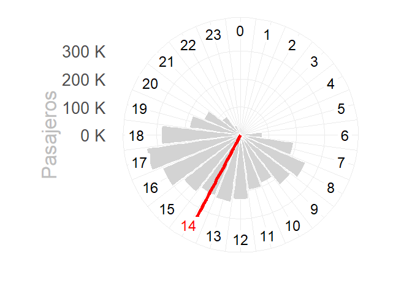
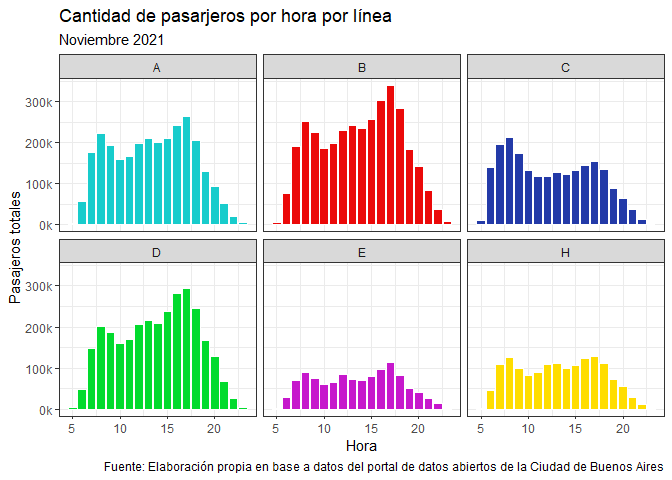
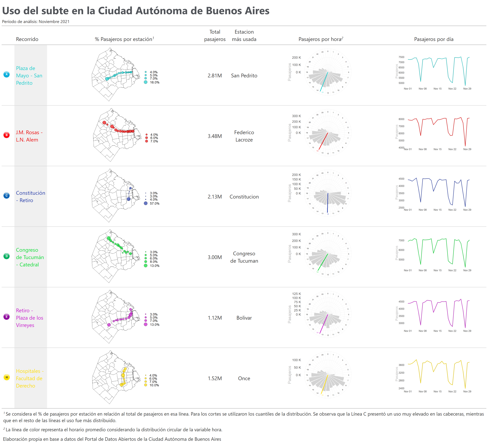

Viajes en subte
================

# Librerías

Se cargan las librerías a utilizar

``` r
library(tidyverse) # Manipulación de datos
library(lubridate)  # Manipulación de fechas
library(circular) # Datos periódicos
library(gt) # Tablas
library(reshape) # Untable
library(sf) # Trabajar con mapas
conflicted::conflict_prefer("filter", "dplyr")
conflicted::conflict_prefer("select", "dplyr")

options(scipen=999)
```

# Datos

Se importan los datos de viajes en subte de la Ciudad Autónoma de Buenos
Aires, en 2020.

``` r
df <-
  read_delim(
    'https://cdn.buenosaires.gob.ar/datosabiertos/datasets/sbase/subte-viajes-molinetes/molinetes_112021.csv',
    delim = ';',
    col_types = cols(FECHA = col_date("%d/%m/%Y"))
  ) %>%
  janitor::clean_names() %>%
  filter(!is.na(fecha)) %>%
  mutate(hora = hour(desde))
```

# Hora de uso de cada línea de subte

Función para obtener la hora promedio:

``` r
get_hour <- function(.linea, .df) {
  temp <- .df %>%
    filter(linea == .linea) %>%
    select(hora, pax_total)
  
    hora <- untable(temp, num = temp$pax_total) %>%
      select(-pax_total) %>%
      mutate(hora_circular = circular(hora, template = "clock24", units = "hours")) %>%
      summarise(hora = mean(hora_circular)) %>%
      pull(hora)
  
  as.numeric(hora) %% 24
}
```

Función para generar un gráfico circular de la cantidad de pasajeros por
hora por línea de subte:

``` r
plot_clock <- function(.linea, .df, .color = 'black', .hora_promedio) {
  temp <- data.frame(hora = seq(0, 23)) %>%
    left_join(
      .df %>%
        filter(linea == .linea) %>%
        group_by(hora) %>%
        summarise(pax_total = sum(pax_total)) %>%
        ungroup()
    ) %>%
    mutate(color_hora = ifelse(hora == round(.hora_promedio), TRUE, FALSE)) %>%
    mutate(pax_total = ifelse(is.na(pax_total), 0, pax_total))
  
  temp %>%
    ggplot(aes(x = hora, y = pax_total)) +
    geom_col(color = 'white', fill = 'lightgrey') +
    coord_polar(start = 0) +
    geom_vline(xintercept = .hora_promedio,
               color = .color,
               size = 2) +
    geom_label(
      aes(
        x = hora,
        y = max(pax_total) + quantile(pax_total, 0.3),
        color = color_hora,
        label = hora
      ),
      size = 6,
      label.size = NA,
      show.legend = FALSE
    ) +
    scale_color_manual(values = c('black', .color)) +
    scale_x_continuous(
      "",
      limits = c(0, 24),
      breaks = seq(0, 24),
      labels = seq(0, 24)
    ) +
    scale_y_continuous(labels = scales::unit_format(unit = "K", scale = 1e-3)) +
    labs(y = 'Pasajeros') +
    theme_minimal() +
    theme(text = element_text(size = 25, color = 'grey'),
          axis.text.x = element_blank())
}
```

Test de la función

``` r
plot_clock(.df=df, .linea='LineaB', .color='red',
           .hora_promedio=get_hour(.linea='LineaB',.df=df))
```

<!-- -->

# Estación más utilizada por línea

``` r
estacion_mas_usada <- df %>% 
  group_by(linea, estacion_mas_usada = estacion) %>% 
  summarise(pax_total = sum(pax_total)) %>% 
  group_by(linea) %>% 
  slice(which.max(pax_total)) 
```

# Mapa de de estaciones y uso

Se cargan los datos del geojson de barrios de la Ciudad Autónoma de
Buenos Aires:

``` r
# Mapa barrios CABA
caba <- st_read('http://cdn.buenosaires.gob.ar/datosabiertos/datasets/barrios/barrios.geojson') %>% 
  mutate(barrio=str_to_title(BARRIO))
```

    ## Reading layer `barrios_badata_wgs84' from data source 
    ##   `http://cdn.buenosaires.gob.ar/datosabiertos/datasets/barrios/barrios.geojson' 
    ##   using driver `GeoJSON'
    ## Simple feature collection with 48 features and 6 fields
    ## Geometry type: MULTIPOLYGON
    ## Dimension:     XY
    ## Bounding box:  xmin: -58.53152 ymin: -34.70529 xmax: -58.33515 ymax: -34.52649
    ## Geodetic CRS:  WGS 84

``` r
mapa <- ggplot()+
  geom_sf(data = caba, 
          color = "grey", 
          fill = 'white',
          size = 0.1, 
          show.legend = FALSE)+
  theme_minimal()

mapa
```

<!-- -->

Se incluyen los datos de latitud y longitud de cada estación:

``` r
estaciones_simple <- readr::read_csv('https://cdn.buenosaires.gob.ar/datosabiertos/datasets/sbase/subte-estaciones/estaciones-de-subte.csv') %>% 
  mutate(estacion = str_to_title(estacion)) %>% 
  mutate(estacion = iconv(estacion, from="UTF-8",to="ASCII//TRANSLIT")) %>% 
  select(linea, estacion, lat, long)


estaciones_accesibles <- readr::read_csv('https://cdn.buenosaires.gob.ar/datosabiertos/datasets/sbase/subte-estaciones/estaciones-accesibles.csv') %>% 
  mutate(estacion = str_to_title(estacion)) %>% 
  mutate(estacion = iconv(estacion, from="UTF-8",to="ASCII//TRANSLIT")) %>% 
  select(linea, estacion, lat, long)

estaciones <- estaciones_accesibles %>% 
  bind_rows(estaciones_simple) %>% 
  mutate(estacion = case_when(estacion=='Saenz Pena'~'Saenz Peña',
                              estacion=='Humberto 1?'~'Humberto I',
                              estacion=='R.scalabrini Ortiz'~'Scalabrini Ortiz',
                              estacion=='Plaza De Los Virreyes - Eva Peron'~'Pza. De Los Virreyes',
                              estacion=='Aguero'~'Agüero',
                              estacion=='San Martin'~'General San Martin',
                              str_detect(estacion,'Carranza')~'Ministro Carranza',
                              TRUE ~ estacion))


estaciones <- estaciones[!duplicated(estaciones[,1:2]),]

df_pasajeros_estaciones <- df %>% 
  group_by(linea, estacion) %>% 
  summarise(pax_total = sum(pax_total)) %>% 
  mutate(estacion = str_trim(str_to_title(estacion)), 
         linea = str_replace(linea, 'Linea','')) %>% 
    mutate(estacion = case_when(estacion=='Flores'~'San Jose De Flores',
                                estacion=='Saenz Peña '~'Saenz Peña',
                                estacion=='Callao.b'~'Callao',
                                estacion=='Retiro E'~'Retiro',
                                estacion=='Independencia.h'~'Independencia',
                                estacion=='Pueyrredon.d'~'Pueyrredon',
                                estacion=='General Belgrano'~'Belgrano',
                                estacion=='Rosas'~'Juan Manuel De Rosas',
                                estacion=='Patricios'~'Parque Patricios',
                                estacion=='Mariano Moreno'~'Moreno',
                              TRUE ~ estacion)) %>% 
  left_join(estaciones, by = c("linea" = "linea", "estacion" = "estacion")) %>% 
  mutate(color = case_when(linea == 'A'~'#18cccc',
                           linea == 'B'~'#eb0909',
                           linea == 'C'~'#233aa8',
                           linea == 'D' ~'#02db2e',
                           linea == 'E' ~'#c618cc',
                           linea == 'H' ~ '#ffdd00',
                           TRUE ~ 'black'))
```

Mapa de todas las estaciones juntas:

``` r
ggplot() +
  geom_sf(data = caba, 
          color = "grey", 
          fill = 'white',
          size = 0.1, 
          show.legend = FALSE)+
  geom_point(data = df_pasajeros_estaciones,
             aes(x = long, y = lat, color=linea, size=pax_total))+
  scale_color_manual(values=unique(df_pasajeros_estaciones$color))+
  theme_minimal()
```

<!-- -->

Estaciones individuales para la tabla:

``` r
plot_mapa <- function(.df, .linea){
   temp <- .df %>% 
    mutate(linea = paste0('Linea',linea)) %>% 
    filter(linea==.linea) %>% 
    mutate(pax_percent = pax_total / sum(pax_total))
   
  lbreaks <- round(quantile(temp$pax_percent, c(0,0.25,0.5,0.75,1)),2) %>%
    as.numeric()
  
  ggplot() +
    geom_sf(data = caba, 
            color = "black", 
            fill = 'white',
            size = 0.1, 
            show.legend = FALSE)+
    geom_point(data = temp,
               aes(x = long, y = lat, size=pax_percent), alpha=0.7,
               fill = temp$color %>% unique(), color='black', shape=21)+
    scale_size_continuous(breaks = lbreaks, range=c(1,10),
                          limits=c(min(temp$pax_percent),max(temp$pax_percent)),
                          labels = scales::percent(lbreaks, accuracy=0.1))+
    theme_void()+
    theme(text = element_text(size = 25), 
          legend.position = 'right', 
          axis.text = element_blank(), 
          plot.margin = unit(c(0, 0, 0, 0), "null"))+
    labs(x='',y='',size='')
}
```

# Datos para la tabla

Se genera el tibble que contiene los datos para luego generar la tabla:

``` r
datos_tabla <- tibble(linea = sort(unique(df$linea))) %>% 
  
  # Colores
  mutate(recorrido = case_when(linea == 'LineaA'~'Plaza de Mayo - San Pedrito',
                           linea == 'LineaB'~'J.M. Rosas - L.N. Alem',
                           linea == 'LineaC'~'Constitución - Retiro',
                           linea == 'LineaD' ~'Congreso de Tucumán - Catedral',
                           linea == 'LineaE' ~'Retiro - Plaza de los Virreyes',
                           linea == 'LineaH' ~ 'Hospitales - Facultad de Derecho',
                           TRUE ~ 'black')) %>%
  
  
  # Colores
  mutate(color = case_when(linea == 'LineaA'~'#18cccc',
                           linea == 'LineaB'~'#eb0909',
                           linea == 'LineaC'~'#233aa8',
                           linea == 'LineaD' ~'#02db2e',
                           linea == 'LineaE' ~'#c618cc',
                           linea == 'LineaH' ~ '#ffdd00',
                           TRUE ~ 'black')) %>%
  
  # Cantidad de viajes realizados en cada línea
  left_join(df %>% 
    group_by(linea) %>% 
    summarise(pax_total = sum(pax_total))) %>%
  
  # Hora promedio por línea
  mutate(hora_promedio = map(linea, ~get_hour(.linea=.x, .df=df))) %>% 

  mutate(hora_promedio = unlist(hora_promedio)) %>% 
  
  
  # Gráfico de cantidad de pasajeros por hora por línea
  mutate(reloj_plot = pmap(
    list(linea, color, hora_promedio),
    ~ plot_clock(
      .linea = ..1,
      .df = df,
      .color = ..2,
      .hora_promedio = ..3
    )
  )) %>%
  
  # Gráfico de la evolución de cantidad de pasajeros por línea
  mutate(
    evolucion_plot = map2(linea, color,
      ~ df %>% filter(linea == .x) %>%
          group_by(fecha) %>%
          summarise(n = sum(pax_total)) %>%
          ggplot(aes(x = fecha, y = n)) +
          geom_line(color='grey', size=2.5)+
          geom_line(color=.y, size=1.5)+
          # scale_y_continuous(labels = scales::unit_format(unit = "K", scale = 1e-3)) +
          theme_minimal()+
          labs(x='',y='Pasajeros')+
          theme(text=element_text(size=30),
                axis.title.y=element_text(color='grey'),
                 panel.grid = element_blank())
    )
  ) %>% 
  mutate(linea_imagen = here::here('',paste0('gcba_subte/lineas/',
                                             tolower(linea), 
                                             '.jpg'))) %>% 
  
  # Mapa por línea:
  mutate(mapa = map(linea, ~ plot_mapa(.df=df_pasajeros_estaciones, 
                                       .linea=.x))) %>% 
  
  # Estación más utilizada por línea
  left_join(estacion_mas_usada %>% select(-pax_total))
```

# Generación de la tabla

Se utiliza el paquete {gt} para generar la tabla que contiene plots de
{ggplot2}

``` r
tabla <- datos_tabla %>%
  
  ungroup() %>%
  
  # Selección de variables relevantes y orden:
  select(
    linea,
    linea_imagen,
    recorrido,
    mapa,
    pax_total,
    estacion_mas_usada,
    reloj_plot,
    evolucion_plot
  ) %>%
  
  # Se genera la tabla
  gt() %>%
  
  
  # Colores de los textos
  tab_style(
    style = cell_text(color = "#18cccc"),
    locations = cells_body(columns = c(recorrido),
                           rows = linea == "LineaA")
  ) %>%
  tab_style(
    style = cell_text(color = "#eb0909"),
    locations = cells_body(columns = c(recorrido),
                           rows = linea == "LineaB")
  ) %>%
  tab_style(
    style = cell_text(color = "#233aa8"),
    locations = cells_body(columns = c(recorrido),
                           rows = linea == "LineaC")
  ) %>%
  tab_style(
    style = cell_text(color = "#02db2e"),
    locations = cells_body(columns = c(recorrido),
                           rows = linea == "LineaD")
  ) %>%
  tab_style(
    style = cell_text(color = "#c618cc"),
    locations = cells_body(columns = c(recorrido),
                           rows = linea == "LineaE")
  ) %>%
  tab_style(
    style = cell_text(color = "#ffdd00"),
    locations = cells_body(columns = c(recorrido),
                           rows = linea == "LineaH")
  ) %>%
  
  # La línea oculta, con la imagen alcanza
  cols_hide(linea) %>%
  
  
  # Iconos de cada línea
  text_transform(
    locations = cells_body(columns = c(linea_imagen)),
    fn = function(linea_imagen) {
      lapply(linea_imagen, local_image, height = 20)
    }
  ) %>%
  cols_label(linea_imagen = '') %>%
  
  # Ggplots en formato gráfico (sino aparecen como texto)
  text_transform(
    locations = cells_body(columns = reloj_plot),
    fn = function(x) {
      map(
        datos_tabla$reloj_plot,
        gt::ggplot_image,
        height = px(180),
        aspect_ratio = 2
      )
    }
  ) %>%
  
  text_transform(
    locations = cells_body(columns = evolucion_plot),
    fn = function(x) {
      map(
        datos_tabla$evolucion_plot,
        gt::ggplot_image,
        height = px(140),
        aspect_ratio = 2
      )
    }
  ) %>%
  
  text_transform(
    locations = cells_body(columns = mapa),
    fn = function(x) {
      map(
        datos_tabla$mapa,
        gt::ggplot_image,
        height = px(180),
        aspect_ratio = 2
      )
    }
  ) %>%
  
  
  # Formato numérico
  fmt_number(pax_total, suffixing = TRUE) %>%
  
  # Renombrar variables
  cols_label(
    recorrido = md('Recorrido'),
    mapa = md('% Pasajeros por estación'),
    reloj_plot = md('Pasajeros por hora'),
    pax_total = md('Total pasajeros'),
    evolucion_plot = 'Pasajeros por día',
    estacion_mas_usada = 'Estación más usada'
  ) %>%
  
  # Fondo gris en el recorrido
  tab_style(style     = list(cell_fill(color = "#f0f0f0")),
            locations = cells_body(columns = c('recorrido'))) %>%
  
  # Opciones de la tabla
  tab_options(
    data_row.padding = px(0),
    table.border.top.style = "hidden",
    table.border.bottom.style = "hidden",
    table_body.border.top.style = "solid",
    column_labels.border.bottom.style = "solid"
  ) %>%
  
  # Título y anotaciones
  tab_header(
    title = md('**Uso del subte en la Ciudad Autónoma de Buenos Aires**'),
    subtitle = 'Período de análisis: Noviembre 2021'
  ) %>%
  
  opt_align_table_header('left') %>%
  
  tab_footnote(cells_column_labels(columns = reloj_plot), 
               footnote = 'La línea de color representa el horario promedio considerando la distribución circular de la variable hora.') %>%
  
  tab_footnote(cells_column_labels(columns = mapa), 
               footnote = 'Se considera el % de pasajeros por estación con relación al total de pasajeros en esa línea. Para los cortes se utilizaron los cuantiles de la distribución. Se observa que la Línea C presentó un uso muy elevado en las cabeceras, mientras que en el resto de las líneas el uso fue más distribuido.') %>%
  
  
  tab_source_note(
    source_note = html(
      "<div><br>Elaboración propia en base a datos del Portal de datos abiertos de la Ciudad de Buenos Aires</br></div>")
  ) %>% 
  
  
  # Estilo
  tab_style(locations = cells_title(groups = 'title'),
            style = list(
              cell_text(
                font = google_font(name = 'Raleway'),
                size = 'xx-large',
                weight = 'bold',
                align = 'left',
                color = '#515459'
              )
            )) %>%
  
  tab_style(locations = cells_title(groups = 'subtitle'),
            style = list(cell_text(
              font = google_font(name = 'Raleway'),
              size = 'small',
              align = 'left', 
              color = '#666666'
            ))) %>%
  
  tab_style(locations = cells_source_notes(),
            style = list(cell_text(
              font = google_font(name = 'Raleway'),
              size = 'medium',
              align = 'left', 
              color = '#666666'
            ))) %>%
  
  tab_style(locations = cells_footnotes(),
            style = list(cell_text(
              font = google_font(name = 'Raleway'),
              size = 'medium',
              align = 'left', 
              color = '#666666'
            ))) %>%
  
  # Alineación
  cols_align(
    'center',
    columns = c(
      'pax_total',
      'estacion_mas_usada',
      'reloj_plot',
      'evolucion_plot'
    )
  ) %>%
  
  # Ancho de las columnas
  cols_width(recorrido ~ px(100),
             estacion_mas_usada ~ px(80),
             reloj_plot ~ px(20),
             pax_total ~ px(80))
```

# Guardar la tabla nueva

Se guarda la tabla:

``` r
gt::gtsave(tabla, 'tabla_subtes.png', 
           vwidth = 1500, vheight = 2500)
```

<!-- -->
